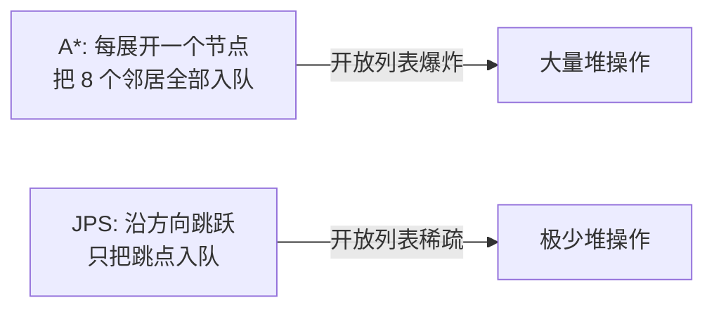
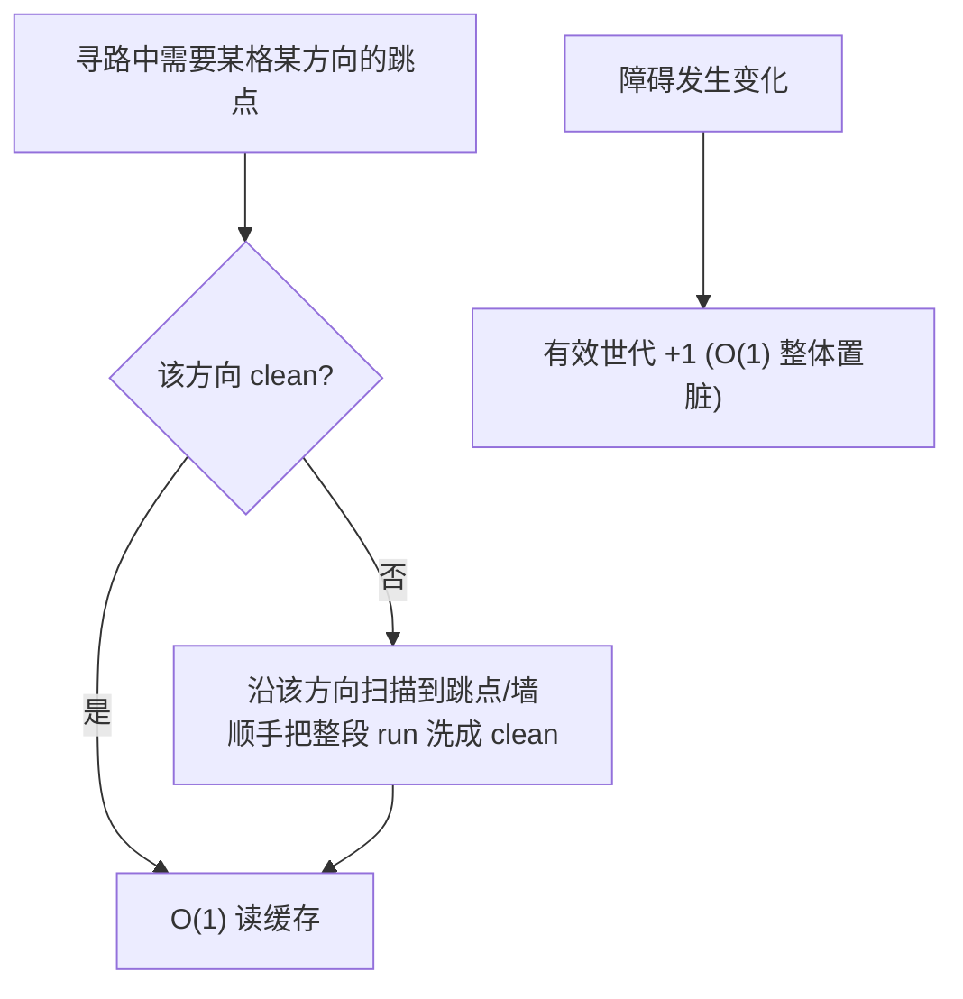
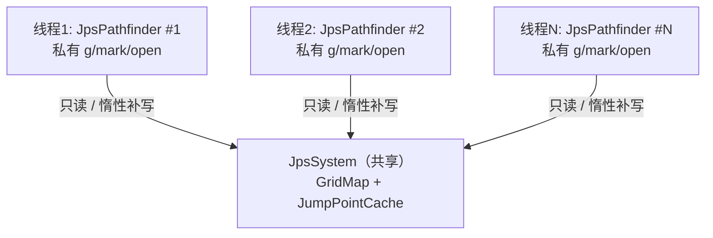
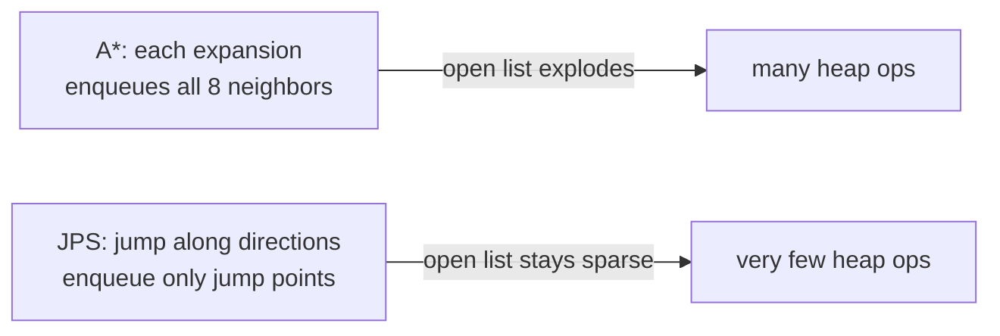
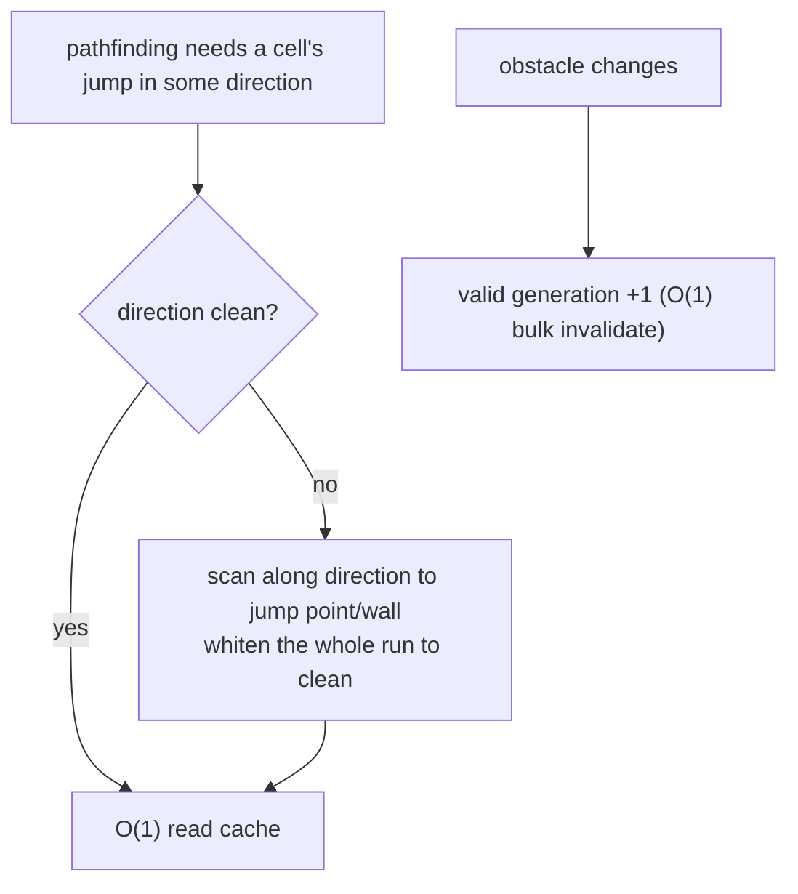
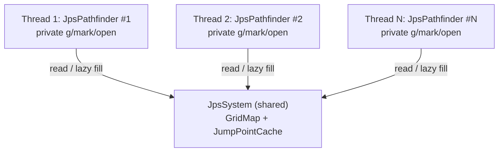

# JPS Pathfinding Playground

[](LICENSE)

一个用于**直观演示与测试 JPS（Jump Point Search，跳点搜索）寻路算法**的 Windows Forms 应用（.NET / C#）。内置 A\* 对照、路径平滑、JSON 存档，以及把"跳点表更新过程"实时可视化的能力——非常适合用来理解 JPS 的内部机理。
_A Windows Forms app (.NET / C#) for **visually demonstrating and testing the JPS (Jump Point Search) pathfinding algorithm**. It ships with an A\* baseline, path smoothing, JSON save/load, and real-time visualization of the "jump-table update process" — ideal for understanding how JPS works inside._

**核心技术亮点 · Core Highlights**

- **惰性跳点表（本项目核心）**：不做任何预计算，跳点距离"用到哪格才算哪格"；障碍变化只需 `O(1)` 整体置脏，并跨查询持续复用已洗白的跳点，越跑越快。
  _**Lazy jump table (the core idea):** no precomputation — jump distances are filled on demand; obstacle changes invalidate in `O(1)`, and whitened jump points are reused across queries, getting faster the more it runs._
- **动态障碍零重建**：因惰性表把"重建代价"消解为零，静态/动态障碍统一为一种，改任意障碍都不触发重建。
  _**Zero-rebuild dynamic obstacles:** since the lazy table reduces "rebuild cost" to zero, static and dynamic obstacles unify into one — editing any obstacle never triggers a rebuild._
- **无锁多线程共享缓存（默认开启）**：多个寻路器共享同一份缓存并**互相预热**，用 `Volatile` 对世代戳做 acquire/release 发布保证可见性与次序，免锁并行（x86 上额外开销可忽略；可移除 `JPS_CONCURRENT_CACHE` 退回单线程极速）。
  _**Lock-free shared cache across threads (on by default):** many pathfinders share one cache and **warm it for each other**, publishing generation stamps with `Volatile` acquire/release for visibility and ordering — parallel without locks (negligible cost on x86; remove `JPS_CONCURRENT_CACHE` for single-thread max speed)._
- **全整数 + 零分配的高性能内核**：整数代价/启发、扁平数组、世代戳免清零、缓冲复用；结果与 A\* 同样最优（全 7 个 MovingAI 地图集、562 张图、**56.2 万组**随机查询与 A\* **0 不符**），扩展节点平均少约 **54×**、墙钟平均快约 **44×**（大开阔图可达 100–170×）。
  _**All-integer, zero-allocation core:** integer cost/heuristic, flat arrays, generation stamps (no clearing), buffer reuse; just as optimal as A\* (0 mismatches across **562,000** queries over all 7 MovingAI map sets / 562 maps), averaging ~**54×** fewer expanded nodes and ~**44×** faster wall-clock (up to 100–170× on large open maps)._
- **算法核心与界面解耦、可移植**：`Models` + `Pathfinding` 不依赖 WinForms，可整体拷入 Unity 2022。
  _**Decoupled, portable core:** `Models` + `Pathfinding` don't depend on WinForms and drop into Unity 2022 wholesale._

> 刷阻挡 → 设起点/终点 → `JPS寻路` / `A*寻路`，即可看到搜索过程、最终路径、平滑路径，以及每个格子各方向跳点缓存的更新状态。
> _Brush obstacles → set start/goal → `JPS寻路` / `A*寻路` to watch the search process, final path, smoothed path, and each cell's per-direction jump-cache update state._

> 中文正文在前，**English translation of the full body is appended after the Chinese sections** (see the right-hand links in the table of contents).

---

## 目录 · Table of Contents

> 每条左侧为中文锚点，右侧 `·` 后为英文锚点。 _Left link → Chinese section, right link (after `·`) → English section._

- [功能一览](#功能一览) · [Features](#features)
- [一、JPS 算法核心原理](#一jps-算法核心原理) · [Core Principles of JPS](#i-core-principles-of-jps)
  - [1. 网格与移动规则](#1-网格与移动规则) · [Grid and Movement Rules](#1-grid-and-movement-rules)
  - [2. 剪枝思想：自然邻居与强迫邻居](#2-剪枝思想自然邻居与强迫邻居) · [Pruning: Natural vs Forced Neighbors](#2-pruning-natural-vs-forced-neighbors)
  - [3. 强迫邻居判定规则](#3-强迫邻居判定规则forced-neighbor) · [Forced-Neighbor Rules](#3-forced-neighbor-rules)
  - [4. 走直线与走斜线的扫描规则](#4-走直线与走斜线的扫描规则) · [Straight and Diagonal Scanning](#4-straight-and-diagonal-scanning)
  - [5. 为什么比 A\* 快](#5-为什么比-a-快) · [Why It's Faster Than A\*](#5-why-its-faster-than-a)
- [二、本项目的核心实现](#二本项目的核心实现) · [Implementation Highlights](#ii-implementation-highlights)
  - [1. 惰性跳点表](#1-jump-table-lazy-update惰性跳点表) · [Jump Table Lazy Update](#1-jump-table-lazy-update)
  - [2. 静态 / 动态障碍的兼容设计](#2-静态--动态障碍的兼容设计) · [Unified Obstacle Model](#2-unified-obstacle-model)
  - [3. 平滑方案的选择](#3-平滑方案的选择) · [Path Smoothing](#3-path-smoothing)
  - [4. 无锁多线程：共享惰性缓存的并行寻路](#4-无锁多线程共享惰性缓存的并行寻路) · [Lock-Free Multithreading](#4-lock-free-multithreading)
- [三、可视化说明](#三可视化说明) · [Visualization](#iii-visualization)
- [四、工程与性能要点](#四工程与性能要点) · [Engineering and Performance](#iv-engineering-and-performance)
- [运行](#运行) · [Run](#run)

---

## 功能一览

| 类别 | 内容 |
|---|---|
| 编辑 | 阻挡画刷（点空地刷 2×2、点阻挡清 1 格）、设起点/终点、清空 |
| 寻路 | **JPS**、**A\***（对照），整数代价（横 1000 / 斜 1414，八方向 octile 启发） |
| 平滑 | 前向增量视线拉直（string pulling），红色折线叠加显示 |
| 存档 | 地图（阻挡 + 起终点）导出/载入 JSON |
| 可视化 | 已扩展 / 已入队未扩展 / 扫描跳过 / 路径 / 平滑路径；**每格 4 方向跳点缓存的 dirty/clean 状态点** |

---

## 一、JPS 算法核心原理

JPS 是对 A\* 在**均匀代价栅格**上的加速：它不改变最优性，而是利用栅格的对称性，把"每步看 8 个邻居"压缩成"沿方向一路跳过无意义的格子，只在**跳点**处停下入队"。

### 1. 网格与移动规则

- 8 邻接：4 个正交方向（↑↓←→）+ 4 个对角方向（↖↗↙↘）。
- 代价：正交 `1000`，对角 `1414`（≈ √2 × 1000），全整数。
- 启发式：八方向距离（octile）
  `h = (max(dx,dy) - min(dx,dy)) × 1000 + min(dx,dy) × 1414`
- 本项目采用**允许斜穿拐角**的模型：对角移动只要求目标格可走（不要求两侧正交格都空）。A\* 与 JPS 采用同一套移动规则，保证两者结果可比。

### 2. 剪枝思想：自然邻居与强迫邻居

要理解 JPS，先理解它**为什么能跳过格子**。

在均匀代价栅格上，从起点到某格往往存在**大量代价相同的等价路径**（比如"先右后下"和"先下后右"完全等价）——这叫**路径对称性**。A\* 会把这些等价路径全部展开，做了大量重复功。**JPS 的本质就是打破这种对称：每个格子只保留一条"规范路径"，把其余等价分支全部剪掉。**

具体地，从父节点 `p` 沿某方向走到当前节点 `n` 后，把 `n` 的邻居分成两类：

| 类别 | 定义 | 处理 |
|---|---|---|
| **自然邻居（natural）** | 不经过 `n`、用同样或更短代价也能到达 | **剪掉**（交给别的路径去走） |
| **强迫邻居（forced）** | 因为旁边有**阻挡**，绕过去只能经过 `n` | **保留** |

> 一旦某个格子存在强迫邻居，它就是一个**跳点（jump point）**——必须在此停下、入开放列表，因为路径可能要在这里"拐弯"。**没有强迫邻居的格子可以一路跳过，根本不必入队。** 这就是 JPS 省下绝大部分开销的根源。

所以 JPS 的两个关键问题就是：**怎么判定强迫邻居（→ 找跳点）**，以及**怎么沿方向高效扫描跳点**。下面两节分别回答。

### 3. 强迫邻居判定规则（forced neighbor）

强迫邻居总是由**阻挡**造成的（`X` = 阻挡，箭头 = 移动方向，`F` = 强迫邻居）：

**直线移动（以向右 → 为例）**：当 `n` 正上/正下被挡，但其**斜前方**可走时，斜前方就是强迫邻居（绕过阻挡只能经过 `n`）：

```
 .  X  F      y-1 行: (x,y-1)=X 被挡, (x+1,y-1)=F 可走 → F 是强迫邻居
 .  n→ .      y   行: n 沿 → 前进
 .  .  .      y+1 行

规则: !walk(x, y-1) && walk(x+1, y-1)   （上侧强迫）
      !walk(x, y+1) && walk(x+1, y+1)   （下侧强迫）
```

**对角移动（以 ↘ 为例，dx=+1, dy=+1）**：当某个正交"身后"方向被挡、而其对应斜向可走时，产生强迫邻居：

```
规则: !walk(x-dx, y)  && walk(x-dx, y+dy)   → 强迫邻居 (x-dx, y+dy)
      !walk(x, y-dy)  && walk(x+dx, y-dy)   → 强迫邻居 (x+dx, y-dy)
```

> 实现见 [`JpsRules`](JPS.Core/Pathfinding/JpsRules.cs)：`HasCardinalForcedNeighbor` / `HasDiagonalForcedNeighbor`。
> ⚠️ 强迫邻居判定的方向必须与剪枝时实际探索的方向**严格一致**（看"前进方向 `x+dx`"而不是"身后 `x-dx`"），否则会漏掉真正的跳点导致找不到路——这是实现 JPS 最容易踩的坑之一。

### 4. 走直线与走斜线的扫描规则

**直线跳跃**（沿单一正交方向）：

1. 一格格沿该方向推进。
2. 撞墙/越界 → 该方向无跳点。
3. 到达终点 → 终点即跳点。
4. 当前格出现强迫邻居 → 当前格是跳点，停止并返回。

**对角跳跃**（沿对角方向）：

1. 一格格沿对角推进；撞墙/越界 → 无跳点；到达终点 → 返回。
2. 当前对角格出现对角强迫邻居 → 是跳点，返回。
3. **关键递归**：在每个对角格上，先沿它的两个正交分量做"直线跳跃"；只要任一分量能找到跳点，当前对角格就也算跳点并返回。

这条"对角每步派生两次直线扫描"的递归，是对角跳跃天然比直线贵的原因（最坏 O(L²)）——本项目用[惰性正交缓存](#1-jump-table-lazy-update惰性跳点表)把它降回接近 O(L)。

### 5. 为什么比 A\* 快

把前面的剪枝思想落到开销上，就能看出 JPS 相对 A\* 的优势：



- **A\***：把每个可走格都放进优先队列，反复做堆的入队/出队。
- **JPS**：沿方向连续推进时，中间格子只是被"扫一眼"（不入队、不展开、不做堆操作），**只有跳点进入开放列表**。

由于跳点数量远小于格子数量，JPS 的开放列表节点数、堆操作次数都大幅下降，因此通常比 A\* 快一个量级；而启发式可采纳、移动规则一致，所以**结果与 A\* 同样最优**（本项目用 600+ 组随机地图对照验证两者代价完全一致）。

---

## 二、本项目的核心实现

### 1. Jump Table Lazy Update（惰性跳点表）

这是本项目的核心设计。

经典 JPS+ 会**预计算**一张"每格每方向到下一个跳点/墙的距离"表，把跳跃加速到 O(1)。但这张表依赖障碍布局——**障碍一变就要全量重建 O(N)**，对频繁变化的障碍非常不友好。

本项目**不做任何 eager 预计算**，把跳点表改为"**用到哪格才更新哪格**"的惰性缓存。

**数据结构（仅正交 4 方向）**：每格每正交方向存一个带符号距离（`>0` = 跳点距离，`≤0` = 到墙距离）+ 一个**世代戳**。

**三个操作**：

| 事件 | 处理 | 复杂度 |
|---|---|---|
| 障碍变化（`Version` 改变） | 全局有效世代 `+1` → 整张表瞬间全部 dirty | **O(1)** |
| 查询某格某方向（clean） | 直接读缓存 | **O(1)** |
| 查询某格某方向（dirty） | 沿该方向扫一次找到跳点/墙，并把**整段 run 一起洗白** | O(L)，但一次扫描清一串 |

**为什么只缓存正交方向、对角永远扫描？** 这是本设计刻意的取舍，有三个理由：

1. **对角的瓶颈本来就在正交上**。回忆[对角扫描规则](#4-走直线与走斜线的扫描规则)：对角每走一步，都要沿它的两个正交分量各做一次直线扫描，所以对角跳跃最坏是 **O(L²)**。只要把这两次正交子检测改成"查正交缓存"，对角跳跃就降到接近 **O(L)**——**缓存正交，对角免费提速**，根本不需要单独给对角建表。

2. **正交缓存性价比极高**。重算一个正交表项的代价 = 一次直线扫描（O(L)），和"不缓存直接扫"一样；但一旦缓存，后续复用就是 **O(1)**，而且**一次扫描能顺手把整段 run 全部洗白**（一串格子共享同一个跳点/墙）。所以"扫一次、长期复用"非常划算。

3. **对角表项很难惰性维护，收益还小**。对角距离依赖"对角邻居的对角距离 + 沿途正交分量上的跳点"，一处障碍变化会沿**对角线扩散（ripple）**、且更新时要递归依赖正交结果，复杂且极易写错；而它能带来的额外收益，又已经被理由 1 的"对角复用正交缓存"基本吃掉了。投入产出比不划算，干脆不做。

> 此外，终点由[经典对角扫描](#4-走直线与走斜线的扫描规则)的 `==goal` 判定和正交子检测自然处理，也**不需要对角表来做目标导向**。



**意义**：

- **动态障碍零重建**：改障碍只是 `O(1)` 置脏，不重建任何表。
- **只为踩过的格子付费**：相比"全量重建 O(N)"，惰性方案只更新寻路实际触及的格子；查询若只覆盖局部，开销远小于 O(N)。
- **跨查询复用**：两次障碍变化之间的多次寻路，会不断复用已洗白的跳点，越用越快——明显优于纯逐格扫描。
- 用**世代计数器**而非 bool 数组，使"整体置脏"真正 O(1)（无需遍历清零）。

> 实现见 [`JpsPathfinder`](JPS.Core/Pathfinding/JpsPathfinder.cs) 的 `CardinalDist`（惰性正交 memo）与 `DiagonalJump`（复用 memo 的经典对角扫描）。

### 2. 静态 / 动态障碍的兼容设计

传统做法会区分"**静态障碍**（进预计算表）"和"**动态障碍**（不进表、寻路时特殊处理）"，因为预计算表重建代价高，不能让频繁变化的动态障碍触发重建。

但在本项目里，跳点表已经是[上一节的惰性更新](#1-jump-table-lazy-update惰性跳点表)——**任何障碍变化都只是 O(1) 整体置脏**，根本没有"重建代价"。于是这个区分就失去了意义：

> 既然改任何障碍都只要 O(1) 置脏，"静态 vs 动态"在算法层就**没有区别了**——障碍只有"此刻能不能走"这一个属性。

因此本项目**彻底统一为一种障碍**：

- 只有**一种障碍** + 一个版本号 [`GridMap.Version`](JPS.Core/Models/GridMap.cs)：任何增删 → `Version++` → 惰性跳点表整体置脏。
- 寻路 / 跳点表 / A\* 一视同仁地看 `IsWalkable`，不关心障碍"来源"。
- 没有静态/动态两套逻辑、没有"动态障碍回退到经典扫描"的分支、没有手动预计算按钮——架构大幅简化。

换句话说：**惰性跳点表把"动态障碍"这个难题直接消解掉了**——所有障碍天然都是"动态"的，且代价为零。

### 3. 平滑方案的选择

栅格寻路得到的是"贴格子的折线"，需要平滑成更自然的路径。我们对比了多种方案，最终选择**前向增量视线拉直（forward-incremental string pulling）**：

| 方案 | 复杂度 | 在栅格上的表现 | 结论 |
|---|---|---|---|
| 末端贪心拉直（找最远可视点） | 最坏 O(n³) | 质量略好一点点 | 太慢 |
| **前向增量拉直（本项目）** | **O(n·L)** | 与末端贪心几乎同质量 | ✅ 采用 |
| 漏斗算法 Funnel | O(n) | 受限于 1 格宽走廊，开阔区反而**更差** | 适合 navmesh，不适合栅格 |
| Theta\* | 慢（丢失 JPS 剪枝 + 全程 LOS） | any-angle 近最优 | 是"更好的寻路器"，非"更好的平滑器" |

- **视线检测**用整数 supercover 直线（与寻路同样整数、同样允许斜穿拐角），逐格判断线段是否穿障碍。
- **整数 / 浮点边界**：寻路全程整数；**浮点只出现在最终路径平滑与绘制**。平滑结果以连续坐标（格中心 = `cx+0.5`）输出，用红色折线叠加在原路径之上。

> 实现见 [`PathSmoother`](JPS.Core/Pathfinding/PathSmoother.cs)。
> 注：JPS 与 A\* 即便代价相同，也可能走不同的等价最优栅格路；平滑是依赖输入的贪心算法，所以两者平滑结果可能不同——这是正常现象，非 bug。

### 4. 无锁多线程：共享惰性缓存的并行寻路

很多场景（如服务器同时为成百上千个单位寻路）希望**多个线程在同一张地图上并行寻路**。本项目的结构天然适合这件事，且做到了**无锁（lock-free）**。

#### 设计思路

**1) 拆分"共享只读态"与"线程私有态"。**
[`JpsSystem`](JPS.Core/Pathfinding/JpsSystem.cs) 持有 `GridMap` + `JumpPointCache`（**共享**）；每个 [`JpsPathfinder`](JPS.Core/Pathfinding/JpsPathfinder.cs) 只持有自己的逐节点搜索状态（`g / mark / open / parent …`，**线程私有**）。于是并行寻路 = 多个私有 pathfinder 各跑各的，唯一的交汇点就是那份共享缓存。



**2) 让共享缓存无需锁。** 关键观察：并行期间地图不变，所以缓存里每一项的**正确值是固定地图的纯函数**——不同线程对同一格同方向算出的 dist 必然相同。因此即使两个线程同时给同一格补写，也只是把**同一个值**写两遍，结果一致。剩下的唯一风险是**可见性与写入次序**：读者可能先看到"已 clean"的世代戳、却还没看到对应的 dist。

**3) 用 `Volatile` 的 acquire/release 保证发布次序（而非加锁）。** 世代戳 `gen` 是"发布标志"，按元素发布：

- **写者**：每格先**普通写** `dist`，再 `Volatile.Write(gen)` 发布该格世代戳。release 语义保证"此前的 dist 写"对 acquire 读者可见——即"看得到 gen 就一定看得到 dist"。
- **读者**：`Volatile.Read(gen)` 命中 clean（`gen == 有效世代`）后，再**普通读** `dist`。
- **按元素发布**：每格的 `gen` 只守护本格的 `dist`，所以逐格 release 即可——无需额外全屏障、也无需分两遍写。读热路径只是一次 **acquire 读**（半屏障，比全屏障便宜），无锁无竞争。

取字段引用用结构体的静态 `ref` 方法（`Dir4Byte.Slot`）+ `ref` 三元（结构体实例方法不能 `ref` 返回自身字段，CS8170）。这样既不需要互斥锁、也**不增加单格内存**（仍 12 B/格，AoS 布局不变，`gen`/`dist` 仍同缓存行），`Volatile` 只约束次序、不增字段。

**4) 多个 finder 互相预热缓存 → 越并行越快。** 这是共享缓存最甜的红利：缓存是[惰性洗白](#1-jump-table-lazy-update惰性跳点表)的，**哪条线段被走到，哪条线段才被扫描并洗白成 clean**。由于所有线程共享**同一份**缓存——

- 某个区域只要被**任意一个**线程第一个走到，就被它一次性扫描洗白；此后**所有线程**再经过该区域全是 O(1) 命中。
- 于是整段并行寻路里，每条线段的 O(L) 扫描代价**全局只付一次**，而不是"每线程各付一次"。线程越多、查询越密集、路径越重叠，复用率越高，**平均每次寻路反而越快**。

换句话说：多个 JPS finder 在共享缓存上**互相预热**——先跑的替后跑的把跳点铺好，把"建表"的成本摊薄到整个线程池上。（实测见[第四章缓存复用](#jps-vs-a-性能开销对比实测)：复用比无复用快 ~10×。）

> ⚠️ 前提：并行寻路**之前**必须由**单线程**调用一次 `JpsSystem.Sync()`（确定缓存版本），且并行期间**不得修改地图**。要改地图就先 join 掉所有寻路线程，改完再 Sync、再并行。

#### 使用指南

| 模式 | 如何启用 | 适用 |
|---|---|---|
| **无锁多线程**（默认） | 工程已在 `JPS.Core` 定义 `JPS_CONCURRENT_CACHE` | 多线程共享同一 `JpsSystem` 并行寻路；x86/x64 上额外开销可忽略 |
| **单线程极速** | 移除该符号 | `Volatile` 全部消失（退回普通读写），榨干单线程（尤其 ARM） |

多线程支持**默认开启**——`JPS.Core/JPS.Core.csproj` 的 `<PropertyGroup>` 已包含：

```xml
<DefineConstants>$(DefineConstants);JPS_CONCURRENT_CACHE</DefineConstants>
```

如需单线程极速（x86 上几乎无差别，ARM 上略有收益），删掉这行即可。

并行调用范式：

```csharp
var system = new JpsSystem(map);
system.Sync();                       // ① 并行前，单线程同步一次

Parallel.For(0, threads, _ =>
{
    var jps = new JpsPathfinder();   // ② 每个线程一个私有 pathfinder
    foreach (var (s, g) in queries)  //    共享同一个 system（只读 / 惰性补写缓存）
        jps.FindPath(system, s, g);
});                                  // ③ 并行期间不修改 map
```

> **正确性验证**：默认（已开启 `JPS_CONCURRENT_CACHE`）用 8 线程并行、共享同一缓存跑 3000 组随机查询，结果与单线程 A\* ground truth **完全一致（0 不符）**。`dotnet run --project JPS.Benchmark -- mt` 可复现该压测（见 [`JPS.Benchmark/Program.cs`](JPS.Benchmark/Program.cs) 的 `MtTest`）。

---

## 三、可视化说明

| 颜色 / 标记 | 含义 |
|---|---|
| 灰底 / 近黑 | 可走格 / 阻挡 |
| 🟩 绿 | 已扩展（出队展开的跳点） |
| 🟪 紫 | 已入队未扩展（前沿） |
| 🟦 蓝灰 | 扫描跳过（射线经过但未进 open 的格子） |
| 🟡 金线 | 最终路径 |
| 🔴 红线 | 平滑后路径 |
| S / G | 起点 / 终点 |

**每格的十字 4 点** = 该格 4 个正交方向跳点缓存的状态（位置即方向：上 N、下 S、左 W、右 E）：

- 空心 = **dirty**（待计算）
- 白色实心 = 之前已缓存
- 橙色实心 = **本次寻路新更新**的方向

这组点让"惰性跳点表"的工作过程一目了然：编辑障碍后全部变空心（O(1) 整体置脏）；跑一次寻路，只有被触及的方向被点亮，其中本次新洗白的显示为橙色。

---

## 四、工程与性能要点

- **整数寻路**：代价、启发、g/f 全用整数（`long`），无浮点误差。
- **扁平数组替代哈希**：`g / parent / closed / 跳点缓存` 等逐节点数据按 `id = y·W + x` 索引，避免元组哈希开销。
- **世代戳免清零**：每次查询自增世代号判断"是否本次访问过"，无需每次清零数组。
- **缓冲区复用**：按地图尺寸只分配一次，跨多次查询复用，几乎零 GC。
- **零分配方向剪枝**：剪枝方向写入复用缓冲，无迭代器分配。
- **正确性验证**：600+ 组随机地图（含障碍中途变更）对照 A\*，路径代价与成败完全一致。

### JPS vs A\* 内存开销对比

两者的逐节点状态都是"按地图尺寸一次性分配、跨查询复用"的扁平数组（`N = 宽 × 高`）。逐格字节数精确如下：

| 数据 | 字段 | A\* | JPS | 归属 |
|---|---|---|---|---|
| g 值 | `long` | 8 | 8 | 每实例（线程私有） |
| 父信息 | A\*: 来向 `sbyte`；JPS: 来向 `sbyte` + 步数 `short` | 1 | 3 | 每实例（线程私有） |
| 访问状态 | `int`（`2·gen` / `2·gen+1` 合并 seen/closed） | 4 | 4 | 每实例（线程私有） |
| **搜索态小计** | | **13 B/格** | **15 B/格** | 每实例 |
| 跳点缓存 | `Dist` 4×`short` + `Gen` 4×`byte` | — | 12 | **每地图共享**（[`JpsSystem`](JPS.Core/Pathfinding/JpsSystem.cs)） |
| **合计** | | **13 B/格** | **27 B/格** | |

- **单实例**：JPS 约为 A\* 的 **~2.1×**（多出的 14 B/格几乎全是那张 12 B/格的正交跳点缓存——这是用空间换"跳跃 O(1)"的核心代价）。
- **多线程共享**：跳点缓存按地图只存一份、被所有线程共享，只有 15 B/格的搜索态随线程数线性增长。`T` 线程在 200×200（4 万格）地图上：

  | 线程数 | A\* | JPS |
  |---|---|---|
  | 1 | 0.52 MB | 1.08 MB（0.60 MB 搜索态 + 0.48 MB 共享缓存） |
  | 8 | 4.16 MB | 5.28 MB（4.80 MB 搜索态 + 0.48 MB 共享缓存） |

- 地图本身（[`GridMap._blocked`](JPS.Core/Models/GridMap.cs)）位压缩到 1 bit/格（≈0.125 B/格），两者共享，可忽略。
- 开放列表（[`MinHeap`](JPS.Core/Pathfinding/MinHeap.cs)）是动态结构、非 O(N) 固定：A\* 入队的节点数远多于 JPS（见下），其堆峰值内存也明显更大。
- 可视化用的 `_scanGen`（4 B/格）仅在开启调试可视化（`collectDebug`）时才分配，纯算法运行不占用。

### JPS vs A\* 性能开销对比（实测）

JPS 的本质是**用"每次扩展更贵（要跳跃/扫描）"换"扩展次数极少"**——扩展节点数直接决定堆操作与总工作量。下表是本机 `dotnet run -c Release --project JPS.Benchmark -- mapbench 1000` 在 **全部 7 个 [MovingAI](https://movingai.com/benchmarks/) 地图集、共 562 张图、每图 1000 组随机可解起终点（合计 56.2 万组）** 的汇总实测（`speed` = A\* 耗时 / JPS 耗时；区间为该集合内逐图实测的最小~最大）：

| 地图集 | 张数 | 典型尺寸 | 加速 speed 区间 | 集合特征 |
|---|---|---|---|---|
| `bg512-map` | 75 | 512² | **24–171×** | 稀疏开阔，JPS 最强主场 |
| `wc3maps512-map` | 36 | 512² | **26–152×** | 魔兽 3 地图，开阔为主 |
| `sc1-map` | 75 | 512–1024 | **15–119×** | 星际大型战略图 |
| `da2-map` | 67 | 中~大（最大 770²） | 6–72× | 龙腾世纪 2，室内/洞穴 |
| `dao-map` | 156 | 含 1024–1491 巨图 | 3–62× | 龙腾世纪起源，尺寸跨度大 |
| `bgmaps-map` | 120 | 50–320 | 2.5–38× | 小~中图，绝对差距小 |
| `mapf-map` | 33 | 8–1491（混合） | 1.4–73× | MAPF 基准，含随机散点（最弱） |
| **全部合计** | **562** | — | **节点 54.4× / 墙钟 43.9×** | **56.2 万组，JPS 总 11.8 s vs A\* 总 518 s** |

- **正确性**：**562000 组全部与 A\* 一致（成败 + 最短路径代价），0 不符** ✓——在 7 类真实基准上验证了 JPS 的完备性与最优性。

解读要点：

- **越大越开阔，JPS 越赚**：A\* 工作量 ≈ 可达面积（∝ N），JPS ≈ 跳点数（增长慢得多）。512/768/1024 的开阔图（bg512 / wc3 / sc1）普遍 **50–120×**，最高 `bg512/AR0604SR` **170×**、`wc3/heart2heart` **152×**；扩展节点比最高可达 ~**900×**（`bg512/AR0042SR`）。
- **障碍形态决定上下限**：稀疏 / 连续墙体 / 开阔 → 跳点稀疏 → 几十~上百×；**随机散点 / 一格宽迷宫** → 遍地强迫邻居、跳点密集 → 退化到 **1.4–2.5×**（`random-32-32-20` 1.4×、`maze-128-128-1` 2.3×）。真实关卡远比随机散点友好。
- **小图绝对差距小**：50–100 边长的图本就没多少节点可省，多在几×~十几×。
- **巨图仍稳赚**：`orz900d`(1491×656) ~26×、`orz700d`(1104×1260) ~28×、`lak400d`(1057²) ~27×、`ost100d`(1024²) ~16×。
- **任何场景都不输 A\***：最差的随机散点也有 ~1.4×，没有一张图 JPS 慢于 A\*，且结果始终一致。
- **缓存复用 / 单次更贵但堆更省**：表中 JPS 为**热缓存**（同图跨查询持续洗白跳点；单独在 `test2.json` 实测"复用"比"每次冷缓存"快约 **10×**，是[多线程互相预热](#4-无锁多线程共享惰性缓存的并行寻路)的来源）；JPS 单次扩展更贵（剪枝 + 跳跃扫描），但扩展次数锐减、只把跳点入队（堆"清爽"，A\* 入队 ≈ 扩展数×邻居数），综合净赢一个量级。

> 复现：全量 `dotnet run -c Release --project JPS.Benchmark -- mapbench 1000`（递归遍历 `movingai/` 全部子集，结果同时写入 `benchmark-results/` 报告）；只测某子集加第二参数，如 `mapbench 1000 sc1-map`；单图基准 `dotnet run -c Release --project JPS.Benchmark -- bench`（`test2.json`）。绝对耗时随硬件而变，但**节点比**与**趋势**稳定可估。

---

## 运行

需要 .NET（Windows，WinForms）。

```powershell
dotnet run --project JPS.Playground
```

界面语言按系统区域**自动选择**（`zh*` 为中文，其余英文）——工具栏按钮、提示、图例、状态栏、存档对话框一并切换（见 [`Loc`](JPS.Playground/Controls/Loc.cs)）。

工具栏按钮（中文标签 · 英文标签）：

| 按钮 | 作用 |
|---|---|
| **刷阻挡** · Wall | 刷障碍：点空地刷 2×2 阻挡，点阻挡清除 1 格 |
| **起点** · Start | 设置起点 |
| **终点** · Goal | 设置终点 |
| **清除** · Clear | 清空整张地图 |
| **JPS寻路** · JPS Path | 运行 JPS 并可视化搜索过程与路径 |
| **A\*寻路** · A* Path | 运行 A\*（对照）以作比较 |
| **保存** · Save | 把阻挡 + 起终点保存为 JSON |
| **载入** · Load | 从 JSON 载入地图 |
| **打开地图** · Open .map | 打开 **MovingAI** `.map` 基准地图（保持格子原始大小，超出窗口用滚动条查看） |

典型流程：**刷阻挡** 画障碍 → **起点** / **终点** 标记 → **JPS寻路** 或 **A\*寻路** 对比 → **保存** / **载入** 复现场景。

图例（工具栏与网格之间）把每种叠加色映射到含义，同样会本地化。

**MovingAI 地图**：点 **打开地图** 可载入任意 [MovingAI 基准地图](https://movingai.com/benchmarks/) `.map`（octile 格式）——例如仓库 `movingai/` 下的文件。网格会调整到地图的精确尺寸，**格子保持原始大小不缩小**，超出窗口的部分用滚动条查看（大图如 `orz900d` 1491×656 只渲染当前可见区域，滚动流畅）。滚轮可滚动查看，**`Ctrl` + 滚轮以鼠标位置为锚点缩放格子**（放大/缩小，2–64px）。地形按 MovingAI 约定二值化（`.`/`G`/`S` 可走，其余阻挡）。也可在命令行自检单图：`dotnet run --project JPS.Benchmark -- map movingai/mapf-map/den520d.map`；或**递归遍历 `movingai/` 全部子目录（现含 562 张地图）、每图随机取若干可解起终点对比 JPS/A***：`dotnet run -c Release --project JPS.Benchmark -- mapbench 100`（每图样本数可调；可加第二参数只跑某子集，如 `mapbench 100 sc1-map`；输出每图尺寸/可走率/扩展节点/耗时/加速比/与 A* 是否一致及总汇总，并同时写入仓库 `benchmark-results/` 下带时间戳的报告文件，方便日后查看）。

---

## 项目结构

解决方案 `JPS.slnx` 拆成**三个职责清晰的工程**：

| 工程 | 类型 / 目标框架 | 职责 |
|---|---|---|
| **JPS.Core** | 类库 · `netstandard2.1` / C# 9 | 纯算法核心，UI 无关、可直接拷入 **Unity 2022** |
| **JPS.Data** | 类库 · `netstandard2.1` / C# 9 | 地图数据 I/O：JSON 存档 + MovingAI `.map` 解析，引用 Core |
| **JPS.Playground** | WinForms 应用 · `net10.0-windows` | 可视化演示界面，引用 Core/Data |
| **JPS.Benchmark** | 控制台 · `net10.0` | 性能基准 / 并发压测命令行，引用 Core/Data |

```
JPS.slnx                         # 解决方案
│
├── JPS.Core/                    # ① 算法核心（netstandard2.1 / C# 9，整数寻路，无 UI 依赖）
│   ├── Models/
│   │   └── GridMap.cs           # 纯地形：尺寸 + 位压缩阻挡(ulong[]) + 版本号
│   └── Pathfinding/
│       ├── JpsDirections.cs     # 8 方向、整数代价(横1000/斜1414)、octile 启发
│       ├── JpsRules.cs          # 跳点 / 强迫邻居规则（neighbor / forced neighbor）
│       ├── JumpPointCache.cs    # 惰性正交跳点缓存（世代戳整体置脏；JPS_CONCURRENT_CACHE 宏控 Volatile 发布）
│       ├── JpsSystem.cs         # JPS 运行环境：共享的 GridMap + JumpPointCache（多线程共享单位）
│       ├── JpsPathfinder.cs     # JPS：查/更新惰性正交缓存 + 经典对角扫描（搜索态线程私有）
│       ├── AStarPathfinder.cs   # A* 对照（位压缩状态：来向 sbyte + 合并 mark）
│       ├── PathSmoother.cs      # 前向增量视线拉直平滑（Vector2 按构建条件编译）
│       └── MinHeap.cs           # 二叉最小堆（替代 PriorityQueue，兼容 Unity）
│
├── JPS.Data/                    # ② 地图数据 I/O（netstandard2.1 / C# 9，引用 Core）
│   ├── MapData.cs               # JSON 存档模型（阻挡 + 起终点）
│   └── MovingAiMap.cs           # MovingAI .map 基准地图解析器（octile → GridMap）
│
├── JPS.Playground/              # ③ WinForms 演示界面（引用 Core/Data）
│   ├── Controls/
│   │   ├── GridControl.cs       # 网格绘制、交互、起终点、可视化（含跳点 dirty/clean 点）
│   │   ├── SearchOverlay.cs     # 寻路可视化叠加（与模型分离的视图状态）
│   │   ├── EditMode.cs          # 编辑模式枚举（刷阻挡 / 起点 / 终点）
│   │   └── Loc.cs               # 界面本地化（按系统语言中/英二选一，仅 UI 层）
│   ├── Form1.cs / Form1.Designer.cs   # 工具栏、图例、存档对话框
│   └── Program.cs               # WinForms 入口
│
└── JPS.Benchmark/               # ④ 命令行基准 / 压测（引用 Core/Data）
    └── Program.cs               # `-- bench` 单图基准；`-- mt` 并发压测；`-- map <path>` 单图自检；`-- mapbench [q] [子目录]` 递归遍历 movingai/ 全量基准
```

> **可移植性**：**JPS.Core** 与 **JPS.Data** 均锁定 `netstandard2.1` + C# 9（与 Unity 2022 对齐），仅依赖 `System` / `System.Collections.Generic` / `System.IO` / 平滑层条件编译的 `Vector2`——任何 net-only API 或 C#10+ 语法都会在此被编译期拦截，可整体拷入 Unity；Playground / Benchmark 是桌面/命令行宿主，不进 Unity。
>
> **并发**：[无锁多线程模式](#4-无锁多线程共享惰性缓存的并行寻路)**默认开启**（`JPS.Core` 已定义 `JPS_CONCURRENT_CACHE`），多个 `JpsPathfinder` 可共享同一 `JpsSystem` 并行寻路；移除该符号则退回单线程极速模式。

---

## 许可证

本项目以 **MIT License** 开源——可自由用于个人或**商业**用途：使用、复制、修改、合并、发布、分发、再授权、出售均不受限，只需在副本中保留版权与许可声明。详见 [LICENSE](LICENSE)。

---
---

# English Translation

> Full English translation of the body above. Use the right-hand links in the [table of contents](#目录--table-of-contents) to jump here. ([↑ back to top](#jps-pathfinding-playground))

## Features

| Category | Details |
|---|---|
| Editing | Obstacle brush (click empty → paint 2×2; click obstacle → erase 1 cell), set start/goal, clear |
| Pathfinding | **JPS**, **A\*** (baseline); integer cost (1000 cardinal / 1414 diagonal, 8-direction octile heuristic) |
| Smoothing | Forward-incremental line-of-sight string pulling, drawn as a red polyline overlay |
| Save/Load | Export/import the map (obstacles + start/goal) as JSON |
| Visualization | Expanded / frontier / scanned-skipped / path / smoothed path; **per-cell dirty/clean dots for the 4-direction jump cache** |

## I. Core Principles of JPS

JPS accelerates A\* on **uniform-cost grids**: it preserves optimality but exploits grid symmetry, compressing "examine 8 neighbors every step" into "jump along a direction over meaningless cells, stopping to enqueue only at **jump points**".

### 1. Grid and Movement Rules

- 8-connectivity: 4 cardinal directions (↑↓←→) + 4 diagonal (↖↗↙↘).
- Cost: cardinal `1000`, diagonal `1414` (≈ √2 × 1000), all integer.
- Heuristic: octile distance
  `h = (max(dx,dy) - min(dx,dy)) × 1000 + min(dx,dy) × 1414`
- This project allows **cutting corners**: a diagonal move only requires the target cell to be walkable (it does not require both flanking cardinal cells to be free). A\* and JPS share the exact same movement rules, so their results are comparable.

### 2. Pruning: Natural vs Forced Neighbors

To understand JPS, first understand **why it can skip cells**.

On a uniform-cost grid there are usually **many equal-cost equivalent paths** from the start to a given cell (e.g. "right then down" equals "down then right") — this is **path symmetry**. A\* expands all of these equivalents, doing lots of redundant work. **JPS breaks this symmetry: each cell keeps only one "canonical path" and prunes all other equivalent branches.**

Concretely, after moving from parent `p` along some direction to the current node `n`, `n`'s neighbors split into two kinds:

| Kind | Definition | Action |
|---|---|---|
| **Natural** | Reachable with equal or shorter cost without going through `n` | **Pruned** (left to another path) |
| **Forced** | Because of a nearby **obstacle**, the only way around is through `n` | **Kept** |

> Once a cell has a forced neighbor it is a **jump point** — we must stop and enqueue it, because the path may "turn" here. **Cells with no forced neighbor can be skipped entirely and never enqueued.** This is where JPS saves the bulk of its work.

So the two key questions for JPS are: **how to detect forced neighbors (→ find jump points)** and **how to scan for jump points along a direction efficiently**. The next two sections answer each.

### 3. Forced-Neighbor Rules

Forced neighbors are always caused by **obstacles** (`X` = obstacle, arrow = movement direction, `F` = forced neighbor):

**Straight move (rightward → as example):** when the cell directly above/below `n` is blocked but its **diagonal-ahead** cell is walkable, that diagonal cell is a forced neighbor (the only detour is through `n`):

```
 .  X  F      row y-1: (x,y-1)=X blocked, (x+1,y-1)=F walkable → F is forced
 .  n→ .      row y  : n advances along →
 .  .  .      row y+1

rule: !walk(x, y-1) && walk(x+1, y-1)   (forced above)
      !walk(x, y+1) && walk(x+1, y+1)   (forced below)
```

**Diagonal move (↘ as example, dx=+1, dy=+1):** when a cardinal "behind" direction is blocked while its corresponding diagonal is walkable, a forced neighbor appears:

```
rule: !walk(x-dx, y)  && walk(x-dx, y+dy)   → forced neighbor (x-dx, y+dy)
      !walk(x, y-dy)  && walk(x+dx, y-dy)   → forced neighbor (x+dx, y-dy)
```

> See [`JpsRules`](JPS.Core/Pathfinding/JpsRules.cs): `HasCardinalForcedNeighbor` / `HasDiagonalForcedNeighbor`.
> ⚠️ The direction used for forced-neighbor detection must **exactly match** the direction actually explored during pruning (look at the "forward" `x+dx`, not "behind" `x-dx`), otherwise real jump points are missed and no path is found — one of the easiest JPS pitfalls.

### 4. Straight and Diagonal Scanning

**Straight jump** (along a single cardinal direction):

1. Step cell-by-cell along the direction.
2. Hit a wall / out of bounds → no jump point in this direction.
3. Reach the goal → the goal is a jump point.
4. Current cell has a forced neighbor → the current cell is a jump point; stop and return.

**Diagonal jump** (along a diagonal direction):

1. Step cell-by-cell diagonally; wall / out-of-bounds → no jump point; reach goal → return.
2. Current diagonal cell has a diagonal forced neighbor → it is a jump point; return.
3. **Key recursion:** at each diagonal cell, first run a "straight jump" along each of its two cardinal components; if either finds a jump point, the current diagonal cell counts as a jump point and returns.

This "each diagonal step spawns two straight scans" recursion is why diagonal jumping is inherently costlier than straight (worst case O(L²)) — this project uses a [lazy cardinal cache](#1-jump-table-lazy-update) to bring it back to near O(L).

### 5. Why It's Faster Than A\*

Mapping the pruning idea onto cost reveals JPS's edge over A\*:



- **A\***: puts every walkable cell into the priority queue, repeatedly pushing/popping the heap.
- **JPS**: while advancing along a direction, intermediate cells are merely "glanced at" (not enqueued, not expanded, no heap op); **only jump points enter the open list**.

Because jump points are far fewer than cells, JPS drastically cuts open-list size and heap operations, typically running an order of magnitude faster than A\*; with an admissible heuristic and identical movement rules, its **result is just as optimal as A\*** (verified against A\* on 600+ random maps with identical costs).

## II. Implementation Highlights

### 1. Jump Table Lazy Update

This is the core design of the project.

Classic JPS+ **precomputes** a table of "distance from each cell, in each direction, to the next jump point/wall", accelerating jumps to O(1). But this table depends on obstacle layout — **any obstacle change forces a full O(N) rebuild**, which is hostile to frequently changing obstacles.

This project does **no eager precomputation** and instead turns the jump table into a "**update a cell only when it's actually used**" lazy cache.

**Data structure (cardinal 4 directions only):** each cell, per cardinal direction, stores one signed distance (`>0` = distance to a jump point, `≤0` = distance to a wall) + one **generation stamp**.

**Three operations:**

| Event | Handling | Complexity |
|---|---|---|
| Obstacle change (`Version` changes) | Global valid generation `+1` → the entire table is instantly dirty | **O(1)** |
| Query a cell/direction (clean) | Read the cache directly | **O(1)** |
| Query a cell/direction (dirty) | Scan once along the direction to a jump point/wall and **whiten the whole run at once** | O(L), one scan clears a whole strip |

**Why cache only cardinal directions and always scan diagonals?** A deliberate trade-off, for three reasons:

1. **The diagonal bottleneck is actually in the cardinals.** Recall the [diagonal scanning rule](#4-straight-and-diagonal-scanning): each diagonal step runs a straight scan along each of its two cardinal components, so diagonal jumping is worst-case **O(L²)**. Just turning those two cardinal sub-checks into "read the cardinal cache" brings diagonal jumping down to near **O(L)** — **cache the cardinals, diagonals speed up for free**, no separate diagonal table needed.

2. **The cardinal cache has an excellent payoff.** Recomputing one cardinal entry costs one straight scan (O(L)), same as "scan without caching"; but once cached, reuse is **O(1)**, and **a single scan whitens the whole run** (a strip of cells sharing the same jump point/wall). So "scan once, reuse long-term" pays off handsomely.

3. **Diagonal entries are hard to maintain lazily and yield little.** A diagonal distance depends on "the diagonal neighbor's diagonal distance + jump points along the cardinal components"; one obstacle change **ripples along the diagonal** and updates recurse into cardinal results — complex and error-prone, while the extra benefit is already mostly absorbed by reason 1. Poor ROI, so it's skipped.

> Also, the goal is handled naturally by the [classic diagonal scan](#4-straight-and-diagonal-scanning)'s `==goal` test and the cardinal sub-checks, so **no diagonal table is needed for goal-targeting either**.



**Significance:**

- **Zero rebuild for dynamic obstacles:** changing obstacles is just an `O(1)` invalidate, no table rebuild.
- **Pay only for the cells you step on:** versus "full O(N) rebuild", the lazy scheme only updates the cells pathfinding actually touches; if queries cover only a local region, the cost is far below O(N).
- **Cross-query reuse:** between two obstacle changes, multiple searches keep reusing whitened jump points, getting faster the more they run — clearly better than pure per-cell scanning.
- A **generation counter** rather than a bool array makes "bulk invalidate" truly O(1) (no clearing pass).

> See `CardinalDist` (lazy cardinal memo) and `DiagonalJump` (classic diagonal scan reusing the memo) in [`JpsPathfinder`](JPS.Core/Pathfinding/JpsPathfinder.cs).

### 2. Unified Obstacle Model

The traditional approach distinguishes "**static obstacles** (go into the precomputed table)" from "**dynamic obstacles** (kept out of the table, special-cased at search time)", because rebuilding the precomputed table is expensive and must not be triggered by frequently changing dynamic obstacles.

But here the jump table is already the [lazy update from the previous section](#1-jump-table-lazy-update) — **any obstacle change is just an O(1) bulk invalidate**, with no "rebuild cost". So the distinction loses its meaning:

> Since changing any obstacle is only an O(1) invalidate, "static vs dynamic" makes **no difference at the algorithm level** — an obstacle has only one property: "is it walkable right now".

So this project **unifies everything into a single obstacle type**:

- Only **one obstacle type** + one version number [`GridMap.Version`](JPS.Core/Models/GridMap.cs): any add/remove → `Version++` → the lazy jump table is bulk-invalidated.
- Pathfinding / jump table / A\* all just look at `IsWalkable`, indifferent to an obstacle's "origin".
- No dual static/dynamic logic, no "dynamic obstacle falls back to classic scan" branch, no manual precompute button — the architecture is greatly simplified.

In other words: **the lazy jump table dissolves the "dynamic obstacle" problem entirely** — all obstacles are inherently "dynamic", at zero cost.

### 3. Path Smoothing

Grid pathfinding yields a "cell-hugging polyline" that needs smoothing into a more natural path. We compared several approaches and chose **forward-incremental line-of-sight string pulling**:

| Approach | Complexity | Behavior on grids | Verdict |
|---|---|---|---|
| End-greedy pulling (farthest visible point) | worst O(n³) | marginally better quality | too slow |
| **Forward-incremental pulling (this project)** | **O(n·L)** | nearly identical quality to end-greedy | ✅ adopted |
| Funnel algorithm | O(n) | limited by 1-cell-wide corridors, **worse** in open areas | great for navmesh, not grids |
| Theta\* | slow (loses JPS pruning + full LOS) | near-optimal any-angle | a "better pathfinder", not a "better smoother" |

- **Line-of-sight check** uses an integer supercover line (same integer math as pathfinding, same corner-cutting allowance), testing cell-by-cell whether the segment crosses an obstacle.
- **Integer / float boundary:** pathfinding is all-integer; **floats appear only in the final path smoothing and drawing**. The smoothed result is output as continuous coordinates (cell center = `cx+0.5`) and overlaid as a red polyline on the original path.

> See [`PathSmoother`](JPS.Core/Pathfinding/PathSmoother.cs).
> Note: even with identical cost, JPS and A\* may take different equivalent-optimal grid paths; smoothing is an input-dependent greedy algorithm, so their smoothed results can differ — this is normal, not a bug.

### 4. Lock-Free Multithreading

Many scenarios (e.g. a server pathfinding for hundreds/thousands of units at once) want **multiple threads pathfinding on the same map in parallel**. This project's structure suits that naturally, and does it **lock-free**.

#### Design

**1) Split "shared read-only state" from "thread-private state".**
[`JpsSystem`](JPS.Core/Pathfinding/JpsSystem.cs) holds `GridMap` + `JumpPointCache` (**shared**); each [`JpsPathfinder`](JPS.Core/Pathfinding/JpsPathfinder.cs) holds only its own per-node search state (`g / mark / open / parent …`, **thread-private**). So parallel pathfinding = many private pathfinders running independently, with the shared cache as their only meeting point.



**2) Make the shared cache lock-free.** Key observation: the map is unchanged during parallel runs, so **each cache entry's correct value is a pure function of the fixed map** — different threads compute the same dist for the same cell/direction. So even if two threads fill the same cell simultaneously, they just write the **same value** twice; the result is consistent. The only remaining risk is **visibility and write ordering**: a reader might see the "clean" generation stamp before the corresponding dist.

**3) Use `Volatile` acquire/release to guarantee publish ordering (instead of locking).** The generation stamp `gen` is the "publish flag", published per element:

- **Writer**: for each cell, **plainly write** `dist`, then `Volatile.Write(gen)` to publish that cell's stamp. Release semantics make the preceding `dist` write visible to an acquire reader — i.e. "if you can see gen, you can see dist".
- **Reader**: `Volatile.Read(gen)`; on a clean hit (`gen == valid generation`), **plainly read** `dist`.
- **Per-element publish**: each cell's `gen` guards only its own `dist`, so a per-cell release suffices — no extra full barrier and no two-pass write. The read hot path is just one **acquire load** (a half-fence, cheaper than a full barrier), lock-free and uncontended.

Field references use a static `ref` method on the struct (`Dir4Byte.Slot`) plus a `ref` conditional (a struct instance method can't `ref`-return its own field, CS8170). This needs no mutex and does **not increase per-cell memory** (still 12 B/cell, AoS layout unchanged, `gen`/`dist` stay on the same cache line); `Volatile` only constrains ordering, adds no fields.

**4) Multiple finders warm the cache for each other → faster the more parallel it gets.** This is the sweetest dividend of the shared cache: the cache is [lazily whitened](#1-jump-table-lazy-update) — **a strip is scanned and whitened to clean only when it's traversed**. Since all threads share **one** cache —

- A region scanned first by **any** thread is whitened once; afterward **all threads** hit it in O(1).
- So across the whole parallel run, each strip's O(L) scan is **paid globally once**, not "once per thread". The more threads, the denser the queries, the more the paths overlap — the higher the reuse, and the **lower the average time per search**.

In other words: multiple JPS finders **warm the shared cache for each other** — early runs lay out jump points for later ones, amortizing the "table-building" cost across the whole thread pool. (See the [cache-reuse note in chapter IV](#jps-vs-a-performance-measured): reuse is ~10× faster than no-reuse.)

> ⚠️ Prerequisite: **before** parallel pathfinding, a **single thread** must call `JpsSystem.Sync()` once (to fix the cache version), and the map **must not change** during parallel runs. To edit the map, join all pathfinding threads first, then Sync, then go parallel again.

#### Usage

| Mode | How to enable | Use case |
|---|---|---|
| **Lock-free multithreading** (default) | `JPS.Core` already defines `JPS_CONCURRENT_CACHE` | multiple threads sharing one `JpsSystem` in parallel; negligible cost on x86/x64 |
| **Single-thread max speed** | remove the symbol | `Volatile` calls vanish (plain read/write), squeeze single-thread (esp. ARM) |

Multithreading is **on by default** — the `<PropertyGroup>` of `JPS.Core/JPS.Core.csproj` already contains:

```xml
<DefineConstants>$(DefineConstants);JPS_CONCURRENT_CACHE</DefineConstants>
```

Remove that line for single-thread max speed (virtually identical on x86, a small win on ARM).

Parallel calling pattern:

```csharp
var system = new JpsSystem(map);
system.Sync();                       // ① sync once on a single thread before going parallel

Parallel.For(0, threads, _ =>
{
    var jps = new JpsPathfinder();   // ② one private pathfinder per thread
    foreach (var (s, g) in queries)  //    sharing the same system (read / lazy-fill cache)
        jps.FindPath(system, s, g);
});                                  // ③ do not modify the map during parallel runs
```

> **Correctness check:** by default (with `JPS_CONCURRENT_CACHE` on), 8 threads sharing one cache run 3000 random queries in parallel; results are **identical to single-threaded A\* ground truth (0 mismatches)**. Reproduce via `dotnet run --project JPS.Benchmark -- mt` (see `MtTest` in [`JPS.Benchmark/Program.cs`](JPS.Benchmark/Program.cs)).

## III. Visualization

| Color / marker | Meaning |
|---|---|
| Gray / near-black | walkable cell / obstacle |
| 🟩 green | expanded (dequeued and expanded jump point) |
| 🟪 purple | frontier (enqueued, not yet expanded) |
| 🟦 blue-gray | scanned-skipped (cells a ray passed through but never entered open) |
| 🟡 gold line | final path |
| 🔴 red line | smoothed path |
| S / G | start / goal |

**The 4 dots in each cell's cross** = the cache state of that cell's 4 cardinal directions (position = direction: up N, down S, left W, right E):

- hollow = **dirty** (to be computed)
- solid white = previously cached
- solid orange = direction **newly updated by this search**

These dots make the "lazy jump table" process obvious: after editing obstacles everything turns hollow (O(1) bulk invalidate); run one search and only the touched directions light up, with the ones newly whitened this run shown in orange.

## IV. Engineering and Performance

- **Integer pathfinding:** cost, heuristic, g/f are all integer (`long`), no float error.
- **Flat arrays instead of hashing:** per-node data (`g / parent / closed / jump cache`) is indexed by `id = y·W + x`, avoiding tuple-hash overhead.
- **Generation stamps avoid clearing:** each query increments a generation number to test "visited this run?", with no per-query array clear.
- **Buffer reuse:** allocated once per map size and reused across queries, near-zero GC.
- **Zero-allocation direction pruning:** pruned directions are written to a reused buffer, no iterator allocation.
- **Correctness check:** 600+ random maps (including mid-run obstacle changes) compared against A\*, identical path cost and success/failure.

### JPS vs A\* Memory Footprint

Both keep per-node state as flat arrays "allocated once per map size, reused across queries" (`N = width × height`). Exact bytes per cell:

| Data | Field | A\* | JPS | Owner |
|---|---|---|---|---|
| g value | `long` | 8 | 8 | per instance (thread-private) |
| parent info | A\*: came-dir `sbyte`; JPS: came-dir `sbyte` + steps `short` | 1 | 3 | per instance (thread-private) |
| visit state | `int` (`2·gen` / `2·gen+1` merged seen/closed) | 4 | 4 | per instance (thread-private) |
| **search-state subtotal** | | **13 B/cell** | **15 B/cell** | per instance |
| jump cache | `Dist` 4×`short` + `Gen` 4×`byte` | — | 12 | **shared per map** ([`JpsSystem`](JPS.Core/Pathfinding/JpsSystem.cs)) |
| **total** | | **13 B/cell** | **27 B/cell** | |

- **Single instance:** JPS is about **~2.1×** A\* (the extra 14 B/cell is almost entirely the 12 B/cell cardinal jump cache — the core space-for-"O(1) jump" trade-off).
- **Multithread sharing:** the jump cache is stored once per map and shared by all threads; only the 15 B/cell search state grows linearly with thread count. For `T` threads on a 200×200 (40k-cell) map:

  | Threads | A\* | JPS |
  |---|---|---|
  | 1 | 0.52 MB | 1.08 MB (0.60 MB search state + 0.48 MB shared cache) |
  | 8 | 4.16 MB | 5.28 MB (4.80 MB search state + 0.48 MB shared cache) |

- The map itself ([`GridMap._blocked`](JPS.Core/Models/GridMap.cs)) is bit-packed to 1 bit/cell (≈0.125 B/cell), shared by both, negligible.
- The open list ([`MinHeap`](JPS.Core/Pathfinding/MinHeap.cs)) is dynamic, not fixed O(N): A\* enqueues far more nodes than JPS (see below), so its heap peak memory is clearly larger too.
- The visualization `_scanGen` (4 B/cell) is allocated only when debug visualization (`collectDebug`) is on; pure algorithm runs don't use it.

### JPS vs A\* Performance (measured)

JPS essentially **trades "more expensive per expansion (jump/scan)" for "far fewer expansions"** — expanded-node count directly drives heap ops and total work. The table below summarizes `dotnet run -c Release --project JPS.Benchmark -- mapbench 1000` over **all 7 [MovingAI](https://movingai.com/benchmarks/) map sets, 562 maps, 1000 random solvable start/goal pairs each (562,000 total)** (`speed` = A\* time / JPS time; the range is the per-map min–max measured within each set):

| Map set | Maps | Typical size | speed range | Set character |
|---|---|---|---|---|
| `bg512-map` | 75 | 512² | **24–171×** | sparse & open — JPS's strongest turf |
| `wc3maps512-map` | 36 | 512² | **26–152×** | Warcraft III maps, mostly open |
| `sc1-map` | 75 | 512–1024 | **15–119×** | StarCraft large strategic maps |
| `da2-map` | 67 | medium–large (up to 770²) | 6–72× | Dragon Age 2, indoor/caverns |
| `dao-map` | 156 | incl. 1024–1491 huge | 3–62× | Dragon Age Origins, wide size range |
| `bgmaps-map` | 120 | 50–320 | 2.5–38× | small–medium, smaller absolute gap |
| `mapf-map` | 33 | 8–1491 (mixed) | 1.4–73× | MAPF set, incl. random scatter (weakest) |
| **All combined** | **562** | — | **nodes 54.4× / wall-clock 43.9×** | **562k pairs, JPS 11.8 s vs A\* 518 s total** |

- **Correctness:** **all 562,000 pairs agree with A\* on success/failure and shortest-path cost — 0 mismatches** ✓ — validating JPS's completeness and optimality across 7 families of real benchmarks.

Interpretation:

- **Bigger and more open ⇒ JPS wins more:** A\*'s work ≈ reachable area (∝ N), JPS ≈ jump-point count (grows far slower). The 512/768/1024 open maps (bg512 / wc3 / sc1) routinely hit **50–120×**, peaking at `bg512/AR0604SR` **170×** and `wc3/heart2heart` **152×**; the node ratio reaches ~**900×** (`bg512/AR0042SR`).
- **Obstacle shape sets the bounds:** sparse / continuous-wall / open → sparse jump points → tens-to-hundreds ×; **random scatter / 1-cell-wide mazes** → forced neighbors everywhere → degrades to **1.4–2.5×** (`random-32-32-20` 1.4×, `maze-128-128-1` 2.3×). Real levels are far friendlier than random scatter.
- **Small maps, small absolute gap:** 50–100-cell maps have few nodes to save, so a few× to low tens×.
- **Huge maps still pay off:** `orz900d` (1491×656) ~26×, `orz700d` (1104×1260) ~28×, `lak400d` (1057²) ~27×, `ost100d` (1024²) ~16×.
- **Never loses to A\*:** even the worst random scatter is ~1.4×; no single map has JPS slower than A\*, and results always match.
- **Cache reuse / costlier expansion but leaner heap:** JPS times are **warm-cache** (jump points whitened across queries; measured separately on `test2.json`, "reuse" is ~**10×** faster than "cold every time" — the source of [multithreaded mutual warming](#4-lock-free-multithreading)); each JPS expansion is costlier (pruning + jump scanning) but expansions plummet and only jump points are enqueued (clean heap, vs A\*'s ≈ expansions × neighbors), netting an order-of-magnitude win.

> Reproduce: full suite `dotnet run -c Release --project JPS.Benchmark -- mapbench 1000` (recurses over all of `movingai/`; results are also written to a report under `benchmark-results/`); limit to one subset with a second arg, e.g. `mapbench 1000 sc1-map`; single-map benchmark `dotnet run -c Release --project JPS.Benchmark -- bench` (`test2.json`). Absolute time varies by hardware, but the **node ratio** and **trend** are stable and estimable.

## Run

Requires .NET (Windows, WinForms).

```powershell
dotnet run --project JPS.Playground
```

The UI **auto-selects its language from the system locale** — Chinese on `zh*` systems, English otherwise — so toolbar buttons, tooltips, the legend, the status bar and the save/load dialogs all switch accordingly (see [`Loc`](JPS.Playground/Controls/Loc.cs)).

Toolbar buttons (English label · Chinese label):

| Button | Action |
|---|---|
| **Wall** · 刷阻挡 | Brush obstacles: click empty to paint a 2×2 wall; click a wall to erase 1 cell |
| **Start** · 起点 | Set the start cell |
| **Goal** · 终点 | Set the goal cell |
| **Clear** · 清除 | Clear the whole map |
| **JPS Path** · JPS寻路 | Run JPS and visualize the search + path |
| **A\* Path** · A*寻路 | Run A\* (baseline) for comparison |
| **Save** · 保存 | Save obstacles + start/goal to JSON |
| **Load** · 载入 | Load a map from JSON |
| **Open .map** · 打开地图 | Open a **MovingAI** `.map` benchmark map (keeps the native cell size; scroll to view maps larger than the window) |

Typical flow: **Wall** to draw obstacles → **Start** / **Goal** to mark → **JPS Path** or **A\* Path** to compare → **Save** / **Load** to reproduce a scene.

The legend (between the toolbar and the grid) maps every overlay color to its meaning; it is localized too.

**MovingAI maps:** click **Open .map** to load any [MovingAI benchmark](https://movingai.com/benchmarks/) `.map` (octile format) — e.g. the files under `movingai/`. The grid resizes to the map's exact dimensions, **keeps the native cell size (no shrinking)**, and you scroll to view anything larger than the window (large maps like `orz900d` at 1491×656 only render the visible region, so scrolling stays smooth). The mouse wheel scrolls; **`Ctrl` + wheel zooms the cells anchored at the cursor** (2–64px). Terrain is binarized per the MovingAI convention (`.`/`G`/`S` walkable, everything else blocked). You can sanity-check a single map from the CLI: `dotnet run --project JPS.Benchmark -- map movingai/mapf-map/den520d.map`; or **benchmark JPS vs A\* recursively across all of `movingai/` (562 maps), each with random solvable start/goal pairs**: `dotnet run -c Release --project JPS.Benchmark -- mapbench 100` (samples-per-map is configurable; an optional second arg limits to one subset, e.g. `mapbench 100 sc1-map`; prints per-map size/walkable%/expanded/time/speedup/A*-match plus a grand total, and also writes a timestamped report under `benchmark-results/`).

## Project Structure

The `JPS.slnx` solution splits into **three clearly-scoped projects**:

| Project | Type / TFM | Responsibility |
|---|---|---|
| **JPS.Core** | class library · `netstandard2.1` / C# 9 | pure algorithm core, UI-agnostic, drops straight into **Unity 2022** |
| **JPS.Data** | class library · `netstandard2.1` / C# 9 | map data I/O: JSON save + MovingAI `.map` parsing, references Core |
| **JPS.Playground** | WinForms app · `net10.0-windows` | the visual demo UI, references Core/Data |
| **JPS.Benchmark** | console · `net10.0` | performance benchmark / concurrency stress CLI, references Core/Data |

```
JPS.slnx                         # solution
│
├── JPS.Core/                    # ① algorithm core (netstandard2.1 / C# 9, integer pathfinding, no UI deps)
│   ├── Models/
│   │   └── GridMap.cs           # Pure terrain: size + bit-packed obstacles (ulong[]) + version
│   └── Pathfinding/
│       ├── JpsDirections.cs     # 8 directions, integer cost (1000/1414), octile heuristic
│       ├── JpsRules.cs          # Jump-point / forced-neighbor rules
│       ├── JumpPointCache.cs    # Lazy cardinal jump cache (generation-stamp bulk invalidate; Volatile publish gated by JPS_CONCURRENT_CACHE)
│       ├── JpsSystem.cs         # JPS runtime: shared GridMap + JumpPointCache (the multithread sharing unit)
│       ├── JpsPathfinder.cs     # JPS: query/update lazy cardinal cache + classic diagonal scan (search state is thread-private)
│       ├── AStarPathfinder.cs   # A* baseline (packed state: came-dir sbyte + merged mark)
│       ├── PathSmoother.cs      # Forward-incremental LOS smoothing (Vector2 chosen by build conditional)
│       └── MinHeap.cs           # Binary min-heap (replaces PriorityQueue, Unity-compatible)
│
├── JPS.Data/                    # ② map data I/O (netstandard2.1 / C# 9, references Core)
│   ├── MapData.cs               # JSON save model (obstacles + start/goal)
│   └── MovingAiMap.cs           # MovingAI .map benchmark parser (octile → GridMap)
│
├── JPS.Playground/              # ③ WinForms demo UI (references Core/Data)
│   ├── Controls/
│   │   ├── GridControl.cs       # Grid drawing, interaction, start/goal, visualization (incl. jump dirty/clean dots)
│   │   ├── SearchOverlay.cs     # Search visualization overlay (view state separated from the model)
│   │   ├── EditMode.cs          # Edit-mode enum (brush / start / goal)
│   │   └── Loc.cs               # UI localization (Chinese/English by system locale; UI layer only)
│   ├── Form1.cs / Form1.Designer.cs   # Toolbar, legend, save/load dialogs
│   └── Program.cs               # WinForms entry
│
└── JPS.Benchmark/               # ④ CLI benchmark / stress test (references Core/Data)
    └── Program.cs               # `-- bench` single-map benchmark; `-- mt` concurrency stress; `-- map <path>` self-check; `-- mapbench [q] [subdir]` recursive MovingAI benchmark
```

> **Portability:** **JPS.Core** and **JPS.Data** are both pinned to `netstandard2.1` + C# 9 (aligned with Unity 2022) and only use `System` / `System.Collections.Generic` / `System.IO` / the smoothing layer's conditionally-compiled `Vector2` — any net-only API or C#10+ syntax is caught at compile time here, so they drop into Unity wholesale; Playground / Benchmark are the desktop/CLI hosts and stay out of Unity.
>
> **Concurrency:** [lock-free multithreading](#4-lock-free-multithreading) is **on by default** (`JPS.Core` defines `JPS_CONCURRENT_CACHE`), so multiple `JpsPathfinder`s can share one `JpsSystem` in parallel; remove the symbol to fall back to single-thread max-speed mode.

## License

This project is open-sourced under the **MIT License** — free for personal or **commercial** use: use, copy, modify, merge, publish, distribute, sublicense, and sell without restriction, provided the copyright and license notice are retained in copies. See [LICENSE](LICENSE).
