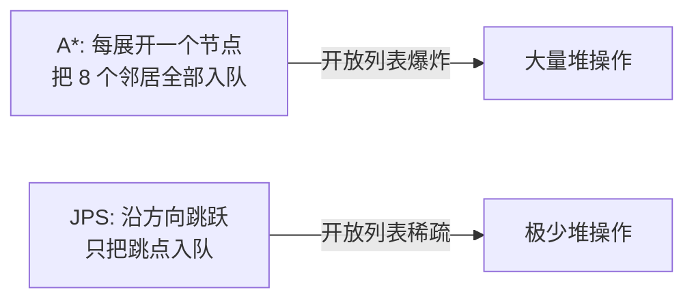
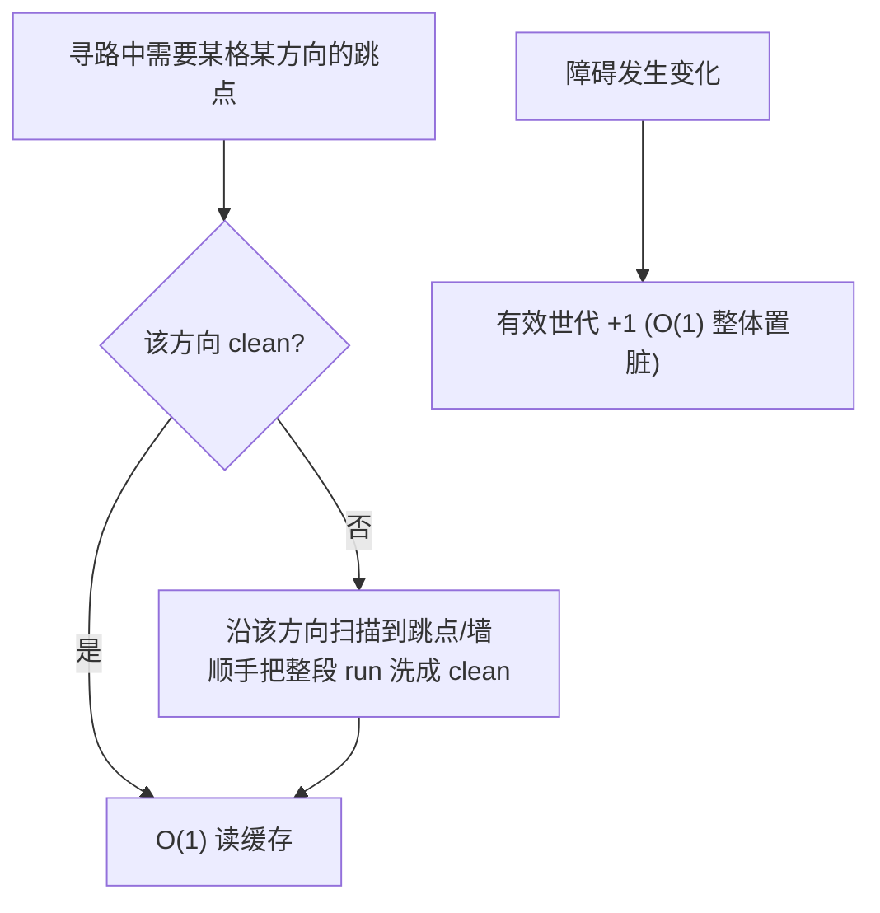

# JPS Pathfinding Playground

[](LICENSE)

一个用于**直观演示与测试 JPS（Jump Point Search，跳点搜索）寻路算法**的 Windows Forms 应用（.NET / C#）。
内置 A\* 对照、路径平滑、JSON 存档，以及把"跳点表更新过程"实时可视化的能力——非常适合用来理解 JPS 的内部机理。

> 刷阻挡 → 设起点/终点 → `JPS寻路` / `A*寻路`，即可看到搜索过程、最终路径、平滑路径，以及每个格子各方向跳点缓存的更新状态。

---

## 目录

- [功能一览](#功能一览)
- [一、JPS 算法核心原理](#一jps-算法核心原理)
  - [1. 网格与移动规则](#1-网格与移动规则)
  - [2. 剪枝思想：自然邻居与强迫邻居](#2-剪枝思想自然邻居与强迫邻居)
  - [3. 强迫邻居判定规则（forced neighbor）](#3-强迫邻居判定规则forced-neighbor)
  - [4. 走直线与走斜线的扫描规则](#4-走直线与走斜线的扫描规则)
  - [5. 为什么比 A\* 快](#5-为什么比-a-快)
- [二、本项目的核心实现](#二本项目的核心实现)
  - [1. Jump Table Lazy Update（惰性跳点表）](#1-jump-table-lazy-update惰性跳点表)
  - [2. 静态 / 动态障碍的兼容设计](#2-静态--动态障碍的兼容设计)
  - [3. 平滑方案的选择](#3-平滑方案的选择)
- [三、可视化说明](#三可视化说明)
- [四、工程与性能要点](#四工程与性能要点)
- [运行](#运行)

---

## 功能一览

| 类别 | 内容 |
|---|---|
| 编辑 | 阻挡画刷（点空地刷 2×2、点阻挡清 1 格）、设起点/终点、清空 |
| 寻路 | **JPS**、**A\***（对照），整数代价（横 1000 / 斜 1414，八方向 octile 启发） |
| 平滑 | 前向增量视线拉直（string pulling），红色折线叠加显示 |
| 存档 | 地图（阻挡 + 起终点）导出/载入 JSON |
| 可视化 | 已扩展 / 已入队未扩展 / 扫描跳过 / 路径 / 平滑路径；**每格 4 方向跳点缓存的 dirty/clean 状态点** |

---

## 一、JPS 算法核心原理

JPS 是对 A\* 在**均匀代价栅格**上的加速：它不改变最优性，而是利用栅格的对称性，把"每步看 8 个邻居"压缩成"沿方向一路跳过无意义的格子，只在**跳点**处停下入队"。

### 1. 网格与移动规则

- 8 邻接：4 个正交方向（↑↓←→）+ 4 个对角方向（↖↗↙↘）。
- 代价：正交 `1000`，对角 `1414`（≈ √2 × 1000），全整数。
- 启发式：八方向距离（octile）
  `h = (max(dx,dy) - min(dx,dy)) × 1000 + min(dx,dy) × 1414`
- 本项目采用**允许斜穿拐角**的模型：对角移动只要求目标格可走（不要求两侧正交格都空）。A\* 与 JPS 采用同一套移动规则，保证两者结果可比。

### 2. 剪枝思想：自然邻居与强迫邻居

要理解 JPS，先理解它**为什么能跳过格子**。

在均匀代价栅格上，从起点到某格往往存在**大量代价相同的等价路径**（比如"先右后下"和"先下后右"完全等价）——这叫**路径对称性**。A\* 会把这些等价路径全部展开，做了大量重复功。**JPS 的本质就是打破这种对称：每个格子只保留一条"规范路径"，把其余等价分支全部剪掉。**

具体地，从父节点 `p` 沿某方向走到当前节点 `n` 后，把 `n` 的邻居分成两类：

| 类别 | 定义 | 处理 |
|---|---|---|
| **自然邻居（natural）** | 不经过 `n`、用同样或更短代价也能到达 | **剪掉**（交给别的路径去走） |
| **强迫邻居（forced）** | 因为旁边有**阻挡**，绕过去只能经过 `n` | **保留** |

> 一旦某个格子存在强迫邻居，它就是一个**跳点（jump point）**——必须在此停下、入开放列表，因为路径可能要在这里"拐弯"。**没有强迫邻居的格子可以一路跳过，根本不必入队。** 这就是 JPS 省下绝大部分开销的根源。

所以 JPS 的两个关键问题就是：**怎么判定强迫邻居（→ 找跳点）**，以及**怎么沿方向高效扫描跳点**。下面两节分别回答。

### 3. 强迫邻居判定规则（forced neighbor）

强迫邻居总是由**阻挡**造成的（`X` = 阻挡，箭头 = 移动方向，`F` = 强迫邻居）：

**直线移动（以向右 → 为例）**：当 `n` 正上/正下被挡，但其**斜前方**可走时，斜前方就是强迫邻居（绕过阻挡只能经过 `n`）：

```
 .  X  F      y-1 行: (x,y-1)=X 被挡, (x+1,y-1)=F 可走 → F 是强迫邻居
 .  n→ .      y   行: n 沿 → 前进
 .  .  .      y+1 行

规则: !walk(x, y-1) && walk(x+1, y-1)   （上侧强迫）
      !walk(x, y+1) && walk(x+1, y+1)   （下侧强迫）
```

**对角移动（以 ↘ 为例，dx=+1, dy=+1）**：当某个正交"身后"方向被挡、而其对应斜向可走时，产生强迫邻居：

```
规则: !walk(x-dx, y)  && walk(x-dx, y+dy)   → 强迫邻居 (x-dx, y+dy)
      !walk(x, y-dy)  && walk(x+dx, y-dy)   → 强迫邻居 (x+dx, y-dy)
```

> 实现见 [`JpsRules`](JPS/Pathfinding/JpsRules.cs)：`HasCardinalForcedNeighbor` / `HasDiagonalForcedNeighbor`。
> ⚠️ 强迫邻居判定的方向必须与剪枝时实际探索的方向**严格一致**（看"前进方向 `x+dx`"而不是"身后 `x-dx`"），否则会漏掉真正的跳点导致找不到路——这是实现 JPS 最容易踩的坑之一。

### 4. 走直线与走斜线的扫描规则

**直线跳跃**（沿单一正交方向）：

1. 一格格沿该方向推进。
2. 撞墙/越界 → 该方向无跳点。
3. 到达终点 → 终点即跳点。
4. 当前格出现强迫邻居 → 当前格是跳点，停止并返回。

**对角跳跃**（沿对角方向）：

1. 一格格沿对角推进；撞墙/越界 → 无跳点；到达终点 → 返回。
2. 当前对角格出现对角强迫邻居 → 是跳点，返回。
3. **关键递归**：在每个对角格上，先沿它的两个正交分量做"直线跳跃"；只要任一分量能找到跳点，当前对角格就也算跳点并返回。

这条"对角每步派生两次直线扫描"的递归，是对角跳跃天然比直线贵的原因（最坏 O(L²)）——本项目用[惰性正交缓存](#2-jump-table-lazy-update惰性跳点表)把它降回接近 O(L)。

### 5. 为什么比 A\* 快

把前面的剪枝思想落到开销上，就能看出 JPS 相对 A\* 的优势：



- **A\***：把每个可走格都放进优先队列，反复做堆的入队/出队。
- **JPS**：沿方向连续推进时，中间格子只是被"扫一眼"（不入队、不展开、不做堆操作），**只有跳点进入开放列表**。

由于跳点数量远小于格子数量，JPS 的开放列表节点数、堆操作次数都大幅下降，因此通常比 A\* 快一个量级；而启发式可采纳、移动规则一致，所以**结果与 A\* 同样最优**（本项目用 600+ 组随机地图对照验证两者代价完全一致）。

---

## 二、本项目的核心实现

### 1. Jump Table Lazy Update（惰性跳点表）

这是本项目的核心设计。

经典 JPS+ 会**预计算**一张"每格每方向到下一个跳点/墙的距离"表，把跳跃加速到 O(1)。但这张表依赖障碍布局——**障碍一变就要全量重建 O(N)**，对频繁变化的障碍非常不友好。

本项目**不做任何 eager 预计算**，把跳点表改为"**用到哪格才更新哪格**"的惰性缓存。

**数据结构（仅正交 4 方向）**：每格每正交方向存一个带符号距离（`>0` = 跳点距离，`≤0` = 到墙距离）+ 一个**世代戳**。

**三个操作**：

| 事件 | 处理 | 复杂度 |
|---|---|---|
| 障碍变化（`Version` 改变） | 全局有效世代 `+1` → 整张表瞬间全部 dirty | **O(1)** |
| 查询某格某方向（clean） | 直接读缓存 | **O(1)** |
| 查询某格某方向（dirty） | 沿该方向扫一次找到跳点/墙，并把**整段 run 一起洗白** | O(L)，但一次扫描清一串 |

**为什么只缓存正交方向、对角永远扫描？** 这是本设计刻意的取舍，有三个理由：

1. **对角的瓶颈本来就在正交上**。回忆[对角扫描规则](#4-走直线与走斜线的扫描规则)：对角每走一步，都要沿它的两个正交分量各做一次直线扫描，所以对角跳跃最坏是 **O(L²)**。只要把这两次正交子检测改成"查正交缓存"，对角跳跃就降到接近 **O(L)**——**缓存正交，对角免费提速**，根本不需要单独给对角建表。

2. **正交缓存性价比极高**。重算一个正交表项的代价 = 一次直线扫描（O(L)），和"不缓存直接扫"一样；但一旦缓存，后续复用就是 **O(1)**，而且**一次扫描能顺手把整段 run 全部洗白**（一串格子共享同一个跳点/墙）。所以"扫一次、长期复用"非常划算。

3. **对角表项很难惰性维护，收益还小**。对角距离依赖"对角邻居的对角距离 + 沿途正交分量上的跳点"，一处障碍变化会沿**对角线扩散（ripple）**、且更新时要递归依赖正交结果，复杂且极易写错；而它能带来的额外收益，又已经被理由 1 的"对角复用正交缓存"基本吃掉了。投入产出比不划算，干脆不做。

> 此外，终点由[经典对角扫描](#4-走直线与走斜线的扫描规则)的 `==goal` 判定和正交子检测自然处理，也**不需要对角表来做目标导向**。



**意义**：

- **动态障碍零重建**：改障碍只是 `O(1)` 置脏，不重建任何表。
- **只为踩过的格子付费**：相比"全量重建 O(N)"，惰性方案只更新寻路实际触及的格子；查询若只覆盖局部，开销远小于 O(N)。
- **跨查询复用**：两次障碍变化之间的多次寻路，会不断复用已洗白的跳点，越用越快——明显优于纯逐格扫描。
- 用**世代计数器**而非 bool 数组，使"整体置脏"真正 O(1)（无需遍历清零）。

> 实现见 [`JpsPathfinder`](JPS/Pathfinding/JpsPathfinder.cs) 的 `CardinalDist`（惰性正交 memo）与 `DiagonalJump`（复用 memo 的经典对角扫描）。

### 2. 静态 / 动态障碍的兼容设计

传统做法会区分"**静态障碍**（进预计算表）"和"**动态障碍**（不进表、寻路时特殊处理）"，因为预计算表重建代价高，不能让频繁变化的动态障碍触发重建。

但在本项目里，跳点表已经是[上一节的惰性更新](#1-jump-table-lazy-update惰性跳点表)——**任何障碍变化都只是 O(1) 整体置脏**，根本没有"重建代价"。于是这个区分就失去了意义：

> 既然改任何障碍都只要 O(1) 置脏，"静态 vs 动态"在算法层就**没有区别了**——障碍只有"此刻能不能走"这一个属性。

因此本项目**彻底统一为一种障碍**：

- 只有**一种障碍** + 一个版本号 [`GridMap.Version`](JPS/Models/GridMap.cs)：任何增删 → `Version++` → 惰性跳点表整体置脏。
- 寻路 / 跳点表 / A\* 一视同仁地看 `IsWalkable`，不关心障碍"来源"。
- 没有静态/动态两套逻辑、没有"动态障碍回退到经典扫描"的分支、没有手动预计算按钮——架构大幅简化。

换句话说：**惰性跳点表把"动态障碍"这个难题直接消解掉了**——所有障碍天然都是"动态"的，且代价为零。

### 3. 平滑方案的选择

栅格寻路得到的是"贴格子的折线"，需要平滑成更自然的路径。我们对比了多种方案，最终选择**前向增量视线拉直（forward-incremental string pulling）**：

| 方案 | 复杂度 | 在栅格上的表现 | 结论 |
|---|---|---|---|
| 末端贪心拉直（找最远可视点） | 最坏 O(n³) | 质量略好一点点 | 太慢 |
| **前向增量拉直（本项目）** | **O(n·L)** | 与末端贪心几乎同质量 | ✅ 采用 |
| 漏斗算法 Funnel | O(n) | 受限于 1 格宽走廊，开阔区反而**更差** | 适合 navmesh，不适合栅格 |
| Theta\* | 慢（丢失 JPS 剪枝 + 全程 LOS） | any-angle 近最优 | 是"更好的寻路器"，非"更好的平滑器" |

- **视线检测**用整数 supercover 直线（与寻路同样整数、同样允许斜穿拐角），逐格判断线段是否穿障碍。
- **整数 / 浮点边界**：寻路全程整数；**浮点只出现在最终路径平滑与绘制**。平滑结果以连续坐标（格中心 = `cx+0.5`）输出，用红色折线叠加在原路径之上。

> 实现见 [`PathSmoother`](JPS/Pathfinding/PathSmoother.cs)。
> 注：JPS 与 A\* 即便代价相同，也可能走不同的等价最优栅格路；平滑是依赖输入的贪心算法，所以两者平滑结果可能不同——这是正常现象，非 bug。

---

## 三、可视化说明

| 颜色 / 标记 | 含义 |
|---|---|
| 灰底 / 近黑 | 可走格 / 阻挡 |
| 🟩 绿 | 已扩展（出队展开的跳点） |
| 🟪 紫 | 已入队未扩展（前沿） |
| 🟦 蓝灰 | 扫描跳过（射线经过但未进 open 的格子） |
| 🟡 金线 | 最终路径 |
| 🔴 红线 | 平滑后路径 |
| S / G | 起点 / 终点 |

**每格的十字 4 点** = 该格 4 个正交方向跳点缓存的状态（位置即方向：上 N、下 S、左 W、右 E）：

- 空心 = **dirty**（待计算）
- 白色实心 = 之前已缓存
- 橙色实心 = **本次寻路新更新**的方向

这组点让"惰性跳点表"的工作过程一目了然：编辑障碍后全部变空心（O(1) 整体置脏）；跑一次寻路，只有被触及的方向被点亮，其中本次新洗白的显示为橙色。

---

## 四、工程与性能要点

- **整数寻路**：代价、启发、g/f 全用整数（`long`），无浮点误差。
- **扁平数组替代哈希**：`g / parent / closed / 跳点缓存` 等逐节点数据按 `id = y·W + x` 索引，避免元组哈希开销。
- **世代戳免清零**：每次查询自增世代号判断"是否本次访问过"，无需每次清零数组。
- **缓冲区复用**：按地图尺寸只分配一次，跨多次查询复用，几乎零 GC。
- **零分配方向剪枝**：剪枝方向写入复用缓冲，无迭代器分配。
- **正确性验证**：600+ 组随机地图（含障碍中途变更）对照 A\*，路径代价与成败完全一致。

---

## 运行

需要 .NET（Windows，WinForms）。

```powershell
dotnet run --project JPS/JPS.csproj
```

操作：`刷阻挡` 画障碍 → `起点` / `终点` 标记 → `JPS寻路` 或 `A*寻路` 对比 → `保存` / `载入` 复现场景。

---

## 项目结构

分三层：**Models（纯地形模型）** / **Pathfinding（算法核心，UI 无关、可移植到 Unity 2022）** / **Controls + Form1（WinForms 界面）**。

```
JPS/
├── Models/                      # 纯模型层（无 UI 依赖）
│   ├── GridMap.cs               # 纯地形：尺寸 + 位压缩阻挡(ulong[]) + 版本号
│   └── MapData.cs               # JSON 存档模型（阻挡 + 起终点）
│
├── Pathfinding/                 # 算法核心（C# 9 / Unity 2022 友好，整数寻路）
│   ├── JpsDirections.cs         # 8 方向、整数代价(横1000/斜1414)、octile 启发
│   ├── JpsRules.cs              # 跳点 / 强迫邻居规则（neighbor / forced neighbor）
│   ├── JumpPointCache.cs        # 惰性正交跳点缓存（世代戳整体置脏；Dir4 内联值类型）
│   ├── JpsPathfinder.cs         # JPS：查/更新惰性正交缓存 + 经典对角扫描
│   ├── AStarPathfinder.cs       # A* 对照（位压缩状态：来向 sbyte + 合并 mark）
│   ├── PathSmoother.cs          # 前向增量视线拉直平滑（Vector2 按构建条件编译）
│   └── MinHeap.cs               # 二叉最小堆（替代 PriorityQueue，兼容 Unity）
│
├── Controls/                    # 视图/交互层（WinForms）
│   ├── GridControl.cs           # 网格绘制、交互、起终点、可视化（含跳点 dirty/clean 点）
│   ├── SearchOverlay.cs         # 寻路可视化叠加（与模型分离的视图状态）
│   └── EditMode.cs              # 编辑模式枚举（刷阻挡 / 起点 / 终点）
│
├── Form1.cs / Form1.Designer.cs # 工具栏、图例、存档对话框
└── Program.cs                   # 入口
```

> **可移植性**：`Models/` + `Pathfinding/` 不依赖 WinForms（仅用 `System` / `System.Collections.Generic` / 平滑层条件编译的 `Vector2`），可整体拷入 Unity 2022 使用；`Controls/` + `Form1` 是桌面演示界面，不进 Unity。

---

## 许可证

本项目以 **MIT License** 开源——可自由用于个人或**商业**用途：使用、复制、修改、合并、发布、分发、再授权、出售均不受限，只需在副本中保留版权与许可声明。详见 [LICENSE](LICENSE)。
