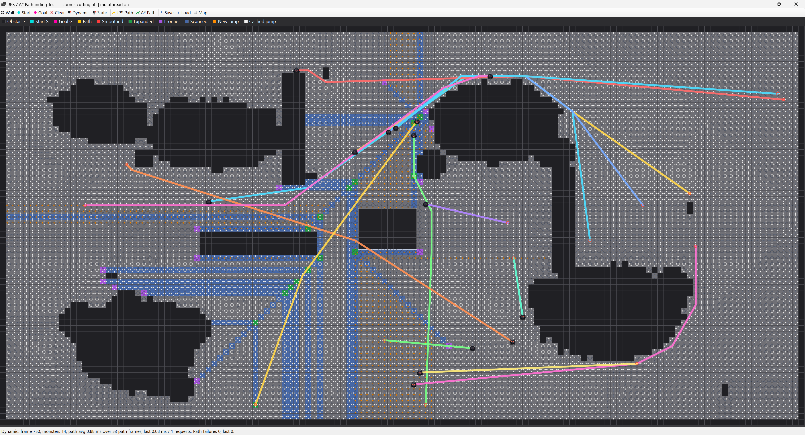
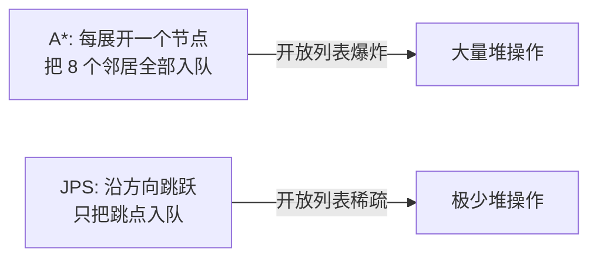
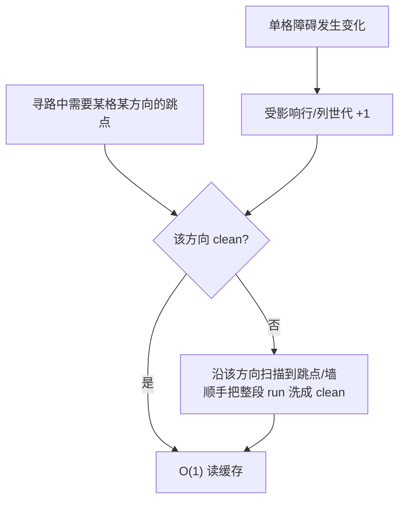
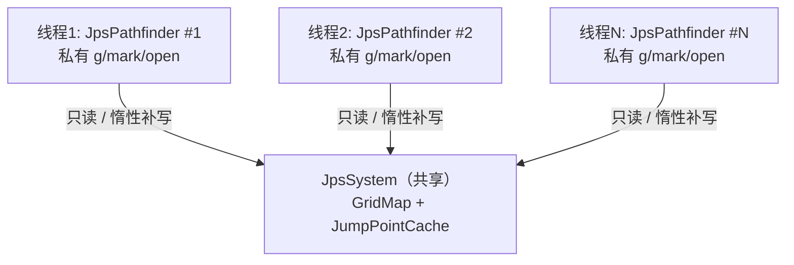
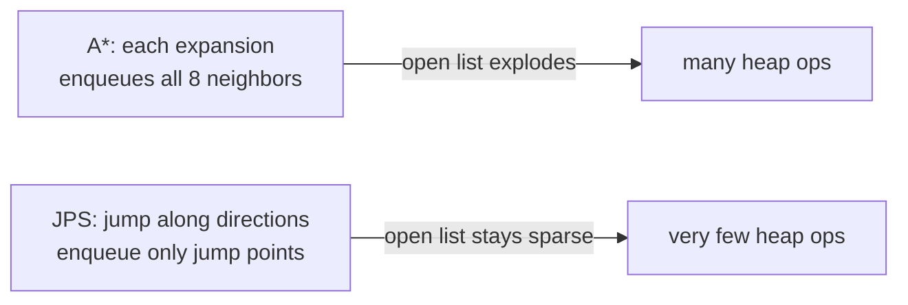
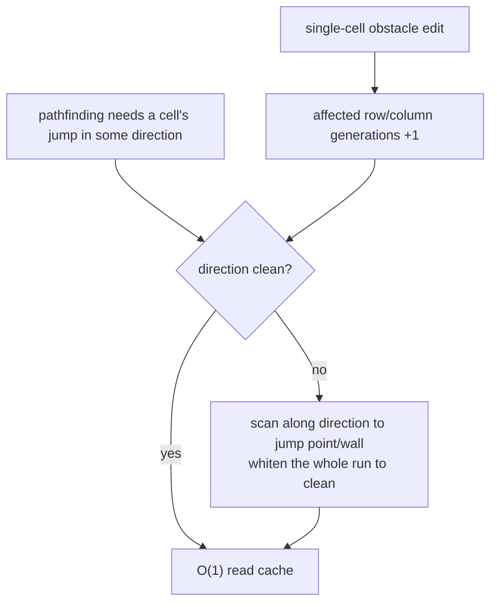
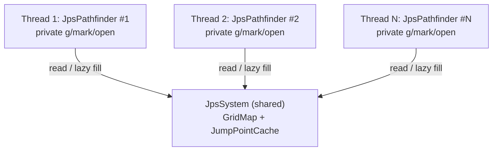

# JPS Pathfinding + Playground Visualization

[](LICENSE)



一个**工程化、可直接复用的 Jump Point Search 寻路实现**，严格遵循 Harabor & Grastien (SoCS'12) 的**禁止斜穿角**规则。算法核心是 UI 无关的可移植库（`netstandard2.1` / C# 9），可整体拷入 **Unity 2022**。<br>
_A **production-ready, reusable Jump Point Search implementation** that strictly follows the no-corner-cutting rules of Harabor & Grastien (SoCS'12). The core is a UI-agnostic, portable library (`netstandard2.1` / C# 9) that drops into **Unity 2022** wholesale._

工程分三层，各司其职：**A\*** 是准确性基准；**C# JPS** 是基础 JPS 算法的可移植参考实现；**C JPS（`JPS.Native`）** 是极致优化的跨平台 native 版本（桌面 / iOS / Android，可按平台构建为动态库或静态库）。三者在全部 7 个 [MovingAI](https://movingai.com/benchmarks/) 地图集上做百万级逐条验证与基准测试。仓库同时附带一个 Windows Forms **Playground**，把"跳点表更新过程"实时可视化，方便理解算法内部机理。<br>
_The project splits into three tiers with explicit roles: **A\*** is the accuracy baseline; **C# JPS** is the portable reference implementation of the base JPS algorithm; **C JPS (`JPS.Native`)** is the aggressively optimized cross-platform native build (desktop / iOS / Android, built as a dynamic or static library per platform). All three are validated and benchmarked at million-case scale across all 7 [MovingAI](https://movingai.com/benchmarks/) map sets. The repo also ships a Windows Forms **Playground** that visualizes the jump-table update process in real time._

**核心技术亮点 · Core Highlights**

- **惰性跳点表（本项目核心）**：不做任何预计算，跳点距离"用到哪格才算哪格"；单格障碍变化只标记受影响的行/列，`Sync` 时推进对应行/列世代，不重建全表，并跨查询持续复用已洗白的跳点，越跑越快。<br>
  _**Lazy jump table (the core idea):** no precomputation — jump distances are filled on demand; a single obstacle edit only marks affected rows/columns, `Sync` advances the corresponding row/column generations, and whitened jump points are reused across queries, with no table rebuild._
- **动态障碍零重建**：因惰性表把"重建代价"消解为零，静态/动态障碍统一为一种，改任意障碍都不触发重建。<br>
  _**Zero-rebuild dynamic obstacles:** since the lazy table reduces "rebuild cost" to zero, static and dynamic obstacles unify into one — editing any obstacle never triggers a rebuild._
- **无锁多线程共享缓存（默认开启）**：多个寻路器共享同一份缓存并**互相预热**，用 `Volatile` 对世代戳做 acquire/release 发布保证可见性与次序，免锁并行（x86 上额外开销可忽略；可移除 `JPS_CONCURRENT_CACHE` 退回单线程极速）。<br>
  _**Lock-free shared cache across threads (on by default):** many pathfinders share one cache and **warm it for each other**, publishing generation stamps with `Volatile` acquire/release for visibility and ordering — parallel without locks (negligible cost on x86; remove `JPS_CONCURRENT_CACHE` for single-thread max speed)._
- **全整数 + 零分配的高性能内核**：整数代价/启发、扁平数组、世代戳免清零、缓冲复用、近零 GC；**142.3 万条**官方 `.scen` 场景验证中，JPS 与 A\* 的整数代价 **处处相等（subopt=0）**、路径非法 **0**、漏解 **0**。与官方最优长度比对时，**142.3034 万条精确吻合**，3 条属于整数 `1414≈√2` 度量内的舍入容差，另 1 条仅与官方参考长度有 0.0315 格偏差。<br>
  _**All-integer, zero-allocation core:** integer cost/heuristic, flat arrays, generation stamps (no clearing), buffer reuse, near-zero GC. Across **1.423M** official `.scen` cases, JPS integer cost equals A\* **everywhere (subopt=0)**, with **0** illegal paths and **0** missed solutions. Against the official optimal lengths, **1.423034M** cases match exactly, 3 are normal integer-`1414≈√2` tolerance artifacts, and 1 differs only from the official reference length by 0.0315 cell._
- **A\* / C# JPS / C JPS 三层分工**：**A\*** 只负责给准确性兜底；`JPS.Core` 是 C# 基础算法与可移植参考实现；`JPS.Native` 是跨平台 C 原生极致优化版本（C11 API / SSE2 或 NEON 128 位 SIMD 位图扫描 / 按方向 SoA 缓存 + SIMD 回写 / 行·列级惰性失效 / guard band 免边界分支 / 打包节点状态）。C 版与 C# 版在 **142.3 万条**官方场景中 compact path 与平滑路径**逐点强一致**（`mism=0`），冷缓存随机改图+还原后仍一致。性能（AMD Ryzen 7 5800X3D，6 map workers）：C 原生 hot 比 A\* 快 **44.1–51.8×**，cold 比 A\* 快 **28.1–30.8×**；相对 C# JPS，C hot 快 **1.40–1.51×**，cold 快 **2.02–2.51×**。<br>
  _**A\* / C# JPS / C JPS split:** **A\*** is the accuracy ground truth; `JPS.Core` is the C# base algorithm and portable reference; `JPS.Native` is the aggressively optimized cross-platform C build (C11 API / SSE2 or NEON 128-bit SIMD bitmap scan / per-direction SoA cache + SIMD write-back / row·column-level lazy invalidation / guard band for branch-free bounds / packed node state). The C build returns the same compact path **and smoothed path, point for point,** as C# over **1.423M** official cases (`mism=0`), and stays identical after cold-cache random edit+restore checks. Performance (AMD Ryzen 7 5800X3D, 6 map workers): C native is **44.1–51.8×** faster than A\* on hot cache and **28.1–30.8×** on cold cache; compared with C# JPS, C is **1.40–1.51×** faster hot and **2.02–2.51×** faster cold._
- **工程化分层、可移植、有测试背书**：拆分为 `JPS.Core`（纯算法）/ `JPS.Data`（地图 I/O）/ `JPS.Native`（跨平台 C native）/ `JPS.Playground`（界面）/ `JPS.Benchmark`（性能基准）/ `JPS.Accuracy`（正确性）六个工程；C# 核心锁定 `netstandard2.1` / C# 9、不依赖 WinForms，可整体拷入 Unity 2022；native 核心可按目标平台编译为 Windows/macOS/Linux/iOS/Android 插件。<br>
  _**Layered engineering, portable, test-backed:** split into `JPS.Core` (pure algorithm) / `JPS.Data` (map I/O) / `JPS.Native` (cross-platform C native) / `JPS.Playground` (UI) / `JPS.Benchmark` (perf) / `JPS.Accuracy` (correctness); the C# core targets `netstandard2.1` / C# 9 with no WinForms dependency and drops into Unity 2022 wholesale; the native core can be compiled as a Windows/macOS/Linux/iOS/Android plugin for the target platform._

> Playground 用法：刷阻挡 → 设起点/终点 → `JPS寻路` / `A*寻路`，即可看到搜索过程、最终路径、平滑路径，以及每个格子各方向跳点缓存的更新状态。<br>
> _In the Playground: brush obstacles → set start/goal → `JPS寻路` / `A*寻路` to watch the search process, final path, smoothed path, and each cell's per-direction jump-cache update state._

> 中文正文在前，**English translation of the full body is appended after the Chinese sections** (see the right-hand links in the table of contents).

---

## 目录 · Table of Contents

> 每条左侧为中文锚点，右侧 `·` 后为英文锚点。 _Left link → Chinese section, right link (after `·`) → English section._

- [一、JPS 算法核心原理](#一jps-算法核心原理) · [Core Principles of JPS](#i-core-principles-of-jps)
  - [1. 网格与移动规则](#1-网格与移动规则) · [Grid and Movement Rules](#1-grid-and-movement-rules)
  - [2. 剪枝思想：自然邻居与强迫邻居](#2-剪枝思想自然邻居与强迫邻居) · [Pruning: Natural vs Forced Neighbors](#2-pruning-natural-vs-forced-neighbors)
  - [3. 强迫邻居判定规则](#3-强迫邻居判定规则forced-neighbor) · [Forced-Neighbor Rules](#3-forced-neighbor-rules)
  - [4. 走直线与走斜线的扫描规则](#4-走直线与走斜线的扫描规则) · [Straight and Diagonal Scanning](#4-straight-and-diagonal-scanning)
  - [5. 为什么比 A\* 快](#5-为什么比-a-快) · [Why It's Faster Than A\*](#5-why-its-faster-than-a)
- [二、本项目的核心实现](#二本项目的核心实现) · [Implementation Highlights](#ii-implementation-highlights)
  - [1. 惰性跳点表](#1-jump-table-lazy-update惰性跳点表) · [Jump Table Lazy Update](#1-jump-table-lazy-update)
  - [2. 静态 / 动态障碍的兼容设计](#2-静态--动态障碍的兼容设计) · [Unified Obstacle Model](#2-unified-obstacle-model)
  - [3. 平滑方案的选择](#3-平滑方案的选择) · [Path Smoothing](#3-path-smoothing)
  - [4. 无锁多线程：共享惰性缓存的并行寻路](#4-无锁多线程共享惰性缓存的并行寻路) · [Lock-Free Multithreading](#4-lock-free-multithreading)
  - [5. C Native 极致优化层](#5-c-native-极致优化层) · [C Native Optimization Layer](#5-c-native-optimization-layer)
  - [6. 确定性与帧同步](#6-确定性与帧同步deterministic-lockstep) · [Deterministic Lockstep](#6-deterministic-lockstep)
- [三、工程与性能要点](#三工程与性能要点) · [Engineering and Performance](#iii-engineering-and-performance)
  - [1. 内存开销对比](#1-内存开销对比) · [Memory Footprint](#1-memory-footprint)
  - [2. 性能表现（最新实测）](#2-性能表现最新实测) · [Performance](#2-performance-latest-measured)
- [四、使用说明](#四使用说明) · [Usage Guide](#iv-usage-guide)
  - [1. API 用法](#1-api-用法) · [API Usage](#1-api-usage)
  - [2. 项目结构](#2-项目结构) · [Project Structure](#2-project-structure)
  - [3. 运行测试](#3-运行测试) · [Run Tests](#3-run-tests)
  - [4. 运行 Playground](#4-运行-playground) · [Run Playground](#4-run-playground)
  - [5. 构建 Android 原生库](#5-构建-android-原生库ndk) · [Build the Android Native Library](#5-build-the-android-native-library-ndk)
  - [6. 在 Linux 上构建与测试](#6-在-linux-上构建与测试) · [Build and Test on Linux](#6-build-and-test-on-linux)

---

## 一、JPS 算法核心原理

JPS 是对 A\* 在**均匀代价栅格**上的加速：它不改变最优性，而是利用栅格的对称性，把"每步看 8 个邻居"压缩成"沿方向一路跳过无意义的格子，只在**跳点**处停下入队"。

### 1. 网格与移动规则

- 8 邻接：4 个正交方向（↑↓←→）+ 4 个对角方向（↖↗↙↘）。
- 代价：正交 `1000`，对角 `1414`（≈ √2 × 1000），全整数。
- 启发式：八方向距离（octile）
  `h = (max(dx,dy) - min(dx,dy)) × 1000 + min(dx,dy) × 1414`
- **对角移动默认禁止斜穿角（no-corner-cutting）**：对角移动要求目标格**及两侧正交格都可走**，不能从两块对角阻挡的缝里穿过。定义条件编译符号 `JPS_ALLOW_CORNER_CUTTING` 可恢复"允许斜穿拐角"（只要求目标格可走）。A\* 与 JPS 采用同一套移动规则，两种模式下结果都可比。

### 2. 剪枝思想：自然邻居与强迫邻居

要理解 JPS，先理解它**为什么能跳过格子**。

在均匀代价栅格上，从起点到某格往往存在**大量代价相同的等价路径**（比如"先右后下"和"先下后右"完全等价）——这叫**路径对称性**。A\* 会把这些等价路径全部展开，做了大量重复功。**JPS 的本质就是打破这种对称：每个格子只保留一条"规范路径"，把其余等价分支全部剪掉。**

具体地，从父节点 `p` 沿某方向走到当前节点 `n` 后，把 `n` 的邻居分成两类：

| 类别 | 定义 | 处理 |
|---|---|---|
| **自然邻居（natural）** | 不经过 `n`、用同样或更短代价也能到达 | **剪掉**（交给别的路径去走） |
| **强迫邻居（forced）** | 因为旁边有**阻挡**，绕过去只能经过 `n` | **保留** |

> 一旦某个格子存在强迫邻居，它就是一个**跳点（jump point）**——必须在此停下、入开放列表，因为路径可能要在这里"拐弯"。**没有强迫邻居的格子可以一路跳过，根本不必入队。** 这就是 JPS 省下绝大部分开销的根源。

所以 JPS 的两个关键问题就是：**怎么判定强迫邻居（→ 找跳点）**，以及**怎么沿方向高效扫描跳点**。下面两节分别回答。

### 3. 强迫邻居判定规则（forced neighbor）

强迫邻居总是由**阻挡**造成的（`X` = 阻挡，箭头 = 移动方向，`F` = 强迫邻居）：

**直线移动（以向右 → 为例）**：当 `n` 正上/正下被挡，但其**斜前方**可走时，斜前方就是强迫邻居（绕过阻挡只能经过 `n`）：

```
 .  X  F      y-1 行: (x,y-1)=X 被挡, (x+1,y-1)=F 可走 → F 是强迫邻居
 .  n→ .      y   行: n 沿 → 前进
 .  .  .      y+1 行

规则: !walk(x, y-1) && walk(x+1, y-1)   （上侧强迫）
      !walk(x, y+1) && walk(x+1, y+1)   （下侧强迫）
```

**对角移动（以 ↘ 为例，dx=+1, dy=+1）**：当某个正交"身后"方向被挡、而其对应斜向可走时，产生强迫邻居：

```
规则: !walk(x-dx, y)  && walk(x-dx, y+dy)   → 强迫邻居 (x-dx, y+dy)
      !walk(x, y-dy)  && walk(x+dx, y-dy)   → 强迫邻居 (x+dx, y-dy)
```

> 实现见 [`JpsRules`](JPS.Core/Pathfinding/JpsRules.cs)：`HasCardinalForcedNeighbor` / `HasDiagonalForcedNeighbor`。
> 注：上述对角规则是**允许斜穿拐角**模型；**默认禁止斜穿角**时严格按论文（Harabor & Grastien, SoCS'12）——**对角移动不产生强迫邻居，只有直线移动产生**（强迫邻居出现在"墙刚结束"处，正交与对角各一个），见 `JpsRules` / `FillDirections` 的 `#else` 分支。
> ⚠️ 强迫邻居判定的方向必须与剪枝时实际探索的方向**严格一致**（看"前进方向 `x+dx`"而不是"身后 `x-dx`"），否则会漏掉真正的跳点导致找不到路——这是实现 JPS 最容易踩的坑之一。

### 4. 走直线与走斜线的扫描规则

**直线跳跃**（沿单一正交方向）：

1. 一格格沿该方向推进。
2. 撞墙/越界 → 该方向无跳点。
3. 到达终点 → 终点即跳点。
4. 当前格出现强迫邻居 → 当前格是跳点，停止并返回。

**对角跳跃**（沿对角方向）：

1. 一格格沿对角推进；撞墙/越界 → 无跳点；到达终点 → 返回。
2. 当前对角格出现对角强迫邻居 → 是跳点，返回。
3. **关键递归**：在每个对角格上，先沿它的两个正交分量做"直线跳跃"；只要任一分量能找到跳点，当前对角格就也算跳点并返回。

这条"对角每步派生两次直线扫描"的递归，是对角跳跃天然比直线贵的原因（最坏 O(L²)）——本项目用[惰性正交缓存](#1-jump-table-lazy-update惰性跳点表)把它降回接近 O(L)。

### 5. 为什么比 A\* 快

把前面的剪枝思想落到开销上，就能看出 JPS 相对 A\* 的优势：



- **A\***：把每个可走格都放进优先队列，反复做堆的入队/出队。
- **JPS**：沿方向连续推进时，中间格子只是被"扫一眼"（不入队、不展开、不做堆操作），**只有跳点进入开放列表**。

由于跳点数量远小于格子数量，JPS 的开放列表节点数、堆操作次数都大幅下降，因此通常比 A\* 快一个量级；而启发式可采纳、移动规则一致，所以**结果与 A\* 同样最优**（本项目用 142.3 万条官方 `.scen` 与 A\* 逐条对照，整数代价不一致为 0）。

---

## 二、本项目的核心实现

本项目的设计理念是**把正确性、可读性和极限性能拆开承担**：A\* 保持朴素、稳定、可审计，专门作为准确性基准；C# JPS 保持可移植、易读、贴近论文语义，作为基础 JPS 算法的参考实现；C JPS 则在语义完全锁定后专注压榨性能。这样优化可以非常激进，但每一步都有两道护栏：先不能偏离 A\* 的最短路，再不能偏离 C# JPS 的逐格路径。

_The design philosophy is to **separate correctness, readability, and peak performance**. A\* stays simple, stable, and auditable as the accuracy baseline; C# JPS stays portable, readable, and close to the paper semantics as the base JPS reference; C JPS then pursues performance aggressively after the semantics are locked down. That allows native optimization to be bold while still being guarded twice: it must not diverge from A\*'s shortest path cost, and it must not diverge from the C# JPS cell-by-cell path._

### 1. Jump Table Lazy Update（惰性跳点表）

这是本项目的核心设计。

经典 JPS+ 会**预计算**一张"每格每方向到下一个跳点/墙的距离"表，把跳跃加速到 O(1)。但这张表依赖障碍布局——**障碍一变就要全量重建 O(N)**，对频繁变化的障碍非常不友好。

本项目**不做任何 eager 预计算**，把跳点表改为"**用到哪格才更新哪格**"的惰性缓存。

**数据结构（仅正交 4 方向）**：每格每正交方向存一个带符号距离（`>0` = 跳点距离，`≤0` = 到墙距离）+ 一个**世代戳**；缓存还维护每行的 E/W 有效世代、每列的 S/N 有效世代。

**三个操作**：

| 事件 | 处理 | 复杂度 |
|---|---|---|
| 单格障碍变化（`Version` 改变） | 地图侧推进 `y-1..y+1` 行影响版本与 `x-1..x+1` 列影响版本 | **O(L)** 编辑标记 |
| `Sync` 同步缓存版本 | C# 对比行/列版本并推进变化线的有效世代；C native 用 dirty rows/cols 直接推进变化线 | C# O(W+H)；C native O(变化线数) |
| 整图清空 / 重载后的缓存同步 | 推进全部行/列世代；旧距离不用清，靠世代失配判 dirty | O(W+H)，无 O(N) 跳点表重建 |
| 查询某格某方向（clean） | 直接读缓存 | **O(1)** |
| 查询某格某方向（dirty） | 沿该方向扫一次找到跳点/墙，并把**整段 run 一起洗白** | O(L)，但一次扫描清一串 |

> **水平扫描按字（64 格）批处理**：[`GridMap`](JPS.Core/Models/GridMap.cs) 把阻挡位图**按行对齐到 `ulong`**（每行行首落在 64 位边界、行尾 padding 预置为阻挡），于是横向那次"扫到跳点/墙"可在"当前行 / 上行 / 下行"三行的位图上**一次处理一个 `ulong` = 64 格**——用位运算定位最近的墙或强迫邻居（跨字进位复用相邻字、用 de Bruijn 取最低/最高置位），把横向单次扫描从 O(L) 降到约 **O(L/64)**；纵向仍逐格（行主序下同列相邻格不在同一个字，无法按字批处理）。实现见 [`JumpPointCache.HorizontalScan`](JPS.Core/Pathfinding/JumpPointCache.cs)。

**为什么只缓存正交方向、对角永远扫描？** 这是本设计刻意的取舍，有三个理由：

1. **对角的瓶颈本来就在正交上**。回忆[对角扫描规则](#4-走直线与走斜线的扫描规则)：对角每走一步，都要沿它的两个正交分量各做一次直线扫描，所以对角跳跃最坏是 **O(L²)**。只要把这两次正交子检测改成"查正交缓存"，对角跳跃就降到接近 **O(L)**——**缓存正交，对角免费提速**，根本不需要单独给对角建表。

2. **正交缓存性价比极高**。重算一个正交表项的代价 = 一次直线扫描（O(L)），和"不缓存直接扫"一样；但一旦缓存，后续复用就是 **O(1)**，而且**一次扫描能顺手把整段 run 全部洗白**（一串格子共享同一个跳点/墙）。所以"扫一次、长期复用"非常划算。

3. **对角表项很难惰性维护，收益还小**。对角距离依赖"对角邻居的对角距离 + 沿途正交分量上的跳点"，一处障碍变化会沿**对角线扩散（ripple）**、且更新时要递归依赖正交结果，复杂且极易写错；而它能带来的额外收益，又已经被理由 1 的"对角复用正交缓存"基本吃掉了。投入产出比不划算，干脆不做。

> 此外，终点由[经典对角扫描](#4-走直线与走斜线的扫描规则)的 `==goal` 判定和正交子检测自然处理，也**不需要对角表来做目标导向**。



**意义**：

- **动态障碍零重建**：单格改障碍只影响常数条相关行/列；同步后这些线上的对应方向失效，不重建任何跳点表。
- **只为踩过的格子付费**：相比"全量重建 O(N)"，惰性方案只更新寻路实际触及的格子；查询若只覆盖局部，开销远小于 O(N)。
- **跨查询复用**：两次障碍变化之间的多次寻路，会不断复用已洗白的跳点，越用越快——明显优于纯逐格扫描。
- 用**行/列世代计数器**而非 bool 数组，使局部失效无需遍历清零；单格变化只标记少数行/列，整图变化也只推进 W+H 条线。

> 实现见 [`JumpPointCache`](JPS.Core/Pathfinding/JumpPointCache.cs) 的 `CardinalDist`（惰性正交 memo）与 [`JpsPathfinder`](JPS.Core/Pathfinding/JpsPathfinder.cs) 的 `DiagonalJump`（复用 memo 的经典对角扫描）。

### 2. 静态 / 动态障碍的兼容设计

传统做法会区分"**静态障碍**（进预计算表）"和"**动态障碍**（不进表、寻路时特殊处理）"，因为预计算表重建代价高，不能让频繁变化的动态障碍触发重建。

但在本项目里，跳点表已经是[上一节的惰性更新](#1-jump-table-lazy-update惰性跳点表)——**障碍变化只会让受影响的行/列缓存失效**，根本没有"重建代价"。于是这个区分就失去了意义：

> 既然改单格障碍只影响常数条行/列，"静态 vs 动态"在算法层就**没有区别了**——障碍只有"此刻能不能走"这一个属性。

因此本项目**彻底统一为一种障碍**：

- 只有**一种障碍** + 一个全局版本号 [`GridMap.Version`](JPS.Core/Models/GridMap.cs) + 行/列影响版本：任何增删 → `Version++`，并推进相关 `RowVersion` / `ColVersion`，让对应方向缓存失效。
- 寻路 / 跳点表 / A\* 一视同仁地看 `IsWalkable`，不关心障碍"来源"。
- 没有静态/动态两套逻辑、没有"动态障碍回退到经典扫描"的分支、没有手动预计算按钮——架构大幅简化。

换句话说：**惰性跳点表把"动态障碍"这个难题直接消解掉了**——所有障碍天然都是"动态"的，代价从"重建整表"降为"让相关行/列失效，之后按需重算"。

### 3. 平滑方案的选择

栅格寻路得到的是"贴格子的折线"，需要平滑成更自然的路径。我们对比了多种方案，最终选择**前向增量视线拉直（forward-incremental string pulling）**：

| 方案 | 复杂度 | 在栅格上的表现 | 结论 |
|---|---|---|---|
| 末端贪心拉直（找最远可视点） | 最坏 O(n³) | 质量略好一点点 | 太慢 |
| **前向增量拉直（本项目）** | **O(n·L)** | 与末端贪心几乎同质量 | ✅ 采用 |
| 漏斗算法 Funnel | O(n) | 受限于 1 格宽走廊，开阔区反而**更差** | 适合 navmesh，不适合栅格 |
| Theta\* | 慢（丢失 JPS 剪枝 + 全程 LOS） | any-angle 近最优 | 是"更好的寻路器"，非"更好的平滑器" |

- **视线检测**用整数 supercover 直线（与寻路同样整数、同样的切角规则——默认禁止穿对角缝），逐格判断线段是否穿障碍。
- **整数 / 浮点边界**：寻路全程整数；**浮点只出现在最终路径平滑与绘制**。平滑结果以连续坐标（格中心 = `cx+0.5`）输出，用红色折线叠加在原路径之上。

> 实现见 [`PathSmoother`](JPS.Core/Pathfinding/PathSmoother.cs)。
> 注：JPS 与 A\* 即便代价相同，也可能走不同的等价最优栅格路；平滑是依赖输入的贪心算法，所以两者平滑结果可能不同——这是正常现象，非 bug。

### 4. 无锁多线程：共享惰性缓存的并行寻路

很多场景（如服务器同时为成百上千个单位寻路）希望**多个线程在同一张地图上并行寻路**。本项目的结构天然适合这件事，且做到了**无锁（lock-free）**。

#### 设计思路

**1) 拆分"共享只读态"与"线程私有态"。**
[`JpsSystem`](JPS.Core/Pathfinding/JpsSystem.cs) 持有 `GridMap` + `JumpPointCache`（**共享**）；每个 [`JpsPathfinder`](JPS.Core/Pathfinding/JpsPathfinder.cs) 只持有自己的逐节点搜索状态（`g / mark / open / parent …`，**线程私有**）。于是并行寻路 = 多个私有 pathfinder 各跑各的，唯一的交汇点就是那份共享缓存。



**2) 让共享缓存无需锁。** 关键观察：并行期间地图不变，所以缓存里每一项的**正确值是固定地图的纯函数**——不同线程对同一格同方向算出的 dist 必然相同。因此即使两个线程同时给同一格补写，也只是把**同一个值**写两遍，结果一致。剩下的唯一风险是**可见性与写入次序**：读者可能先看到"已 clean"的世代戳、却还没看到对应的 dist。

**3) 用 `Volatile` 的 acquire/release 保证发布次序（而非加锁）。** 世代戳 `gen` 是"发布标志"，按元素发布：

- **写者**：每格先**普通写** `dist`，再 `Volatile.Write(gen)` 发布该格世代戳。release 语义保证"此前的 dist 写"对 acquire 读者可见——即"看得到 gen 就一定看得到 dist"。
- **读者**：`Volatile.Read(gen)` 命中 clean（`gen == 所在行/列的有效世代`）后，再**普通读** `dist`。
- **按元素发布**：每格的 `gen` 只守护本格的 `dist`，所以逐格 release 即可——无需额外全屏障、也无需分两遍写。读热路径只是一次 **acquire 读**（半屏障，比全屏障便宜），无锁无竞争。

取字段引用用结构体的静态 `ref` 方法（`Dir4Byte.Slot`）+ `ref` 三元（结构体实例方法不能 `ref` 返回自身字段，CS8170）。这样既不需要互斥锁、也**不增加单格内存**（仍 12 B/格，AoS 布局不变，`gen`/`dist` 仍同缓存行），`Volatile` 只约束次序、不增字段。

**4) 多个 finder 互相预热缓存 → 越并行越快。** 这是共享缓存最甜的红利：缓存是[惰性洗白](#1-jump-table-lazy-update惰性跳点表)的，**哪条线段被走到，哪条线段才被扫描并洗白成 clean**。由于所有线程共享**同一份**缓存——

- 某个区域只要被**任意一个**线程第一个走到，就被它一次性扫描洗白；此后**所有线程**再经过该区域全是 O(1) 命中。
- 于是整段并行寻路里，每条线段的 O(L) 扫描代价**全局只付一次**，而不是"每线程各付一次"。线程越多、查询越密集、路径越重叠，复用率越高，**平均每次寻路反而越快**。

换句话说：多个 JPS finder 在共享缓存上**互相预热**——先跑的替后跑的把跳点铺好，把"建表"的成本摊薄到整个线程池上。（实测见[第三章工程与性能要点](#三工程与性能要点)：C hot overall 仍比 C# hot 快 1.41×，且比 A\* 快 45.1×。）

> ⚠️ 前提：并行寻路**之前**必须由**单线程**调用一次 `JpsSystem.Sync()`（确定缓存版本），且并行期间**不得修改地图**。要改地图就先 join 掉所有寻路线程，改完再 Sync、再并行。

> 具体用法（模式开关、C# / C 的并行调用范式）见[使用说明 · API 用法](#1-api-用法)的「多线程并行寻路」小节。

> **正确性验证**：[`JPS.Accuracy`](#3-运行测试) 默认在已开启 `JPS_CONCURRENT_CACHE` 时，按每张图加载后用 `CPU/2` 线程共享同一 `JpsSystem` 跑全部 `.scen`；最新结果覆盖 **142.3 万条**官方真实查询：JPS vs A\* 失败 0；C vs C# 的 compact path 与平滑路径逐点不一致 0；冷缓存随机改图+还原抽测 9.47 万例不一致 0——相当于持续复核共享缓存的多线程安全。

### 5. C Native 极致优化层

`JPS.Native` 不是另一套算法，而是**在 C# JPS 语义已经锁定后**做的跨平台原生性能实现：A\* 继续负责准确性兜底，C# JPS 负责基础算法参考，C native 必须与 C# compact path 一致。它的目标是把同一套 no-corner-cutting JPS 规则压到更低的固定开销、更高的缓存命中率和更少的边界分支，并可按目标平台编译到 Windows/macOS/Linux/iOS/Android。

源码层面保持 C11 风格的窄 API 和不透明句柄，移动端集成时可以按平台产物接入：iOS 通常编成静态库或 framework，Android 编成 `.so`，Unity/托管侧通过对应平台的 native plugin / P\Invoke 入口调用。仓库附带的 `JPS.Native.vcxproj` 是 Windows x64 的便捷工程，也是当前 README benchmark 使用的构建方式；Android 版则由 `CMakeLists.txt` + `ndkbuild.bat` / `ndkbuild.sh` 一键构建出 `libJPS.Native.so`（见[构建 Android 原生库](#5-构建-android-原生库ndk)）。两者都不限制 native 源码的目标平台。

核心结构仍然对应 C#：

- `jps_system` 对应 `JpsSystem`：拥有 `grid_map` + `jump_point_cache`，作为多次查询复用的地图/缓存容器。
- `jps_pathfinder` 对应 `JpsPathfinder`：只拥有线程私有搜索态、开放堆、路径结果和路径重建缓冲，可跨查询持久复用。
- C# 侧通过 P/Invoke / native plugin 调 `jps_system_create` / `jps_system_set_blocked_buffer` / `jps_system_set_blocked_batch` / `jps_system_sync` / `jps_pathfinder_find_path` / `jps_pathfinder_copy_path` / `jps_pathfinder_copy_smoothed_path`；对外只暴露 compact path 与平滑路径，不暴露 expanded path。benchmark 与 accuracy 在同一批用例上比较 C# 与 C。

主要优化点：

- **Guard band 位图**：C 地图在四周补恒阻挡哨兵带，`IsWalkable` 的 ±1 邻查和跳点扫描可以把越界自然当墙处理，热路径少掉边界分支。
- **SSE2 / NEON 双 SIMD 后端**：x86/x64 走 SSE2，ARM64/iOS/Android 走 NEON；同一套 128-bit SIMD 抽象服务于位图扫描与 16 位距离回写。
- **行 + 列双位图**：横向扫描走行位图，纵向扫描走转置后的列位图；两者都能复用同一套 128-bit SIMD 扫描逻辑，不再像 C# 参考实现那样只有横向按字加速。
- **按方向 SoA 跳点缓存**：`dist` / `gen` 拆成连续平面，配合 SIMD 一次写回多个 16 位距离；行方向用 `row_gen`，列方向用 `col_gen`，只让受影响的行/列失效。
- **高效地图同步**：整图初始化走 `jps_system_set_blocked_buffer`，局部动态改图走 `jps_system_set_blocked_batch`；`Sync` 根据 dirty rows / dirty cols 推进缓存世代，而不是每次全表清空。
- **低分配搜索热路径**：搜索状态按访问频率拆成 SoA，堆采用 hole-sift，compact path 用单个 packed `uint32_t` 数组直接完成父链收集与原地翻转，并和开放堆一起跨查询复用，避免每次 find path 的 malloc/free 抖动。

这层优化解释了当前 benchmark 的形态：hot 路径 C 主要赢在更紧的数据布局和更少分支；cold 路径 C 赢得更多，因为重扫/回写/同步受 SIMD、dirty row/col 和批量改图接口的影响更大。

### 6. 确定性与帧同步（Deterministic Lockstep）

**`JPS.Native` 的寻路结果是确定性的，可以用于帧同步游戏。** 给定完全相同的地图状态、起点、终点、移动规则和调用边界，各客户端会得到相同的 compact path 与平滑路径；缓存冷热状态、线程调度和 SIMD 后端只影响执行时间，不改变寻路结果。

确定性来自以下实现约束：

- 搜索代价、八方向启发式、LOS、跳点判断和父链重建全部使用整数运算；正交代价固定为 `1000`，对角代价固定为 `1414`，不存在浮点舍入参与分支判定。
- 方向枚举、邻居剪枝和开放堆比较顺序固定；存在多条等价最优路径时，同一输入仍选择同一条规范路径。
- SSE2 与 NEON 只执行等价的整数位运算和距离回填，不使用平台相关的浮点近似。
- 平滑的 LOS 决策仍为整数；输出坐标只是格中心 `x+0.5f, y+0.5f`，在支持的地图尺寸内可被 IEEE-754 `float` 精确表示。
- 共享惰性缓存只保存固定地图下的纯函数结果。同一缓存项即使被多个线程同时补写，写入的 `dist` 也相同，因此并发调度只改变哪一个线程先完成预热，不改变路径。

用于帧同步时必须遵守下面的调用契约：

1. 所有客户端使用相同的初始阻挡位图，并以相同顺序、在相同逻辑帧应用地图修改。
2. 地图修改完成后，在该逻辑帧的寻路批次开始前由单线程调用一次 `jps_system_sync()`；并行寻路期间不得修改地图或再次 `Sync`。
3. 每个工作线程使用独占的 `jps_pathfinder`；`jps_system` 及其惰性缓存可以由这些 finder 共享。
4. 所有客户端使用相同的移动规则和编译选项，尤其是 `JPS_ALLOW_CORNER_CUTTING` 必须一致。
5. 只把公开输出（compact path 或 smoothed path）用于同步逻辑；耗时、缓存命中状态以及内部结构体原始内存不属于同步状态。

在上述契约内，Windows x64 的 SSE2 构建与 iOS / Android / Linux 的 NEON 或 SSE2 构建具有相同的算法语义，适合作为确定性帧同步中的本地寻路模块。

---

## 三、工程与性能要点

- **三层验证**：A\* 作最短路准确性基准；C# JPS 作基础算法参考；C JPS 作 native 优化实现，必须与 C# compact path 一致。
- **整数寻路**：代价、启发、g/f 全用整数（`long`），A\* 与 JPS 在同一度量下比较，避免浮点误差污染判定。
- **扁平数组替代哈希**：`g / parent / closed / 跳点缓存` 等逐节点数据按 `id = y·W + x` 索引，避免元组哈希开销。
- **世代戳免清零**：每次查询自增世代号判断"是否本次访问过"，无需每次清零数组。
- **共享惰性跳点缓存**：正交跳点距离按地图共享，多个 C# pathfinder 可并发预热同一缓存。
- **跨平台 C native 数据布局**：SSE2/NEON 128-bit SIMD、guard-banded 位图消除边界分支，按方向 SoA 缓存提升连续访问，行/列 dirty 结构让局部改图只同步受影响区域。
- **低分配搜索热路径**：堆采用 hole-sift，compact path 以 packed `uint32_t` 单缓冲重建，剪枝方向和搜索状态等缓冲跨查询复用。
- **基准与准确性验证**：benchmark 按地图分组多线程执行并按分发顺序输出；accuracy 对 142.3 万条官方 `.scen` 做 A\*/C#/C 交叉验证。

### 1. 内存开销对比

两者的逐节点状态都是"按地图尺寸一次性分配、跨查询复用"的扁平数组（`N = 宽 × 高`）。逐格字节数精确如下：

| 数据 | 字段 | A\* | JPS | 归属 |
|---|---|---|---|---|
| g / 步数 / 父 | A\*: g `long` + 来向 `sbyte`（两数组）；JPS: g+步数+来向索引打包进一个 `ulong`（单数组，位[0,44)=g、[44,60)=steps、[60,64)=来向+1） | 9 | 8 | 每实例（线程私有） |
| 访问状态 | `2·gen` / `2·gen+1` 合并 seen/closed；A\*: `int`，JPS: `ushort`（gen 循环 1..32767） | 4 | 2 | 每实例（线程私有） |
| **搜索态小计** | | **13 B/格** | **10 B/格** | 每实例 |
| 跳点缓存 | `Dist` 4×`short` + `Gen` 4×`byte`（C# 为 AoS、gen/dist 同缓存行；C native 为按方向 SoA，字节数相同） | — | 12 | **每地图共享**（[`JpsSystem`](JPS.Core/Pathfinding/JpsSystem.cs)） |
| **合计** | | **13 B/格** | **22 B/格** | |

- **单实例**：JPS 约为 A\* 的 **~1.7×**。注意 JPS 的搜索态（10 B/格）其实比 A\*（13 B/格）更省——多出来的全在那张 12 B/格的正交跳点缓存（用空间换"跳跃 O(1)"的核心代价），净多约 9 B/格。C# 与 C native 现在搜索态布局一致（同为打包 `ulong` + `ushort`），仅缓存 AoS/SoA 之别，字节数相同。
- **多线程共享**：跳点缓存按地图只存一份、被所有线程共享，只有 10 B/格的搜索态随线程数线性增长。因 JPS 每实例搜索态比 A\* 更小，**线程数 ≥4 时 JPS 总内存反而低于 A\***。`T` 线程在 200×200（4 万格）地图上：

  | 线程数 | A\* | JPS |
  |---|---|---|
  | 1 | 0.52 MB | 0.88 MB（0.40 MB 搜索态 + 0.48 MB 共享缓存） |
  | 8 | 4.16 MB | 3.68 MB（3.20 MB 搜索态 + 0.48 MB 共享缓存） |

- 地图本身（[`GridMap._blocked`](JPS.Core/Models/GridMap.cs)）**按行对齐**位压缩（~1 bit/格，行尾 padding 可忽略，≈0.125 B/格；行对齐是为了水平按字扫描），两者共享，可忽略。
- 开放列表（[`MinHeap`](JPS.Core/Pathfinding/MinHeap.cs)）是动态结构、非 O(N) 固定：A\* 入队的节点数远多于 JPS（见下），其堆峰值内存也明显更大。
- 可视化数据完全不在算法核心里：寻路器只通过 [`ISearchObserver`](JPS.Core/Pathfinding/ISearchObserver.cs) 在展开/入队/扫描时发事件，收集与存储由 UI 层的采集器（[`SearchOverlay`](JPS.Playground/Controls/SearchOverlay.cs)）负责；不传 observer（`null`）时纯算法运行零额外开销。

### 2. 性能表现（最新实测）

当前性能口径与准确性口径分开：**A\*** 主要用来证明最优性，不再作为性能目标；**C# JPS** 是基础 JPS 算法的可移植参考；**C JPS** 是 native 优化目标。最新结果来自 `benchmark-results/combo-all-q1000-t6-20260705-034636.txt`，这是 Windows x64 / MSVC native 构建下的实测：**AMD Ryzen 7 5800X3D**（16 逻辑核，6 个 map worker）、.NET 10、`corner-cutting=off`、`concurrent-cache=on`、全部 7 个 MovingAI 地图集 **562 张图**。同一套 `JPS.Native` 源码也可面向 iOS/Android 构建，移动端绝对耗时需以目标设备重测。

两种测试口径：**rand** 每图 1000 组随机可解起终点，共 **56.2 万组**；**scen** 为官方 `.scen` 去重后的 **141.5 万组**，通常更长、更接近真实 benchmark。

加权平均每次查询耗时：

| 范围 | pairs | A\*/JPS 节点比 | C# cold | C cold | C# hot | C hot | A\*/C cold | A\*/C hot | C#/C cold | C#/C hot |
|---|---:|---:|---:|---:|---:|---:|---:|---:|---:|---:|
| rand | 562,000 | 55.6× | 85.35 us | 33.98 us | 27.77 us | 18.42 us | 28.1× | 51.8× | 2.51× | 1.51× |
| scen | 1,414,808 | 40.6× | 151.71 us | 75.20 us | 73.49 us | 52.55 us | 30.8× | 44.1× | 2.02× | 1.40× |
| overall | 1,976,808 | 42.1× | 132.84 us | 63.48 us | 60.49 us | 42.84 us | 30.4× | 45.1× | 2.09× | 1.41× |

总耗时摘要：

| 口径 | A\* | C# cold / hot | C cold / hot |
|---|---:|---:|---:|
| rand | 536.4 s | 48.0 s / 15.6 s | 19.1 s / 10.4 s |
| scen | 3279.9 s | 214.6 s / 104.0 s | 106.4 s / 74.3 s |

解读要点：

- **JPS 的算法收益很稳定**：overall 下 A\* 平均展开 `16,383` 个节点，JPS 平均展开 `389` 个节点，节点量约 **42.1×**。这是机器无关的核心收益。
- **C native 的定位成立**：C 相对 C# 在 cold 路径快 **2.09×**，hot 路径快 **1.41×**；cold 更赚，说明 guard band、row/col dirty sync、SIMD 位图扫描、SoA 回写和持久缓冲复用主要吃到了动态改图/缓存重扫场景。
- **A\* 适合作准确性基准，不适合作性能目标**：C hot overall 比 A\* 快 **45.1×**，C cold 也快 **30.4×**。A\* 的朴素性让它很适合兜底验证，但在大图上会被展开节点数拖垮。
- **地图形态决定上限**：开阔大图如 `bg512-map`、`wc3maps512-map` 的 A\*/C hot 可超过 **100×**；小图、短路径或随机散点中固定开销占比更高，倍率会收窄。
- **严格顺序输出的 benchmark 是并发吞吐测试**：当前按地图分组多线程执行，结果持续回传主线程，并按分发顺序输出；因此最终表格稳定可比，同时每 50 行重打表头。若排在前面的地图很慢，后面已完成的结果会等待轮到自己再打印。

正确性基准来自 `accuracy-results/scen-all-20260704-224247.txt`：有效非平凡用例 **1,423,038**；JPS vs A\* 失败 `0`、路径非法 `0`、C vs C# 的 compact path 与平滑路径逐点不一致 `0`、冷缓存随机改图+还原抽测 94,706 例不一致 `0`。仅 `1` 条与官方 reference length 有小偏差（0.0315 格），但 A\* / C# JPS / C JPS 内部一致，因此不影响 native 性能结论。

复现：

```powershell
dotnet run -c Release --project JPS.Benchmark -- combo 1000
dotnet run -c Release --project JPS.Accuracy
```

---

## 四、使用说明

### 1. API 用法

核心只有两个对象：**`JpsSystem`**（地图 + 共享跳点缓存，可长期持有）与 **`JpsPathfinder`**（搜索状态，线程私有、跨查询复用）。典型生命周期：**建图 → `Sync` → 多次寻路 → 改障碍 → `Sync` → 继续寻路**。C# 与 C 的 API 一一对应。

#### C# API

```csharp
using JPS.Models;        // GridMap
using JPS.Pathfinding;   // JpsSystem / JpsPathfinder / PathResult
using JPS.Data;          // MovingAiMap（可选，MovingAI .map 解析）

// ── 地图加载 ──
var map = new GridMap(64, 64);
map.SetBlocked(10, 10, true);                  // 逐格设置阻挡
// 或直接加载 MovingAI 基准地图：
// GridMap map = MovingAiMap.Parse(File.ReadAllText("movingai/bg512-map/AR0011SR.map"));

var system = new JpsSystem(map);               // 地图 + 惰性跳点缓存
system.Sync();                                 // 建图/改图后同步一次缓存

// ── 寻路 ──
var jps = new JpsPathfinder();                 // 可跨查询复用；一个线程一个
PathResult r = jps.FindPath(system, (2, 3), (60, 55));
if (r.Success)
{
    var compact  = r.Path;           // 整数格坐标：起点 + 跳点/拐点 + 终点
    var smoothed = r.SmoothedPath;   // 平滑路径连续坐标（格中心 = cx+0.5）
    int expanded = r.ExpandedNodes;  // 本次展开的节点数
}

// ── 动态障碍：改哪里失效哪里，永不重建全表 ──
map.SetBlocked(30, 30, true);                  // 任意增删障碍
map.SetBlocked(10, 10, false);
system.Sync();                                 // 再同步一次（O(W+H) 推进世代，非重建）

r = jps.FindPath(system, (2, 3), (60, 55));    // 继续寻路：未受影响的缓存全部复用
```

需要大体积物体和按 id 跟踪的动态矩形时，可使用 `JpsAdapter`。阔边会同时作用于静态阻挡、
动态阻挡和地图边界；动态矩形采用左上角 + 半开尺寸 `[x,x+w) × [y,y+h)`：

```csharp
var adapter = new JpsAdapter(map, obstaclePadding: 2); // 每边扩张 2 格

adapter.UpdateDynamicObstacle(id: 100, x: 20, y: 12, width: 4, height: 3);
adapter.UpdateDynamicObstacle(id: 100, x: 21, y: 12, width: 4, height: 3); // 下一帧移动
adapter.UpdateDynamicObstacle(id: 100, x: 0, y: 0, width: 0, height: 0);   // 删除

var largeAgentJps = new JpsPathfinder();             // 搜索状态独立；一个线程一个
adapter.Sync();                                      // 一帧批量更新后同步一次
PathResult largeAgentPath = largeAgentJps.FindPath(
    adapter.System, (3, 3), (58, 52));

// 一帧批量更新多个 id 后并行寻路：
adapter.Sync();
// 每个线程用自己的 JpsPathfinder，共享 adapter.System。
```

#### C API

与 C# 相同的生命周期；头文件只需 `jps.h`，链接 `JPS.Native.dll` / `libJPS.Native.so`。

```c
#include <stdlib.h>
#include "jps.h"

/* ── 地图加载 ── */
jps_system *s = jps_system_create(64, 64);
uint8_t cells[64 * 64] = {0};                    /* 行主序，0=可走，非 0=阻挡 */
cells[10 * 64 + 10] = 1;
jps_system_set_blocked_buffer(s, cells, 64 * 64);/* 整图一次性载入（逐格改用 jps_system_set_blocked） */
jps_system_sync(s);                              /* 建图/改图后同步一次缓存 */

/* ── 寻路 ── */
jps_pathfinder *pf = jps_pathfinder_create();    /* 可跨查询复用；一个线程一个 */
int n = jps_pathfinder_find_path(pf, s, 2, 3, 60, 55);   /* 返回 compact path 点数；负值见 JPS_ERR_ */
if (n > 0) {
    int *xy = malloc(sizeof(int) * n * 2);       /* 按返回的 n 分配：x0,y0,x1,y1,... 交错 */
    jps_pathfinder_copy_path(pf, xy, n);         /* 容量就传 n */

    int sn = jps_pathfinder_smoothed_path_count(pf);         /* 平滑路径点数（find_path 内已算好） */
    float *sxy = malloc(sizeof(float) * sn * 2); /* 同理按 sn 分配 */
    jps_pathfinder_copy_smoothed_path(pf, sxy, sn);          /* 只是拷贝缓存，无二次计算 */

    /* ... 使用 xy / sxy ... */
    free(sxy);
    free(xy);
}

/* ── 动态障碍：稀疏增量一次批量提交 ── */
int edits[] = { 30, 30, 1,   10, 10, 0 };        /* (x, y, blocked) 三元组 */
jps_system_set_blocked_batch(s, edits, 2);
jps_system_sync(s);

n = jps_pathfinder_find_path(pf, s, 2, 3, 60, 55);   /* 继续寻路 */

jps_pathfinder_destroy(pf);
jps_system_destroy(s);
```

大体积物体和动态矩形使用原生 `jps_adapter`；它与 C# `JpsAdapter` 语义一致：

```c
jps_adapter *a = jps_adapter_create_from_buffer(64, 64, 2, cells, 64 * 64);

jps_adapter_update_dynamic_obstacle(a, 100, 20, 12, 4, 3);
jps_adapter_update_dynamic_obstacle(a, 100, 21, 12, 4, 3); /* 下一帧移动 */
jps_adapter_update_dynamic_obstacle(a, 100, 0, 0, 0, 0);   /* 删除 */

jps_pathfinder *agent_pf = jps_pathfinder_create();          /* 搜索状态独立；一个线程一个 */
jps_adapter_sync(a);                                        /* 一帧批量更新后同步一次 */
int count = jps_pathfinder_find_path(
    agent_pf, jps_adapter_system(a), 3, 3, 58, 52);
if (count > 0) {
    int *path = malloc(sizeof(int) * count * 2);
    jps_pathfinder_copy_path(agent_pf, path, count);
    free(path);
}

/* 并行寻路：更新完一帧后同步，再让每线程自己的 pathfinder 共享 borrowed system。 */
jps_adapter_sync(a);
jps_system *shared = jps_adapter_system(a); /* 不要 destroy，也不要直接改阻挡 */

jps_pathfinder_destroy(agent_pf);
jps_adapter_destroy(a);
```

#### 多线程并行寻路

设计原理见[第二章 · 无锁多线程](#4-无锁多线程共享惰性缓存的并行寻路)。两种模式：

| 模式 | 如何启用 | 适用 |
|---|---|---|
| **无锁多线程**（默认） | 工程已在 `JPS.Core` 定义 `JPS_CONCURRENT_CACHE` | 多线程共享同一 `JpsSystem` 并行寻路；x86/x64 上额外开销可忽略 |
| **单线程极速** | 移除该符号 | `Volatile` 全部消失（退回普通读写），榨干单线程（尤其 ARM） |

多线程支持**默认开启**——`JPS.Core/JPS.Core.csproj` 的 `<PropertyGroup>` 已包含：

```xml
<DefineConstants>$(DefineConstants);JPS_CONCURRENT_CACHE</DefineConstants>
```

如需单线程极速（x86 上几乎无差别，ARM 上略有收益），删掉这行即可。

并行调用范式：

```csharp
var system = new JpsSystem(map);
system.Sync();                       // ① 并行前，单线程同步一次

Parallel.For(0, threads, _ =>
{
    var jps = new JpsPathfinder();   // ② 每个线程一个私有 pathfinder
    foreach (var (s, g) in queries)  //    共享同一个 system（只读 / 惰性补写缓存）
        jps.FindPath(system, s, g);
});                                  // ③ 并行期间不修改 map
```

C native 侧也是同一范式：一个共享 `jps_system` + 每个线程一个私有 `jps_pathfinder`。

```c
jps_system *system = jps_system_create(width, height);
jps_system_set_blocked_buffer(system, blocked, width * height);  // 行主序，0=可走，非0=阻挡
jps_system_sync(system);                                         // ① 并行前，单线程同步一次

/* 在线程池 / pthread / Unity native worker 中执行；并行期间不要修改 system 的地图 */
void worker(const query *queries, int count, int *path_xy, int capacity_points)
{
    jps_pathfinder *pf = jps_pathfinder_create();                // ② 每个线程一个私有 pathfinder

    for (int i = 0; i < count; ++i) {
        const query q = queries[i];                              // ③ 共享同一个 system（只读 / 惰性补写缓存）
        int n = jps_pathfinder_find_path(pf, system, q.sx, q.sy, q.gx, q.gy);
        if (n > 0)
            jps_pathfinder_copy_path(pf, path_xy, capacity_points);  // 取 compact path；path_xy 也应为线程私有
    }

    jps_pathfinder_destroy(pf);
}

/* join 全部 worker 后，才可以 set_blocked_batch / set_blocked_buffer + jps_system_sync */
jps_system_destroy(system);
```

> ⚠️ 并行的三条规则（对应注释 ①②③）：并行前由**单线程** `Sync` 一次；每个线程用**自己的** pathfinder；并行期间**不改地图**——要改就先 join 全部寻路线程，改完再 `Sync`、再并行。

### 2. 项目结构

解决方案 `JPS.slnx` 拆成**六个职责清晰的工程**：

| 工程 | 类型 / 目标框架 | 职责 |
|---|---|---|
| **JPS.Core** | 类库 · `netstandard2.1` / C# 9 | 纯算法核心，UI 无关、可直接拷入 **Unity 2022** |
| **JPS.Data** | 类库 · `netstandard2.1` / C# 9 | 地图数据 I/O：JSON 存档 + MovingAI `.map` 解析，引用 Core |
| **JPS.Native** | C11 native 库 · 跨平台 | C 原生高性能 JPS，实现 SSE2/NEON SIMD 位图扫描、guard band、SoA 跳点缓存、native pathfinder；可面向 Windows/macOS/Linux/iOS/Android 构建 |
| **JPS.Playground** | WinForms 应用 · `net10.0-windows` | 可视化演示界面，引用 Core/Data |
| **JPS.Benchmark** | 控制台 · `net10.0` | 性能基准 / 并发压测命令行，引用 Core/Data，并通过 P/Invoke 调用 `JPS.Native` |
| **JPS.Accuracy** | 控制台 · `net10.0` | MovingAI `.scen` 批量正确性测试（用 A* / 官方最优解校验 C# JPS 与 C native），引用 Core/Data，并通过 P/Invoke 调用 `JPS.Native` |

```
JPS.slnx                         # 解决方案
│
├── JPS.Core/                    # ① 算法核心（netstandard2.1 / C# 9，整数寻路，无 UI 依赖）
│   ├── Models/
│   │   └── GridMap.cs           # 纯地形：尺寸 + 按行对齐位压缩阻挡(ulong[]，供水平按字扫描) + 版本号
│   └── Pathfinding/
│       ├── JpsDirections.cs     # 8 方向、整数代价(横1000/斜1414)、octile 启发、斜走合法性(不切角)
│       ├── JpsRules.cs          # 跳点 / 强迫邻居规则（直接吃 GridMap，无委托）
│       ├── JumpPointCache.cs    # 惰性正交跳点缓存（行/列世代局部失效；水平按字 64 格批扫描；JPS_CONCURRENT_CACHE 宏控 Volatile 发布）
│       ├── JpsSystem.cs         # JPS 运行环境：共享的 GridMap + JumpPointCache（多线程共享单位）
│       ├── JpsPathfinder.cs     # JPS：查/更新惰性正交缓存 + 经典对角扫描（搜索态线程私有）
│       ├── AStarPathfinder.cs   # A* 对照（位压缩状态：来向 sbyte + 合并 mark）
│       ├── ISearchObserver.cs   # 搜索可观测钩子（展开/入队/扫描事件；可视化数据不进算法核心）
│       ├── PathSmoother.cs      # 前向增量视线拉直平滑（Vector2 按构建条件编译）
│       └── MinHeap.cs           # 二叉最小堆（替代 PriorityQueue，兼容 Unity）
│
├── JPS.Data/                    # ② 地图数据 I/O（netstandard2.1 / C# 9，引用 Core）
│   ├── MapData.cs               # JSON 存档模型（阻挡 + 起终点）
│   └── MovingAiMap.cs           # MovingAI .map 基准地图解析器（octile → GridMap）
│
├── JPS.Native/                  # ③ C 原生高性能实现（C11；Windows/macOS/Linux/iOS/Android）
│   ├── jps.h / jps_export.h     # 公共 C API（不透明句柄）与跨平台导出宏
│   ├── system.c/.h              # native JPS 系统：grid map + jump cache + pathfinder 生命周期
│   ├── grid_map.c/.h            # guard-banded 位图、行/列加速结构、blocked buffer 同步
│   ├── jump_point_cache.c/.h    # 按方向 SoA 跳点缓存、SIMD 扫描/回写、dirty 行列同步
│   ├── pathfinder.c/.h          # native JPS 搜索、持久化搜索缓冲、路径重建
│   ├── smoother.c/.h            # 平滑路径的 C 移植（supercover 视线 + 前向增量拉直，与 C# 逐点一致）
│   ├── min_heap.c/.h            # hole-sift 二叉最小堆
│   ├── rules.h / directions.h   # no-corner-cutting 跳点/强迫邻居规则；方向与整数代价
│   ├── jps_simd.h / jps_atomic.h # SSE2/NEON 128 位 SIMD 与原子/内存序的平台抽象
│   ├── JPS.Native.vcxproj       # Windows x64 便捷工程，输出 JPS.Native.dll
│   └── CMakeLists.txt + ndkbuild.bat/.sh   # Android NDK 构建脚本，输出 libJPS.Native.so（见「构建 Android 原生库」）
│
├── JPS.Playground/              # ④ WinForms 演示界面（引用 Core/Data）
│   ├── Controls/
│   │   ├── GridControl.cs       # 网格绘制、交互、起终点、可视化（含跳点 dirty/clean 点）
│   │   ├── SearchOverlay.cs     # 寻路可视化叠加：实现 ISearchObserver 作为采集器（视图状态）
│   │   ├── EditMode.cs          # 编辑模式枚举（刷阻挡 / 起点 / 终点）
│   │   └── Loc.cs               # 界面本地化（按系统语言中/英二选一，仅 UI 层）
│   ├── Form1.cs / Form1.Designer.cs   # 工具栏、图例、存档对话框
│   └── Program.cs               # WinForms 入口
│
├── JPS.Benchmark/               # ⑤ 命令行基准 / 压测（引用 Core/Data，通过 P/Invoke 调 native）
│   └── Benchmark.cs             # `combo [q] [子目录|workers] [workers]`：按地图分组并行跑随机投点 + .scen 合并基准，主线程按分发顺序输出
│
└── JPS.Accuracy/                # ⑥ MovingAI .scen 批量正确性测试（引用 Core/Data，通过 P/Invoke 调 native）
    └── Accuracy.cs              # `[子目录] [每scen最多用例数]`：用 A* + 官方最优解校验 JPS/C native；每图 CPU/2 线程共享 JpsSystem 并行（兼测多线程安全）
```

> **可移植性**：**JPS.Core** 与 **JPS.Data** 均锁定 `netstandard2.1` + C# 9（与 Unity 2022 对齐），仅依赖 `System` / `System.Collections.Generic` / `System.IO` / 平滑层条件编译的 `Vector2`——任何 net-only API 或 C#10+ 语法都会在此被编译期拦截，可整体拷入 Unity。**JPS.Native** 是跨平台 C native 核心，Windows 可用随仓库的 MSVC x64 工程，iOS/Android 可按平台编成 native plugin（iOS 静态库/framework，Android `.so`——Android 有现成的一键 NDK 脚本，见[构建 Android 原生库](#5-构建-android-原生库ndk)）。Playground / Benchmark 是桌面/命令行宿主，不进 Unity。
>
> **并发**：[无锁多线程模式](#4-无锁多线程共享惰性缓存的并行寻路)**默认开启**（`JPS.Core` 已定义 `JPS_CONCURRENT_CACHE`），多个 `JpsPathfinder` 可共享同一 `JpsSystem` 并行寻路；移除该符号则退回单线程极速模式。

### 3. 运行测试

运行完整正确性测试：

```powershell
dotnet run -c Release --project JPS.Accuracy
```

运行完整性能基准（随机投点 + 官方 `.scen` 合并，默认按地图分组并行）：

```powershell
dotnet run -c Release --project JPS.Benchmark -- combo 1000
```

缩小范围的常用形式（`combo [q] [子目录|workers] [workers]`：第二参为数字时作 worker 线程数、否则作 `movingai/` 子目录；`workers` 默认约为逻辑核数的一半；Accuracy 参数为 `[子目录] [每 .scen 最多用例数]`）：

```powershell
dotnet run -c Release --project JPS.Benchmark -- combo 200 bg512-map   # 只测 bg512-map，每图 200 组随机
dotnet run -c Release --project JPS.Benchmark -- combo 1000 8          # 全量，8 个 map worker
dotnet run -c Release --project JPS.Accuracy -- bg512-map 100          # 只验 bg512-map，每个 .scen 至多 100 条
```

> 两者都会通过 P/Invoke 加载 `x64\Release\JPS.Native.dll` 以便同批对比 C 与 C#——请先用 `JPS.Native.vcxproj`（x64 / Release）构建 native 库。

测试结果会写入 `accuracy-results/` 与 `benchmark-results/`，benchmark 主线程会按分发顺序持续输出结果，并每 50 行重打一遍表头。

### 4. 运行 Playground

需要 .NET（Windows，WinForms）。

```powershell
dotnet run --project JPS.Playground
```

界面语言按系统区域**自动选择**（`zh*` 为中文，其余英文）——工具栏按钮、提示、图例、状态栏、存档对话框一并切换（见 [`Loc`](JPS.Playground/Controls/Loc.cs)）。

工具栏按钮（中文标签 · 英文标签）：

| 按钮 | 作用 |
|---|---|
| **刷阻挡** · Wall | 刷障碍：点空地刷 2×2 阻挡，点阻挡清除 1 格 |
| **起点** · Start | 设置起点 |
| **终点** · Goal | 设置终点 |
| **清除** · Clear | 清空整张地图 |
| **JPS寻路** · JPS Path | 运行 JPS 并可视化搜索过程与路径 |
| **A\*寻路** · A* Path | 运行 A\*（对照）以作比较 |
| **保存** · Save | 把阻挡 + 起终点保存为 JSON |
| **载入** · Load | 从 JSON 载入地图 |
| **打开地图** · Open .map | 打开 **MovingAI** `.map` 基准地图（保持格子原始大小，超出窗口用滚动条查看） |

典型流程：**刷阻挡** 画障碍 → **起点** / **终点** 标记 → **JPS寻路** 或 **A\*寻路** 对比 → **保存** / **载入** 复现场景。

图例（工具栏与网格之间）把每种叠加色映射到含义，同样会本地化：

| 颜色 / 标记 | 含义 |
|---|---|
| 灰底 / 近黑 | 可走格 / 阻挡 |
| 🟩 绿 | 已扩展（出队展开的跳点） |
| 🟪 紫 | 已入队未扩展（前沿） |
| 🟦 蓝灰 | 扫描跳过（射线经过但未进 open 的格子） |
| 🟡 金线 | 最终路径 |
| 🔴 红线 | 平滑后路径 |
| S / G | 起点 / 终点 |

**每格的十字 4 点** = 该格 4 个正交方向跳点缓存的状态（位置即方向：上 N、下 S、左 W、右 E）：

- 空心 = **dirty**（待计算）
- 白色实心 = 之前已缓存
- 橙色实心 = **本次寻路新更新**的方向

这组点让"惰性跳点表"的工作过程一目了然：编辑单格障碍后，受影响行/列上的相关方向变空心；跑一次寻路，只有被触及的方向被点亮，其中本次新洗白的显示为橙色。

**MovingAI 地图**：点 **打开地图** 可载入任意 [MovingAI 基准地图](https://movingai.com/benchmarks/) `.map`（octile 格式）——例如仓库 `movingai/` 下的文件。网格会调整到地图的精确尺寸，**格子保持原始大小不缩小**，超出窗口的部分用滚动条查看（大图如 `orz900d` 1491×656 只渲染当前可见区域，滚动流畅）。滚轮可滚动查看，**`Ctrl` + 滚轮以鼠标位置为锚点缩放格子**（放大/缩小，2–64px）。地形按 MovingAI 约定二值化（`.`/`G`/`S` 可走，其余阻挡）。

**动态模式**：

点击 Playground 工具栏的 **动态（Dynamic）** 切换到一个围绕单个共享 `JpsSystem` 构建的固定尺寸压力场景。

- 方向键移动那块大的玩家可控障碍；阻挡画刷的编辑同样作用在这张实时 `GridMap` 上，怪物寻路前会先跑一次 `JpsSystem.Sync()`。
- 不规则的环境障碍在小范围内缓慢随机漂移，且不与怪物或玩家可控块重叠。
- 怪物是动画位图角色、不是地图障碍；它们靠每帧的预约表（reservation table）互相避让。
- 每只怪物缓存自己的路径，仅在以下情形才重新寻路：到达目标、下一步被阻挡/被预约、目标失效、或触发随机重寻概率。
- 并行的怪物寻路共享同一份跳点缓存，并从可复用对象池租借 `JpsPathfinder` 实例；若某一帧需要的并发寻路器多于现有数量，池会自动扩容。
- 怪物路径按各自颜色绘制。状态栏只统计**实际提交了寻路请求的帧**的平均寻路墙钟耗时，外加最近一次的请求数与累计失败数。

### 5. 构建 Android 原生库（NDK）

`JPS.Native` 的 Android 版用 CMake + Android NDK 构建，仓库提供一键脚本：

```powershell
cd JPS.Native
.\ndkbuild.bat        # Windows；Linux/macOS 用 ./ndkbuild.sh
```

- **NDK 查找顺序**：`--ndk-path` 参数 → `ANDROID_NDK_HOME` 环境变量 → 仓库本地 `JPS.Native/ndk/<平台>/`；都没有时自动从 Google 下载 **NDK r27d** 解压到本地使用，零手工配置。
- **默认目标**：只构建 `arm64-v8a`（min API 21，覆盖所有现代 64 位设备，Play Store 也要求 64 位）；需要 32 位 ARM 时加 `--abis "arm64-v8a;armeabi-v7a"`。
- **产物**：`build-android-<平台>/<abi>/lib/<abi>/libJPS.Native.so`，可直接作为 Unity / Android 工程的 native plugin。
- **跨平台一致性保证**（见 `CMakeLists.txt`）：`-ffp-contract=off -fno-fast-math` 禁止 FMA 融合与近似数学，使**平滑路径的浮点结果在 x86 / ARM 各 ABI 间逐位一致**（整数寻路本身与浮点无关）；`-fvisibility=hidden` 把 `.so` 的导出面收敛到公共 API（`jps_system_*` / `jps_pathfinder_*` / `jps_adapter_*`），与 Windows DLL 的导出行为对齐。

iOS / macOS 无需专用脚本：`JPS.Native` 是纯 C11、无外部依赖，把源码直接加入目标平台的构建（静态库 / framework / `.so`）即可。Linux 上跑 accuracy / benchmark 见下一节。

### 6. 在 Linux 上构建与测试

在 Linux（arm64 / x86_64）上构建原生库并跑 accuracy / benchmark：装好依赖后，用仓库根的 [`build-linux.sh`](build-linux.sh) 一键完成（编 `.so` + 构建两个托管工具 + 把 `.so` 复制到输出目录旁供 P/Invoke 解析）。

**依赖**（build 与测试仅在 **Ubuntu 24.04** 上验证过；下述包名按 Ubuntu 24.04 的仓库）：

```bash
sudo apt update
sudo apt install -y git build-essential cmake ninja-build clang lld dotnet-sdk-10.0
```

> `build-essential` / `clang` 提供 host 编译器（`build-linux.sh` 用 `cc` / `clang` 直接编 `.so`）；`cmake` / `ninja-build` / `lld` 供 [Android NDK 构建](#5-构建-android-原生库ndk)；`dotnet-sdk-10.0` 跑托管工具。

**构建**：

```bash
bash build-linux.sh
```

脚本三步：① 用 `cc` / `clang` 把 `JPS.Native/*.c` 编成 `libJPS.Native.so`（沿用与 CMake 一致的 `-O3 -flto -fvisibility=hidden` 及浮点确定性选项 `-ffp-contract=off -fno-fast-math`，保证平滑路径与 C# 逐位一致；按 `uname -m` 自动选 NEON / SSE2）；② `dotnet build` 两个托管工具；③ 把 `.so` 复制到各托管输出目录旁。可用环境变量覆盖：`CONFIG=Debug`、`CC=gcc`、`LTO=0`、`EXTRA_CFLAGS="-mcpu=native"`。

**运行**（从仓库根目录；参数与[第 3 节](#3-运行测试)一致）：

```bash
# 正确性：先跑子集确认 C≡C#，再全量
dotnet JPS.Accuracy/bin/Release/net10.0/JPS.Accuracy.dll dao-map 100
dotnet JPS.Accuracy/bin/Release/net10.0/JPS.Accuracy.dll

# 基准：combo，每图 1000 组随机 + 官方 .scen
dotnet JPS.Benchmark/bin/Release/net10.0/JPS.Benchmark.dll combo 1000 bg512-map
dotnet JPS.Benchmark/bin/Release/net10.0/JPS.Benchmark.dll combo 1000
```

结果写入 `accuracy-results/` 与 `benchmark-results/`（相对仓库根，与运行时 cwd 无关）。

---

## 许可证

本项目以 **MIT License** 开源——可自由用于个人或**商业**用途：使用、复制、修改、合并、发布、分发、再授权、出售均不受限，只需在副本中保留版权与许可声明。详见 [LICENSE](LICENSE)。

---
---

# English Translation

> Full English translation of the body above. Use the right-hand links in the [table of contents](#目录--table-of-contents) to jump here. ([↑ back to top](#jps-pathfinding--playground-visualization))

## I. Core Principles of JPS

JPS accelerates A\* on **uniform-cost grids**: it preserves optimality but exploits grid symmetry, compressing "examine 8 neighbors every step" into "jump along a direction over meaningless cells, stopping to enqueue only at **jump points**".

### 1. Grid and Movement Rules

- 8-connectivity: 4 cardinal directions (↑↓←→) + 4 diagonal (↖↗↙↘).
- Cost: cardinal `1000`, diagonal `1414` (≈ √2 × 1000), all integer.
- Heuristic: octile distance
  `h = (max(dx,dy) - min(dx,dy)) × 1000 + min(dx,dy) × 1414`
- **Diagonal moves forbid corner-cutting by default (no-corner-cutting):** a diagonal move requires the target cell **and both flanking cardinal cells** to be walkable — it cannot slip through the gap between two diagonal obstacles. Define the compile symbol `JPS_ALLOW_CORNER_CUTTING` to restore corner-cutting (target cell only). A\* and JPS share the exact same movement rules, so results stay comparable in either mode.

### 2. Pruning: Natural vs Forced Neighbors

To understand JPS, first understand **why it can skip cells**.

On a uniform-cost grid there are usually **many equal-cost equivalent paths** from the start to a given cell (e.g. "right then down" equals "down then right") — this is **path symmetry**. A\* expands all of these equivalents, doing lots of redundant work. **JPS breaks this symmetry: each cell keeps only one "canonical path" and prunes all other equivalent branches.**

Concretely, after moving from parent `p` along some direction to the current node `n`, `n`'s neighbors split into two kinds:

| Kind | Definition | Action |
|---|---|---|
| **Natural** | Reachable with equal or shorter cost without going through `n` | **Pruned** (left to another path) |
| **Forced** | Because of a nearby **obstacle**, the only way around is through `n` | **Kept** |

> Once a cell has a forced neighbor it is a **jump point** — we must stop and enqueue it, because the path may "turn" here. **Cells with no forced neighbor can be skipped entirely and never enqueued.** This is where JPS saves the bulk of its work.

So the two key questions for JPS are: **how to detect forced neighbors (→ find jump points)** and **how to scan for jump points along a direction efficiently**. The next two sections answer each.

### 3. Forced-Neighbor Rules

Forced neighbors are always caused by **obstacles** (`X` = obstacle, arrow = movement direction, `F` = forced neighbor):

**Straight move (rightward → as example):** when the cell directly above/below `n` is blocked but its **diagonal-ahead** cell is walkable, that diagonal cell is a forced neighbor (the only detour is through `n`):

```
 .  X  F      row y-1: (x,y-1)=X blocked, (x+1,y-1)=F walkable → F is forced
 .  n→ .      row y  : n advances along →
 .  .  .      row y+1

rule: !walk(x, y-1) && walk(x+1, y-1)   (forced above)
      !walk(x, y+1) && walk(x+1, y+1)   (forced below)
```

**Diagonal move (↘ as example, dx=+1, dy=+1):** when a cardinal "behind" direction is blocked while its corresponding diagonal is walkable, a forced neighbor appears:

```
rule: !walk(x-dx, y)  && walk(x-dx, y+dy)   → forced neighbor (x-dx, y+dy)
      !walk(x, y-dy)  && walk(x+dx, y-dy)   → forced neighbor (x+dx, y-dy)
```

> See [`JpsRules`](JPS.Core/Pathfinding/JpsRules.cs): `HasCardinalForcedNeighbor` / `HasDiagonalForcedNeighbor`.
> Note: the diagonal rules above are for the **corner-cutting** model; with **no-corner-cutting (default)**, per Harabor & Grastien (SoCS'12), **diagonal moves produce no forced neighbours — only straight moves do** (forced neighbours appear where a wall just ends); see the `#else` branch in `JpsRules` / `FillDirections`.
> ⚠️ The direction used for forced-neighbor detection must **exactly match** the direction actually explored during pruning (look at the "forward" `x+dx`, not "behind" `x-dx`), otherwise real jump points are missed and no path is found — one of the easiest JPS pitfalls.

### 4. Straight and Diagonal Scanning

**Straight jump** (along a single cardinal direction):

1. Step cell-by-cell along the direction.
2. Hit a wall / out of bounds → no jump point in this direction.
3. Reach the goal → the goal is a jump point.
4. Current cell has a forced neighbor → the current cell is a jump point; stop and return.

**Diagonal jump** (along a diagonal direction):

1. Step cell-by-cell diagonally; wall / out-of-bounds → no jump point; reach goal → return.
2. Current diagonal cell has a diagonal forced neighbor → it is a jump point; return.
3. **Key recursion:** at each diagonal cell, first run a "straight jump" along each of its two cardinal components; if either finds a jump point, the current diagonal cell counts as a jump point and returns.

This "each diagonal step spawns two straight scans" recursion is why diagonal jumping is inherently costlier than straight (worst case O(L²)) — this project uses a [lazy cardinal cache](#1-jump-table-lazy-update) to bring it back to near O(L).

### 5. Why It's Faster Than A\*

Mapping the pruning idea onto cost reveals JPS's edge over A\*:



- **A\***: puts every walkable cell into the priority queue, repeatedly pushing/popping the heap.
- **JPS**: while advancing along a direction, intermediate cells are merely "glanced at" (not enqueued, not expanded, no heap op); **only jump points enter the open list**.

Because jump points are far fewer than cells, JPS drastically cuts open-list size and heap operations, typically running an order of magnitude faster than A\*; with an admissible heuristic and identical movement rules, its **result is just as optimal as A\*** (validated against A\* over 1.423M official `.scen` cases with 0 integer-cost mismatches).

## II. Implementation Highlights

The design philosophy is to **separate correctness, readability, and peak performance**. A\* stays simple, stable, and auditable as the accuracy baseline; C# JPS stays portable, readable, and close to the paper semantics as the base JPS reference; C JPS then pursues performance aggressively after the semantics are locked down. That allows native optimization to be bold while still being guarded twice: it must not diverge from A\*'s shortest path cost, and it must not diverge from the C# JPS cell-by-cell path.

_本项目的设计理念是**把正确性、可读性和极限性能拆开承担**：A\* 保持朴素、稳定、可审计，专门作为准确性基准；C# JPS 保持可移植、易读、贴近论文语义，作为基础 JPS 算法的参考实现；C JPS 则在语义完全锁定后专注压榨性能。这样优化可以非常激进，但每一步都有两道护栏：先不能偏离 A\* 的最短路，再不能偏离 C# JPS 的逐格路径。_

### 1. Jump Table Lazy Update

This is the core design of the project.

Classic JPS+ **precomputes** a table of "distance from each cell, in each direction, to the next jump point/wall", accelerating jumps to O(1). But this table depends on obstacle layout — **any obstacle change forces a full O(N) rebuild**, which is hostile to frequently changing obstacles.

This project does **no eager precomputation** and instead turns the jump table into a "**update a cell only when it's actually used**" lazy cache.

**Data structure (cardinal 4 directions only):** each cell, per cardinal direction, stores one signed distance (`>0` = distance to a jump point, `≤0` = distance to a wall) + one **generation stamp**; the cache also keeps one valid generation per row for E/W and one per column for S/N.

**Three operations:**

| Event | Handling | Complexity |
|---|---|---|
| Single-cell obstacle edit (`Version` changes) | The map advances impact versions for rows `y-1..y+1` and columns `x-1..x+1` | **O(L)** edit marking |
| `Sync` cache-version update | C# compares row/column versions and advances changed line generations; C native uses dirty rows/cols to advance changed lines directly | C# O(W+H); C native O(changed lines) |
| Full clear / reload cache sync | Advance all row/column generations; old distances are left in place and ignored by generation mismatch | O(W+H), no O(N) jump-table rebuild |
| Query a cell/direction (clean) | Read the cache directly | **O(1)** |
| Query a cell/direction (dirty) | Scan once along the direction to a jump point/wall and **whiten the whole run at once** | O(L), one scan clears a whole strip |

> **The horizontal scan is bit-parallel (64 cells per word):** [`GridMap`](JPS.Core/Models/GridMap.cs) stores the obstacle bitmap **row-aligned to `ulong`** (each row starts on a 64-bit boundary; trailing padding is pre-set to blocked), so the horizontal "scan to jump point/wall" processes **one `ulong` = 64 cells at a time** over the current/above/below rows — bitwise locating the nearest wall or forced neighbor (cross-word carry reused from the adjacent word, lowest/highest set bit via de Bruijn) — cutting a single horizontal scan from O(L) to ~**O(L/64)**; vertical stays cell-by-cell (same-column neighbors aren't in one word under row-major). See [`JumpPointCache.HorizontalScan`](JPS.Core/Pathfinding/JumpPointCache.cs).

**Why cache only cardinal directions and always scan diagonals?** A deliberate trade-off, for three reasons:

1. **The diagonal bottleneck is actually in the cardinals.** Recall the [diagonal scanning rule](#4-straight-and-diagonal-scanning): each diagonal step runs a straight scan along each of its two cardinal components, so diagonal jumping is worst-case **O(L²)**. Just turning those two cardinal sub-checks into "read the cardinal cache" brings diagonal jumping down to near **O(L)** — **cache the cardinals, diagonals speed up for free**, no separate diagonal table needed.

2. **The cardinal cache has an excellent payoff.** Recomputing one cardinal entry costs one straight scan (O(L)), same as "scan without caching"; but once cached, reuse is **O(1)**, and **a single scan whitens the whole run** (a strip of cells sharing the same jump point/wall). So "scan once, reuse long-term" pays off handsomely.

3. **Diagonal entries are hard to maintain lazily and yield little.** A diagonal distance depends on "the diagonal neighbor's diagonal distance + jump points along the cardinal components"; one obstacle change **ripples along the diagonal** and updates recurse into cardinal results — complex and error-prone, while the extra benefit is already mostly absorbed by reason 1. Poor ROI, so it's skipped.

> Also, the goal is handled naturally by the [classic diagonal scan](#4-straight-and-diagonal-scanning)'s `==goal` test and the cardinal sub-checks, so **no diagonal table is needed for goal-targeting either**.



**Significance:**

- **Zero rebuild for dynamic obstacles:** a single-cell edit affects only a constant number of related rows/columns; after sync, only those lines' relevant directions become dirty, with no jump-table rebuild.
- **Pay only for the cells you step on:** versus "full O(N) rebuild", the lazy scheme only updates the cells pathfinding actually touches; if queries cover only a local region, the cost is far below O(N).
- **Cross-query reuse:** between two obstacle changes, multiple searches keep reusing whitened jump points, getting faster the more they run — clearly better than pure per-cell scanning.
- **Row/column generation counters** replace bool clearing: local invalidation does not clear cached cells, single-cell edits mark only a few lines, and whole-map changes still advance only W+H lines.

> See `CardinalDist` (lazy cardinal memo) in [`JumpPointCache`](JPS.Core/Pathfinding/JumpPointCache.cs), and `DiagonalJump` (classic diagonal scan reusing the memo) in [`JpsPathfinder`](JPS.Core/Pathfinding/JpsPathfinder.cs).

### 2. Unified Obstacle Model

The traditional approach distinguishes "**static obstacles** (go into the precomputed table)" from "**dynamic obstacles** (kept out of the table, special-cased at search time)", because rebuilding the precomputed table is expensive and must not be triggered by frequently changing dynamic obstacles.

But here the jump table is already the [lazy update from the previous section](#1-jump-table-lazy-update) — **obstacle changes only invalidate the affected row/column cache lines**, with no "rebuild cost". So the distinction loses its meaning:

> Since changing one obstacle only affects a constant number of rows/columns, "static vs dynamic" makes **no difference at the algorithm level** — an obstacle has only one property: "is it walkable right now".

So this project **unifies everything into a single obstacle type**:

- Only **one obstacle type** + one global version number [`GridMap.Version`](JPS.Core/Models/GridMap.cs) + row/column impact versions: any add/remove → `Version++`, then related `RowVersion` / `ColVersion` lines are advanced so the corresponding direction caches become dirty.
- Pathfinding / jump table / A\* all just look at `IsWalkable`, indifferent to an obstacle's "origin".
- No dual static/dynamic logic, no "dynamic obstacle falls back to classic scan" branch, no manual precompute button — the architecture is greatly simplified.

In other words: **the lazy jump table dissolves the "dynamic obstacle" problem entirely** — all obstacles are inherently "dynamic", and the cost drops from "rebuild the table" to "invalidate affected rows/columns and recompute on demand".

### 3. Path Smoothing

Grid pathfinding yields a "cell-hugging polyline" that needs smoothing into a more natural path. We compared several approaches and chose **forward-incremental line-of-sight string pulling**:

| Approach | Complexity | Behavior on grids | Verdict |
|---|---|---|---|
| End-greedy pulling (farthest visible point) | worst O(n³) | marginally better quality | too slow |
| **Forward-incremental pulling (this project)** | **O(n·L)** | nearly identical quality to end-greedy | ✅ adopted |
| Funnel algorithm | O(n) | limited by 1-cell-wide corridors, **worse** in open areas | great for navmesh, not grids |
| Theta\* | slow (loses JPS pruning + full LOS) | near-optimal any-angle | a "better pathfinder", not a "better smoother" |

- **Line-of-sight check** uses an integer supercover line (same integer math and the same corner rule as pathfinding — no diagonal corner-cutting by default), testing cell-by-cell whether the segment crosses an obstacle.
- **Integer / float boundary:** pathfinding is all-integer; **floats appear only in the final path smoothing and drawing**. The smoothed result is output as continuous coordinates (cell center = `cx+0.5`) and overlaid as a red polyline on the original path.

> See [`PathSmoother`](JPS.Core/Pathfinding/PathSmoother.cs).
> Note: even with identical cost, JPS and A\* may take different equivalent-optimal grid paths; smoothing is an input-dependent greedy algorithm, so their smoothed results can differ — this is normal, not a bug.

### 4. Lock-Free Multithreading

Many scenarios (e.g. a server pathfinding for hundreds/thousands of units at once) want **multiple threads pathfinding on the same map in parallel**. This project's structure suits that naturally, and does it **lock-free**.

#### Design

**1) Split "shared read-only state" from "thread-private state".**
[`JpsSystem`](JPS.Core/Pathfinding/JpsSystem.cs) holds `GridMap` + `JumpPointCache` (**shared**); each [`JpsPathfinder`](JPS.Core/Pathfinding/JpsPathfinder.cs) holds only its own per-node search state (`g / mark / open / parent …`, **thread-private**). So parallel pathfinding = many private pathfinders running independently, with the shared cache as their only meeting point.



**2) Make the shared cache lock-free.** Key observation: the map is unchanged during parallel runs, so **each cache entry's correct value is a pure function of the fixed map** — different threads compute the same dist for the same cell/direction. So even if two threads fill the same cell simultaneously, they just write the **same value** twice; the result is consistent. The only remaining risk is **visibility and write ordering**: a reader might see the "clean" generation stamp before the corresponding dist.

**3) Use `Volatile` acquire/release to guarantee publish ordering (instead of locking).** The generation stamp `gen` is the "publish flag", published per element:

- **Writer**: for each cell, **plainly write** `dist`, then `Volatile.Write(gen)` to publish that cell's stamp. Release semantics make the preceding `dist` write visible to an acquire reader — i.e. "if you can see gen, you can see dist".
- **Reader**: `Volatile.Read(gen)`; on a clean hit (`gen == the owning row/column valid generation`), **plainly read** `dist`.
- **Per-element publish**: each cell's `gen` guards only its own `dist`, so a per-cell release suffices — no extra full barrier and no two-pass write. The read hot path is just one **acquire load** (a half-fence, cheaper than a full barrier), lock-free and uncontended.

Field references use a static `ref` method on the struct (`Dir4Byte.Slot`) plus a `ref` conditional (a struct instance method can't `ref`-return its own field, CS8170). This needs no mutex and does **not increase per-cell memory** (still 12 B/cell, AoS layout unchanged, `gen`/`dist` stay on the same cache line); `Volatile` only constrains ordering, adds no fields.

**4) Multiple finders warm the cache for each other → faster the more parallel it gets.** This is the sweetest dividend of the shared cache: the cache is [lazily whitened](#1-jump-table-lazy-update) — **a strip is scanned and whitened to clean only when it's traversed**. Since all threads share **one** cache —

- A region scanned first by **any** thread is whitened once; afterward **all threads** hit it in O(1).
- So across the whole parallel run, each strip's O(L) scan is **paid globally once**, not "once per thread". The more threads, the denser the queries, the more the paths overlap — the higher the reuse, and the **lower the average time per search**.

In other words: multiple JPS finders **warm the shared cache for each other** — early runs lay out jump points for later ones, amortizing the "table-building" cost across the whole thread pool. (See the [performance note in chapter III](#iii-engineering-and-performance): C hot overall is still 1.41× faster than C# hot and 45.1× faster than A\*.)

> ⚠️ Prerequisite: **before** parallel pathfinding, a **single thread** must call `JpsSystem.Sync()` once (to fix the cache version), and the map **must not change** during parallel runs. To edit the map, join all pathfinding threads first, then Sync, then go parallel again.

> For concrete usage (mode switches, C# / C parallel calling patterns) see the "Multithreaded parallel pathfinding" part of [Usage Guide · API Usage](#1-api-usage).

> **Correctness check:** with `JPS_CONCURRENT_CACHE` on, [`JPS.Accuracy`](#3-run-tests) runs each map's full `.scen` set across `CPU/2` threads sharing one `JpsSystem` by default. The latest result covers **1.423M** official real-world queries with 0 JPS-vs-A\* failures, 0 C-vs-C# mismatches on either the compact or the smoothed path, and 0 mismatches across 94.7k sampled cold-cache edit+restore checks, continuously re-checking shared-cache thread safety.

### 5. C Native Optimization Layer

`JPS.Native` is not a different algorithm. It is the cross-platform native performance implementation built **after the C# JPS semantics are locked down**: A\* remains the accuracy ground truth, C# JPS remains the base algorithm reference, and C native must match the C# compact path. Its job is to run the same no-corner-cutting JPS rules with lower fixed overhead, better locality, and fewer bounds branches, and it can be compiled for Windows/macOS/Linux/iOS/Android.

At the source level it exposes a narrow C11-style API with opaque handles. On mobile, it can be integrated as the platform-appropriate native artifact: typically a static library or framework on iOS, and a `.so` on Android, called from Unity/managed code through the platform's native plugin / P/Invoke entry points. The included `JPS.Native.vcxproj` is the convenient Windows x64 project used for the README benchmark; the Android build ships as `CMakeLists.txt` + `ndkbuild.bat` / `ndkbuild.sh`, producing `libJPS.Native.so` in one command (see [Build the Android Native Library](#5-build-the-android-native-library-ndk)). Neither limits the target platforms of the native source.

The structure mirrors C#:

- `jps_system` corresponds to `JpsSystem`: it owns `grid_map` + `jump_point_cache`, and acts as the reusable map/cache container across queries.
- `jps_pathfinder` corresponds to `JpsPathfinder`: it owns only thread-private search state, the open heap, path result, and path-rebuild buffer, all retained across queries.
- C# calls it through P/Invoke / native plugins: `jps_system_create`, `jps_system_set_blocked_buffer`, `jps_system_set_blocked_batch`, `jps_system_sync`, `jps_pathfinder_find_path`, `jps_pathfinder_copy_path`, and `jps_pathfinder_copy_smoothed_path`. Public APIs expose compact path and smoothed path only; expanded per-cell paths are intentionally not exposed. Benchmark and accuracy run C# and C over the same cases.

Main optimizations:

- **Guard-banded bitmaps:** the C map adds always-blocked sentinel bands around the real grid, so ±1 neighbor checks and jump scans naturally treat out-of-bounds as walls with fewer hot-path bounds branches.
- **SSE2 / NEON SIMD backends:** x86/x64 use SSE2 and ARM64/iOS/Android use NEON; the same 128-bit SIMD abstraction serves bitmap scans and 16-bit distance write-back.
- **Row + column bitmaps:** horizontal scans use the row bitmap, vertical scans use a transposed column bitmap; both reuse the same 128-bit SIMD scan code, whereas the C# reference only has word-at-a-time acceleration horizontally.
- **Per-direction SoA jump cache:** `dist` / `gen` are stored as contiguous planes, enabling SIMD write-back of multiple 16-bit distances; row directions use `row_gen`, column directions use `col_gen`, invalidating only affected rows/columns.
- **Efficient map sync:** initial full loads use `jps_system_set_blocked_buffer`, sparse dynamic edits use `jps_system_set_blocked_batch`, and `Sync` advances cache generations from dirty rows / dirty columns instead of clearing the whole table.
- **Low-allocation search hot path:** search state is split by access frequency, the heap uses hole-sift, and a single packed-`uint32_t` compact-path buffer collects and reverses the parent chain in place; it and the open heap are reused across calls.

This explains the current benchmark shape: on hot cache, C mostly wins from tighter layout and fewer branches; on cold cache, C wins more because rescanning, write-back, and sync benefit directly from SIMD, dirty row/column tracking, and batched edit APIs.

### 6. Deterministic Lockstep

**`JPS.Native` produces deterministic pathfinding results and can be used in deterministic lockstep games.** Given the same map state, start, goal, movement rules, and call boundaries, every client obtains the same compact and smoothed paths. Cache temperature, thread scheduling, and the SIMD backend affect execution time only, not the result.

The implementation preserves determinism through these constraints:

- Search costs, the octile heuristic, LOS, jump-point tests, and parent-chain reconstruction all use integer arithmetic. Cardinal cost is fixed at `1000` and diagonal cost at `1414`; no floating-point rounding participates in search decisions.
- Direction enumeration, neighbor pruning, and open-heap comparison order are fixed, so the same canonical path is selected even when several equal-cost optimal paths exist.
- SSE2 and NEON perform equivalent integer bit operations and distance write-back, with no platform-dependent floating-point approximations.
- Smoothing still makes LOS decisions with integers. Its output is limited to cell centers, `x+0.5f, y+0.5f`, which are exactly representable as IEEE-754 `float` values throughout the supported map dimensions.
- The shared lazy cache stores pure-function results for a fixed map. Concurrent fills of the same cache entry write the same `dist`, so scheduling changes only which thread warms it first, not the resulting path.

Lockstep integration must follow this contract:

1. Every client starts from the same blocked-cell bitmap and applies map edits in the same order on the same simulation tick.
2. After edits, a single thread calls `jps_system_sync()` before that tick's pathfinding batch. The map must not be edited or synced again while parallel searches are running.
3. Each worker thread owns a separate `jps_pathfinder`; those finders may share one `jps_system` and its lazy cache.
4. Every client uses identical movement rules and build options, especially `JPS_ALLOW_CORNER_CUTTING`.
5. Only public outputs (the compact or smoothed path) participate in synchronized gameplay state. Timing, cache-hit state, and raw internal-struct memory do not.

Under this contract, Windows x64 SSE2 builds and iOS / Android / Linux NEON or SSE2 builds share the same algorithmic semantics and are suitable as the local pathfinding module in a deterministic lockstep simulation.

## III. Engineering and Performance

- **Three-tier validation:** A\* is the shortest-path accuracy baseline; C# JPS is the base algorithm reference; C JPS is the optimized native build and must match C# compact path.
- **Integer pathfinding:** cost, heuristic, g/f are all integer (`long`), so A\* and JPS are compared under the same metric with no floating-point noise.
- **Flat arrays instead of hashing:** per-node data (`g / parent / closed / jump cache`) is indexed by `id = y·W + x`, avoiding tuple-hash overhead.
- **Generation stamps avoid clearing:** each query increments a generation number to test "visited this run?", with no per-query array clear.
- **Shared lazy jump cache:** cardinal jump distances are shared per map, so multiple C# pathfinders can warm the same cache concurrently.
- **Cross-platform C native layout:** SSE2/NEON 128-bit SIMD, guard-banded bitmaps remove bounds branches, per-direction SoA cache improves sequential access, and row/column dirty structures sync only the locally affected areas after edits.
- **Low-allocation hot path:** the heap uses hole-sift, while path-rebuild nodes, pruning directions, and search state buffers are retained per map size.
- **Benchmark and accuracy harnesses:** benchmarks run map-grouped workers and emit rows in dispatch order; accuracy cross-checks A\*/C#/C over 1.423M official `.scen` cases.

### 1. Memory Footprint

Both keep per-node state as flat arrays "allocated once per map size, reused across queries" (`N = width × height`). Exact bytes per cell:

| Data | Field | A\* | JPS | Owner |
|---|---|---|---|---|
| g / steps / parent | A\*: g `long` + came-dir `sbyte` (two arrays); JPS: g+steps+came-dir index packed into one `ulong` (single array; bits[0,44)=g, [44,60)=steps, [60,64)=dir+1) | 9 | 8 | per instance (thread-private) |
| visit state | `2·gen` / `2·gen+1` merged seen/closed; A\*: `int`, JPS: `ushort` (gen cycles 1..32767) | 4 | 2 | per instance (thread-private) |
| **search-state subtotal** | | **13 B/cell** | **10 B/cell** | per instance |
| jump cache | `Dist` 4×`short` + `Gen` 4×`byte` (C#: AoS, gen/dist on same cache line; C native: per-direction SoA, same byte count) | — | 12 | **shared per map** ([`JpsSystem`](JPS.Core/Pathfinding/JpsSystem.cs)) |
| **total** | | **13 B/cell** | **22 B/cell** | |

- **Single instance:** JPS is about **~1.7×** A\*. Note JPS's search state (10 B/cell) is actually smaller than A\*'s (13 B/cell); the entire extra is the 12 B/cell cardinal jump cache (the space-for-"O(1) jump" trade-off), a net +9 B/cell. C# and C native now share the same search-state layout (packed `ulong` + `ushort`), differing only in AoS vs SoA cache layout at identical byte count.
- **Multithread sharing:** the jump cache is stored once per map and shared by all threads; only the 10 B/cell search state grows linearly with thread count. Since JPS's per-instance search state is smaller than A\*'s, **at ≥4 threads JPS total memory drops below A\***. For `T` threads on a 200×200 (40k-cell) map:

  | Threads | A\* | JPS |
  |---|---|---|
  | 1 | 0.52 MB | 0.88 MB (0.40 MB search state + 0.48 MB shared cache) |
  | 8 | 4.16 MB | 3.68 MB (3.20 MB search state + 0.48 MB shared cache) |

- The map itself ([`GridMap._blocked`](JPS.Core/Models/GridMap.cs)) is **row-aligned** bit-packed (~1 bit/cell, trailing padding negligible, ≈0.125 B/cell; row alignment enables the word-at-a-time horizontal scan), shared by both, negligible.
- The open list ([`MinHeap`](JPS.Core/Pathfinding/MinHeap.cs)) is dynamic, not fixed O(N): A\* enqueues far more nodes than JPS (see below), so its heap peak memory is clearly larger too.
- Visualization data lives entirely outside the algorithm core: the pathfinders only emit events via [`ISearchObserver`](JPS.Core/Pathfinding/ISearchObserver.cs) on expand/enqueue/scan, and collection/storage is handled by a UI-layer collector ([`SearchOverlay`](JPS.Playground/Controls/SearchOverlay.cs)); with no observer (`null`) a pure run has zero extra overhead.

### 2. Performance (latest measured)

Performance and correctness now have separate roles: **A\*** primarily proves optimality and is no longer the performance target; **C# JPS** is the portable reference for the base JPS algorithm; **C JPS** is the native optimization target. The latest run is `benchmark-results/combo-all-q1000-t6-20260705-034636.txt`, measured with the Windows x64 / MSVC native build on **AMD Ryzen 7 5800X3D** (16 logical cores, 6 map workers), .NET 10, `corner-cutting=off`, `concurrent-cache=on`, across all 7 MovingAI map sets (**562 maps**). The same `JPS.Native` source can also be built for iOS/Android; absolute mobile timings should be measured on the target device.

Two regimes are measured: **rand** uses 1000 random solvable start/goal pairs per map (**562k pairs**); **scen** uses the deduplicated official `.scen` workload (**1.415M pairs**), which is usually longer and closer to real benchmark queries.

Weighted average time per query:

| Scope | pairs | A\*/JPS nodes | C# cold | C cold | C# hot | C hot | A\*/C cold | A\*/C hot | C#/C cold | C#/C hot |
|---|---:|---:|---:|---:|---:|---:|---:|---:|---:|---:|
| rand | 562,000 | 55.6× | 85.35 us | 33.98 us | 27.77 us | 18.42 us | 28.1× | 51.8× | 2.51× | 1.51× |
| scen | 1,414,808 | 40.6× | 151.71 us | 75.20 us | 73.49 us | 52.55 us | 30.8× | 44.1× | 2.02× | 1.40× |
| overall | 1,976,808 | 42.1× | 132.84 us | 63.48 us | 60.49 us | 42.84 us | 30.4× | 45.1× | 2.09× | 1.41× |

Total wall time:

| Regime | A\* | C# cold / hot | C cold / hot |
|---|---:|---:|---:|
| rand | 536.4 s | 48.0 s / 15.6 s | 19.1 s / 10.4 s |
| scen | 3279.9 s | 214.6 s / 104.0 s | 106.4 s / 74.3 s |

Interpretation:

- **The algorithmic win is stable:** overall, A\* expands `16,383` nodes per query on average, while JPS expands `389`, a **42.1×** node-count reduction. This is the hardware-independent core win.
- **The C native role is justified:** C is **2.09×** faster than C# on the cold path and **1.41×** faster hot. The cold path benefits more, showing that guard bands, row/column dirty sync, SIMD bitmap scan, SoA write-back, and retained buffers mainly pay off when edits invalidate cache and force rescans.
- **A\* is a good accuracy baseline, not the performance target:** C hot is **45.1×** faster than A\* overall, and C cold is still **30.4×** faster. A\*'s simplicity makes it ideal for validation, but expanded-node count dominates on large maps.
- **Map shape sets the ceiling:** open large maps such as `bg512-map` and `wc3maps512-map` can exceed **100×** A\*/C hot speedup; small maps, short paths, or random scatter have higher fixed-overhead share, so the ratio narrows.
- **The ordered benchmark is a concurrent throughput test:** work is grouped by map, results stream back to the main thread, and rows are printed in dispatch order with the header repeated every 50 rows. If an early map is slow, later completed rows wait until their turn before printing.

The accuracy baseline is `accuracy-results/scen-all-20260704-224247.txt`: **1,423,038** valid non-trivial cases; JPS vs A\* failures `0`, illegal paths `0`, C vs C# mismatches on compact or smoothed paths `0`, cold-cache edit+restore mismatches `0` across 94,706 sampled cases. Only `1` case differs from the official reference length by a tiny amount (0.0315 cell), while A\* / C# JPS / C JPS agree internally, so it does not affect the native performance conclusion.

Reproduce:

```powershell
dotnet run -c Release --project JPS.Benchmark -- combo 1000
dotnet run -c Release --project JPS.Accuracy
```

## IV. Usage Guide

### 1. API Usage

There are only two core objects: **`JpsSystem`** (map + shared jump cache, held long-term) and **`JpsPathfinder`** (search state, thread-private, reused across queries). The typical lifecycle is: **build map → `Sync` → path repeatedly → edit obstacles → `Sync` → keep pathing**. The C# and C APIs correspond one-to-one.

#### C# API

```csharp
using JPS.Models;        // GridMap
using JPS.Pathfinding;   // JpsSystem / JpsPathfinder / PathResult
using JPS.Data;          // MovingAiMap (optional, MovingAI .map parser)

// ── Map loading ──
var map = new GridMap(64, 64);
map.SetBlocked(10, 10, true);                  // set obstacles cell by cell
// or load a MovingAI benchmark map directly:
// GridMap map = MovingAiMap.Parse(File.ReadAllText("movingai/bg512-map/AR0011SR.map"));

var system = new JpsSystem(map);               // map + lazy jump-point cache
system.Sync();                                 // sync the cache once after building/editing the map

// ── Pathfinding ──
var jps = new JpsPathfinder();                 // reusable across queries; one per thread
PathResult r = jps.FindPath(system, (2, 3), (60, 55));
if (r.Success)
{
    var compact  = r.Path;           // integer cell coords: start + jump/turn points + goal
    var smoothed = r.SmoothedPath;   // smoothed path in continuous coords (cell center = cx+0.5)
    int expanded = r.ExpandedNodes;  // nodes expanded by this query
}

// ── Dynamic obstacles: invalidate only what changed, never rebuild ──
map.SetBlocked(30, 30, true);                  // add/remove any obstacle
map.SetBlocked(10, 10, false);
system.Sync();                                 // sync again (O(W+H) generation bump, not a rebuild)

r = jps.FindPath(system, (2, 3), (60, 55));    // keep pathing: all unaffected cache entries are reused
```

For large agents and id-tracked dynamic rectangles, use `JpsAdapter`. Padding is applied to static
obstacles, dynamic obstacles, and the map boundary. Dynamic rectangles use top-left coordinates and
half-open dimensions `[x,x+w) × [y,y+h)`:

```csharp
var adapter = new JpsAdapter(map, obstaclePadding: 2); // grow every side by two cells

adapter.UpdateDynamicObstacle(id: 100, x: 20, y: 12, width: 4, height: 3);
adapter.UpdateDynamicObstacle(id: 100, x: 21, y: 12, width: 4, height: 3); // move next frame
adapter.UpdateDynamicObstacle(id: 100, x: 0, y: 0, width: 0, height: 0);   // remove

var largeAgentJps = new JpsPathfinder();             // independent search state; one per thread
adapter.Sync();                                      // once after all updates for the frame
PathResult largeAgentPath = largeAgentJps.FindPath(
    adapter.System, (3, 3), (58, 52));

// For parallel searches after updating all ids for a frame:
adapter.Sync();
// Give each thread its own JpsPathfinder and share adapter.System.
```

#### C API

Same lifecycle as C#; include only `jps.h` and link `JPS.Native.dll` / `libJPS.Native.so`.

```c
#include <stdlib.h>
#include "jps.h"

/* ── Map loading ── */
jps_system *s = jps_system_create(64, 64);
uint8_t cells[64 * 64] = {0};                    /* row-major, 0=walkable, nonzero=blocked */
cells[10 * 64 + 10] = 1;
jps_system_set_blocked_buffer(s, cells, 64 * 64);/* load the whole map at once (per-cell: jps_system_set_blocked) */
jps_system_sync(s);                              /* sync the cache once after building/editing the map */

/* ── Pathfinding ── */
jps_pathfinder *pf = jps_pathfinder_create();    /* reusable across queries; one per thread */
int n = jps_pathfinder_find_path(pf, s, 2, 3, 60, 55);   /* returns the compact path point count; negatives are JPS_ERR_ */
if (n > 0) {
    int *xy = malloc(sizeof(int) * n * 2);       /* allocate from the returned n: interleaved x0,y0,x1,y1,... */
    jps_pathfinder_copy_path(pf, xy, n);         /* pass n as the capacity */

    int sn = jps_pathfinder_smoothed_path_count(pf);         /* smoothed point count (computed inside find_path) */
    float *sxy = malloc(sizeof(float) * sn * 2); /* likewise allocate from sn */
    jps_pathfinder_copy_smoothed_path(pf, sxy, sn);          /* copies the cached result, no recompute */

    /* ... use xy / sxy ... */
    free(sxy);
    free(xy);
}

/* ── Dynamic obstacles: submit sparse edits in one batch ── */
int edits[] = { 30, 30, 1,   10, 10, 0 };        /* (x, y, blocked) triplets */
jps_system_set_blocked_batch(s, edits, 2);
jps_system_sync(s);

n = jps_pathfinder_find_path(pf, s, 2, 3, 60, 55);   /* keep pathing */

jps_pathfinder_destroy(pf);
jps_system_destroy(s);
```

Use the native `jps_adapter` for large agents and dynamic rectangles. Its semantics match the C#
`JpsAdapter`:

```c
jps_adapter *a = jps_adapter_create_from_buffer(64, 64, 2, cells, 64 * 64);

jps_adapter_update_dynamic_obstacle(a, 100, 20, 12, 4, 3);
jps_adapter_update_dynamic_obstacle(a, 100, 21, 12, 4, 3); /* move next frame */
jps_adapter_update_dynamic_obstacle(a, 100, 0, 0, 0, 0);   /* remove */

jps_pathfinder *agent_pf = jps_pathfinder_create();          /* independent; one per thread */
jps_adapter_sync(a);                                        /* once after frame updates */
int count = jps_pathfinder_find_path(
    agent_pf, jps_adapter_system(a), 3, 3, 58, 52);
if (count > 0) {
    int *path = malloc(sizeof(int) * count * 2);
    jps_pathfinder_copy_path(agent_pf, path, count);
    free(path);
}

/* Parallel search: sync after frame updates, then share the borrowed system across private PFs. */
jps_adapter_sync(a);
jps_system *shared = jps_adapter_system(a); /* do not destroy or edit obstacles directly */

jps_pathfinder_destroy(agent_pf);
jps_adapter_destroy(a);
```

#### Multithreaded parallel pathfinding

For the design rationale see [chapter II · Lock-Free Multithreading](#4-lock-free-multithreading). Two modes:

| Mode | How to enable | Use case |
|---|---|---|
| **Lock-free multithreading** (default) | `JPS.Core` already defines `JPS_CONCURRENT_CACHE` | multiple threads sharing one `JpsSystem` in parallel; negligible cost on x86/x64 |
| **Single-thread max speed** | remove the symbol | `Volatile` calls vanish (plain read/write), squeeze single-thread (esp. ARM) |

Multithreading is **on by default** — the `<PropertyGroup>` of `JPS.Core/JPS.Core.csproj` already contains:

```xml
<DefineConstants>$(DefineConstants);JPS_CONCURRENT_CACHE</DefineConstants>
```

Remove that line for single-thread max speed (virtually identical on x86, a small win on ARM).

Parallel calling pattern:

```csharp
var system = new JpsSystem(map);
system.Sync();                       // ① sync once on a single thread before going parallel

Parallel.For(0, threads, _ =>
{
    var jps = new JpsPathfinder();   // ② one private pathfinder per thread
    foreach (var (s, g) in queries)  //    sharing the same system (read / lazy-fill cache)
        jps.FindPath(system, s, g);
});                                  // ③ do not modify the map during parallel runs
```

The C native side uses the same pattern: one shared `jps_system` plus one private `jps_pathfinder` per worker thread.

```c
jps_system *system = jps_system_create(width, height);
jps_system_set_blocked_buffer(system, blocked, width * height);  // row-major, 0=walkable, nonzero=blocked
jps_system_sync(system);                                         // ① sync once on a single thread

/* Run inside your thread pool / pthread / Unity native worker; do not edit the map while workers run. */
void worker(const query *queries, int count, int *path_xy, int capacity_points)
{
    jps_pathfinder *pf = jps_pathfinder_create();                // ② one private pathfinder per thread

    for (int i = 0; i < count; ++i) {
        const query q = queries[i];                              // ③ sharing the same system (read / lazy-fill cache)
        int n = jps_pathfinder_find_path(pf, system, q.sx, q.sy, q.gx, q.gy);
        if (n > 0)
            jps_pathfinder_copy_path(pf, path_xy, capacity_points);  // copies compact path; path_xy should also be thread-private
    }

    jps_pathfinder_destroy(pf);
}

/* Join all workers before calling set_blocked_batch / set_blocked_buffer + jps_system_sync again. */
jps_system_destroy(system);
```

> ⚠️ The three parallel rules (matching comments ①②③): `Sync` once on a **single thread** before going parallel; each thread uses **its own** pathfinder; **never edit the map** during parallel runs — to edit, join all pathfinding threads first, then `Sync`, then go parallel again.

### 2. Project Structure

The `JPS.slnx` solution splits into **six clearly-scoped projects**:

| Project | Type / TFM | Responsibility |
|---|---|---|
| **JPS.Core** | class library · `netstandard2.1` / C# 9 | pure algorithm core, UI-agnostic, drops straight into **Unity 2022** |
| **JPS.Data** | class library · `netstandard2.1` / C# 9 | map data I/O: JSON save + MovingAI `.map` parsing, references Core |
| **JPS.Native** | C11 native library · cross-platform | high-performance native JPS: SSE2/NEON SIMD bitmap scan, guard bands, SoA jump cache, native pathfinder; buildable for Windows/macOS/Linux/iOS/Android |
| **JPS.Playground** | WinForms app · `net10.0-windows` | the visual demo UI, references Core/Data |
| **JPS.Benchmark** | console · `net10.0` | performance benchmark / concurrency stress CLI, references Core/Data and calls `JPS.Native` via P/Invoke |
| **JPS.Accuracy** | console · `net10.0` | MovingAI `.scen` batch correctness test (validates C# JPS and C native with A* / official optima), references Core/Data and calls `JPS.Native` via P/Invoke |

```
JPS.slnx                         # solution
│
├── JPS.Core/                    # ① algorithm core (netstandard2.1 / C# 9, integer pathfinding, no UI deps)
│   ├── Models/
│   │   └── GridMap.cs           # Pure terrain: size + row-aligned bit-packed obstacles (ulong[], enables word-at-a-time horizontal scan) + version
│   └── Pathfinding/
│       ├── JpsDirections.cs     # 8 directions, integer cost (1000/1414), octile heuristic, diagonal legality (no corner-cut)
│       ├── JpsRules.cs          # Jump-point / forced-neighbor rules (take GridMap directly, no delegate)
│       ├── JumpPointCache.cs    # Lazy cardinal jump cache (row/column generation invalidation; word-at-a-time 64-cell horizontal scan; Volatile publish gated by JPS_CONCURRENT_CACHE)
│       ├── JpsSystem.cs         # JPS runtime: shared GridMap + JumpPointCache (the multithread sharing unit)
│       ├── JpsPathfinder.cs     # JPS: query/update lazy cardinal cache + classic diagonal scan (search state is thread-private)
│       ├── AStarPathfinder.cs   # A* baseline (packed state: came-dir sbyte + merged mark)
│       ├── ISearchObserver.cs   # Search observability hook (expand/enqueue/scan events; visualization data stays out of the core)
│       ├── PathSmoother.cs      # Forward-incremental LOS smoothing (Vector2 chosen by build conditional)
│       └── MinHeap.cs           # Binary min-heap (replaces PriorityQueue, Unity-compatible)
│
├── JPS.Data/                    # ② map data I/O (netstandard2.1 / C# 9, references Core)
│   ├── MapData.cs               # JSON save model (obstacles + start/goal)
│   └── MovingAiMap.cs           # MovingAI .map benchmark parser (octile → GridMap)
│
├── JPS.Native/                  # ③ high-performance C native implementation (C11; Windows/macOS/Linux/iOS/Android)
│   ├── jps.h / jps_export.h     # public C API (opaque handles) and cross-platform export macros
│   ├── system.c/.h              # native JPS system: grid map + jump cache + pathfinder lifetime
│   ├── grid_map.c/.h            # guard-banded bitmap, row/column acceleration structures, blocked-buffer sync
│   ├── jump_point_cache.c/.h    # per-direction SoA jump cache, SIMD scan/write-back, dirty row/column sync
│   ├── pathfinder.c/.h          # native JPS search, retained search buffers, path reconstruction
│   ├── smoother.c/.h            # C port of path smoothing (supercover LOS + forward-incremental pulling, point-identical to C#)
│   ├── min_heap.c/.h            # hole-sift binary min-heap
│   ├── rules.h / directions.h   # no-corner-cutting jump-point / forced-neighbor rules; directions and integer costs
│   ├── jps_simd.h / jps_atomic.h # platform abstraction for SSE2/NEON 128-bit SIMD and atomics/memory order
│   ├── JPS.Native.vcxproj       # Windows x64 convenience project, outputs JPS.Native.dll
│   └── CMakeLists.txt + ndkbuild.bat/.sh   # Android NDK build scripts, output libJPS.Native.so (see "Build the Android Native Library")
│
├── JPS.Playground/              # ④ WinForms demo UI (references Core/Data)
│   ├── Controls/
│   │   ├── GridControl.cs       # Grid drawing, interaction, start/goal, visualization (incl. jump dirty/clean dots)
│   │   ├── SearchOverlay.cs     # Search visualization overlay: implements ISearchObserver as the collector (view state)
│   │   ├── EditMode.cs          # Edit-mode enum (brush / start / goal)
│   │   └── Loc.cs               # UI localization (Chinese/English by system locale; UI layer only)
│   ├── Form1.cs / Form1.Designer.cs   # Toolbar, legend, save/load dialogs
│   └── Program.cs               # WinForms entry
│
├── JPS.Benchmark/               # ⑤ CLI benchmark / stress test (references Core/Data, calls native via P/Invoke)
│   └── Benchmark.cs             # `combo [q] [subdir|workers] [workers]`: map-grouped parallel random + .scen combined benchmark, printed by dispatch order
│
└── JPS.Accuracy/                # ⑥ MovingAI .scen batch correctness test (references Core/Data, calls native via P/Invoke)
    └── Accuracy.cs              # `[subdir] [maxPerScen]`: validate JPS/C native with A* + official optima; per map, CPU/2 threads share one JpsSystem in parallel (also a thread-safety test)
```

> **Portability:** **JPS.Core** and **JPS.Data** are both pinned to `netstandard2.1` + C# 9 (aligned with Unity 2022) and only use `System` / `System.Collections.Generic` / `System.IO` / the smoothing layer's conditionally-compiled `Vector2` — any net-only API or C#10+ syntax is caught at compile time here, so they drop into Unity wholesale. **JPS.Native** is a cross-platform C native core: Windows can use the bundled MSVC x64 project, while iOS/Android can build it as native plugins (iOS static library/framework, Android `.so` — Android has ready-made one-command NDK scripts, see [Build the Android Native Library](#5-build-the-android-native-library-ndk)). Playground / Benchmark are the desktop/CLI hosts and stay out of Unity.
>
> **Concurrency:** [lock-free multithreading](#4-lock-free-multithreading) is **on by default** (`JPS.Core` defines `JPS_CONCURRENT_CACHE`), so multiple `JpsPathfinder`s can share one `JpsSystem` in parallel; remove the symbol to fall back to single-thread max-speed mode.

### 3. Run Tests

Run the full correctness test:

```powershell
dotnet run -c Release --project JPS.Accuracy
```

Run the full performance benchmark (random sampling + official `.scen` combined, map-grouped parallel by default):

```powershell
dotnet run -c Release --project JPS.Benchmark -- combo 1000
```

Common narrowed forms (`combo [q] [subdir|workers] [workers]`: a numeric 2nd arg is the worker-thread count, otherwise a `movingai/` subdirectory; `workers` defaults to roughly half the logical cores; Accuracy takes `[subdir] [max cases per .scen]`):

```powershell
dotnet run -c Release --project JPS.Benchmark -- combo 200 bg512-map   # bg512-map only, 200 random pairs per map
dotnet run -c Release --project JPS.Benchmark -- combo 1000 8          # full run with 8 map workers
dotnet run -c Release --project JPS.Accuracy -- bg512-map 100          # bg512-map only, at most 100 cases per .scen
```

> Both load `x64\Release\JPS.Native.dll` via P/Invoke to compare C against C# on the same cases — build the native library first with `JPS.Native.vcxproj` (x64 / Release).

Results are written to `accuracy-results/` and `benchmark-results/`; the benchmark's main thread streams rows in dispatch order and reprints the header every 50 rows.

### 4. Run Playground

Requires .NET (Windows, WinForms).

```powershell
dotnet run --project JPS.Playground
```

The UI **auto-selects its language from the system locale** — Chinese on `zh*` systems, English otherwise — so toolbar buttons, tooltips, the legend, the status bar and the save/load dialogs all switch accordingly (see [`Loc`](JPS.Playground/Controls/Loc.cs)).

Toolbar buttons (English label · Chinese label):

| Button | Action |
|---|---|
| **Wall** · 刷阻挡 | Brush obstacles: click empty to paint a 2×2 wall; click a wall to erase 1 cell |
| **Start** · 起点 | Set the start cell |
| **Goal** · 终点 | Set the goal cell |
| **Clear** · 清除 | Clear the whole map |
| **JPS Path** · JPS寻路 | Run JPS and visualize the search + path |
| **A\* Path** · A*寻路 | Run A\* (baseline) for comparison |
| **Save** · 保存 | Save obstacles + start/goal to JSON |
| **Load** · 载入 | Load a map from JSON |
| **Open .map** · 打开地图 | Open a **MovingAI** `.map` benchmark map (keeps the native cell size; scroll to view maps larger than the window) |

Typical flow: **Wall** to draw obstacles → **Start** / **Goal** to mark → **JPS Path** or **A\* Path** to compare → **Save** / **Load** to reproduce a scene.

The legend (between the toolbar and the grid) maps every overlay color to its meaning; it is localized too:

| Color / marker | Meaning |
|---|---|
| Gray / near-black | walkable cell / obstacle |
| 🟩 green | expanded (dequeued and expanded jump point) |
| 🟪 purple | frontier (enqueued, not yet expanded) |
| 🟦 blue-gray | scanned-skipped (cells a ray passed through but never entered open) |
| 🟡 gold line | final path |
| 🔴 red line | smoothed path |
| S / G | start / goal |

**The 4 dots in each cell's cross** = the cache state of that cell's 4 cardinal directions (position = direction: up N, down S, left W, right E):

- hollow = **dirty** (to be computed)
- solid white = previously cached
- solid orange = direction **newly updated by this search**

These dots make the "lazy jump table" process obvious: after a single-cell obstacle edit, the affected row/column directions turn hollow; run one search and only the touched directions light up, with the ones newly whitened this run shown in orange.

**MovingAI maps:** click **Open .map** to load any [MovingAI benchmark](https://movingai.com/benchmarks/) `.map` (octile format) — e.g. the files under `movingai/`. The grid resizes to the map's exact dimensions, **keeps the native cell size (no shrinking)**, and you scroll to view anything larger than the window (large maps like `orz900d` at 1491×656 only render the visible region, so scrolling stays smooth). The mouse wheel scrolls; **`Ctrl` + wheel zooms the cells anchored at the cursor** (2–64px). Terrain is binarized per the MovingAI convention (`.`/`G`/`S` walkable, everything else blocked).

**Dynamic mode:** click **Dynamic** in the Playground toolbar to switch to a fixed-size stress scene built around one shared `JpsSystem`.

- Arrow keys move the large user-controlled obstacle; edits from the wall brush update the same live `GridMap`, and `JpsSystem.Sync()` runs before monster pathfinding.
- Irregular environment obstacles drift slowly in a small random range without overlapping monsters or the user-controlled block.
- Monsters are animated bitmap actors, not map obstacles. They avoid each other with a per-frame reservation table.
- Each monster keeps its cached path and only re-paths when it reaches the target, the next step becomes blocked/reserved, the target becomes invalid, or the random re-path chance fires.
- Parallel monster pathfinding shares the same jump cache and rents `JpsPathfinder` instances from a reusable pool; the pool grows if one frame needs more concurrent finders than are currently available.
- Monster paths are drawn in per-monster colors. The status bar reports average pathfinding wall time only across frames that actually submitted path requests, plus the latest request count and accumulated failure count.

### 5. Build the Android Native Library (NDK)

The Android build of `JPS.Native` uses CMake + the Android NDK; the repo ships one-command scripts:

```powershell
cd JPS.Native
.\ndkbuild.bat        # Windows; use ./ndkbuild.sh on Linux/macOS
```

- **NDK lookup order:** the `--ndk-path` argument → the `ANDROID_NDK_HOME` environment variable → a repo-local copy under `JPS.Native/ndk/<platform>/`. If none is found, the script downloads **NDK r27d** from Google and extracts it locally — zero manual setup.
- **Default target:** `arm64-v8a` only (min API 21, covering all modern 64-bit devices; the Play Store requires 64-bit). Add 32-bit ARM with `--abis "arm64-v8a;armeabi-v7a"`.
- **Output:** `build-android-<platform>/<abi>/lib/<abi>/libJPS.Native.so`, ready to use as a native plugin in Unity / Android projects.
- **Cross-platform consistency guarantees** (see `CMakeLists.txt`): `-ffp-contract=off -fno-fast-math` disables FMA fusion and approximate math so **the smoothed path's float results are bit-identical across x86 / ARM ABIs** (integer pathfinding itself involves no floats); `-fvisibility=hidden` trims the `.so` export surface to the public API (`jps_system_*` / `jps_pathfinder_*` / `jps_adapter_*`), matching the Windows DLL's export behavior.

iOS / macOS need no dedicated script: `JPS.Native` is pure C11 with no external dependencies — add the sources directly to the target platform's build (static library / framework / `.so`). For running accuracy / benchmark on Linux, see the next section.

### 6. Build and Test on Linux

To build the native library and run accuracy / benchmark on Linux (arm64 / x86_64): install the prerequisites, then run [`build-linux.sh`](build-linux.sh) at the repo root — it builds the `.so`, builds both managed tools, and copies the `.so` next to their outputs so the P/Invoke resolver finds it.

**Prerequisites** (build and tests were verified only on **Ubuntu 24.04**; the package names below are for the Ubuntu 24.04 repositories):

```bash
sudo apt update
sudo apt install -y git build-essential cmake ninja-build clang lld dotnet-sdk-10.0
```

> `build-essential` / `clang` provide the host compiler (`build-linux.sh` builds the `.so` directly via `cc` / `clang`); `cmake` / `ninja-build` / `lld` are for the [Android NDK build](#5-build-the-android-native-library-ndk); `dotnet-sdk-10.0` runs the managed tools.

**Build:**

```bash
bash build-linux.sh
```

The script does three things: ① compile `JPS.Native/*.c` into `libJPS.Native.so` with `cc` / `clang` (using the same `-O3 -flto -fvisibility=hidden` and float-determinism flags `-ffp-contract=off -fno-fast-math` as the CMake build, keeping the smoothed path bit-identical to C#; NEON / SSE2 auto-selected from `uname -m`); ② `dotnet build` both managed tools; ③ copy the `.so` next to each managed output. Override via env vars: `CONFIG=Debug`, `CC=gcc`, `LTO=0`, `EXTRA_CFLAGS="-mcpu=native"`.

**Run** (from the repo root; same arguments as [section 3](#3-run-tests)):

```bash
# Correctness: run a subset first to confirm C≡C#, then the full set
dotnet JPS.Accuracy/bin/Release/net10.0/JPS.Accuracy.dll dao-map 100
dotnet JPS.Accuracy/bin/Release/net10.0/JPS.Accuracy.dll

# Benchmark: combo, 1000 random pairs per map + official .scen
dotnet JPS.Benchmark/bin/Release/net10.0/JPS.Benchmark.dll combo 1000 bg512-map
dotnet JPS.Benchmark/bin/Release/net10.0/JPS.Benchmark.dll combo 1000
```

Results are written to `accuracy-results/` and `benchmark-results/` (relative to the repo root, independent of the runtime cwd).

## License

This project is open-sourced under the **MIT License** — free for personal or **commercial** use: use, copy, modify, merge, publish, distribute, sublicense, and sell without restriction, provided the copyright and license notice are retained in copies. See [LICENSE](LICENSE).
